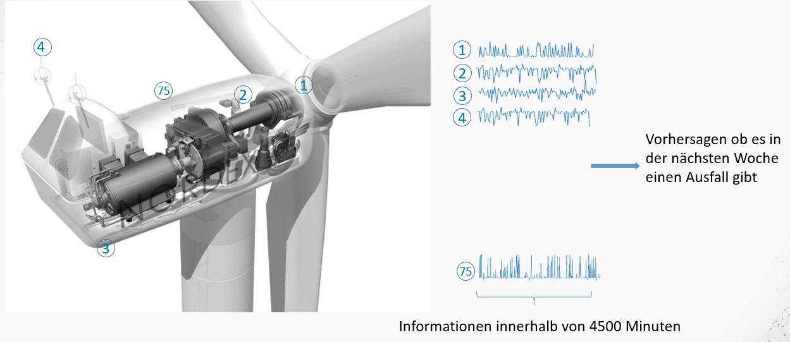

Wie beschleunige ich meine Datenanalyse zuhause oder im Cluster
===============================================================

Parallelisierung der Merkmalsberechnung mit python, joblib und dask
-------------------------------------------------------------------

Zuerst initialisieren wir unsere Umgebung mit einigen Paketen. Falls es
zu Fehlern kommt sollten die Pakete auf der Kommandozeile mit pip oder
conda nachinstalliert werden.

    import warnings
    warnings.filterwarnings("ignore")
    import os
    import pandas as pd
    import time
    import numpy as np
    import sklearn as sk
    from tqdm import tqdm
    import dask.dataframe as dd
    import intake
    from dtreeviz.trees import *

    %matplotlib inline
    %config InteractiveShell.ast_node_interactivity="last_expr_or_assign"

Die folgenden Pfade müssen angepasst werden, sobald die Daten
runtergeladen wurden (&gt;800MB gepackt). Die Daten können unter
<a href="https://bwsyncandshare.kit.edu/s/NzrXCAnTHDWJZRk" class="uri">https://bwsyncandshare.kit.edu/s/NzrXCAnTHDWJZRk</a>
heruntergeladen werden.

    TRAIN_LABEL_PATH = "data/train_labels.csv"
    TRAIN_PATH = "data/train/"

Die Daten sind von verschiedene Windrädern in China bei denen 75
Sensoren alle 10 Minuten aufgezeichnet wurden.

    data= pd.read_csv("data/train/002/cbd192c9-5e59-3b3c-bae8-20f8ae9f2b36.csv")

         Wheel speed  hub angle  blade 1 angle  blade 2 angle  blade 3 angle  \
    0          14.63     154.01           0.24           0.31           0.22   
    1          13.74     312.77           0.24           0.31           0.22   
    2          13.55      73.76           0.24           0.31           0.22   
    3          12.21     132.26           0.24           0.31           0.22   
    4          12.91     239.51           0.24           0.31           0.22   
    ..           ...        ...            ...            ...            ...   
    445        11.37      93.24           0.24           0.31           0.22   
    446        14.37     194.51           0.24           0.31           0.22   
    447        12.31      82.76           0.24           0.31           0.22   
    448        12.24     183.49           0.24           0.31           0.22   
    449        12.89     340.74           0.24           0.31           0.22   

         pitch motor 1 current  pitch motor 2 current  Pitch motor 3 current  \
    0                    12.48                  13.58                  14.00   
    1                    11.36                  11.14                  13.06   
    2                    11.74                  11.90                  14.64   
    3                    10.08                  10.30                  12.20   
    4                    10.90                  11.84                  13.04   
    ..                     ...                    ...                    ...   
    445                  10.10                   8.84                  11.28   
    446                  12.20                  13.46                  14.64   
    447                  10.00                  10.10                  12.02   
    448                   9.48                  10.30                  11.56   
    449                  10.30                   9.80                  11.50   

         overspeed sensor speed detection value  \
    0                                     14.91   
    1                                     13.95   
    2                                     13.81   
    3                                     12.47   
    4                                     13.16   
    ..                                      ...   
    445                                   11.62   
    446                                   14.65   
    447                                   12.60   
    448                                   12.50   
    449                                   13.14   

         5 second yaw against wind average  ...  blade 3 inverter box temperature  \
    0                                  2.6  ...                               300   
    1                                  8.7  ...                               300   
    2                                  5.4  ...                               300   
    3                                 -7.1  ...                               300   
    4                                  1.2  ...                               300   
    ..                                 ...  ...                               ...   
    445                              -27.1  ...                               300   
    446                                1.6  ...                               300   
    447                               -1.5  ...                               300   
    448                                2.3  ...                               300   
    449                               -7.7  ...                               300   

         blade 1 super capacitor voltage  blade 2 super capacitor voltage  \
    0                                  0                                0   
    1                                  0                                0   
    2                                  0                                0   
    3                                  0                                0   
    4                                  0                                0   
    ..                               ...                              ...   
    445                                0                                0   
    446                                0                                0   
    447                                0                                0   
    448                                0                                0   
    449                                0                                0   

         blade 3 super capacitor voltage  drive 1 thyristor temperature  \
    0                                  0                              0   
    1                                  0                              0   
    2                                  0                              0   
    3                                  0                              0   
    4                                  0                              0   
    ..                               ...                            ...   
    445                                0                              0   
    446                                0                              0   
    447                                0                              0   
    448                                0                              0   
    449                                0                              0   

         Drive 2 thyristor temperature  Drive 3 thyristor temperature  \
    0                                0                              0   
    1                                0                              0   
    2                                0                              0   
    3                                0                              0   
    4                                0                              0   
    ..                             ...                            ...   
    445                              0                              0   
    446                              0                              0   
    447                              0                              0   
    448                              0                              0   
    449                              0                              0   

         Drive 1 output torque  Drive 2 output torque  Drive 3 output torque  
    0                        0                      0                      0  
    1                        0                      0                      0  
    2                        0                      0                      0  
    3                        0                      0                      0  
    4                        0                      0                      0  
    ..                     ...                    ...                    ...  
    445                      0                      0                      0  
    446                      0                      0                      0  
    447                      0                      0                      0  
    448                      0                      0                      0  
    449                      0                      0                      0  

    [450 rows x 75 columns]

Soviele Minuten umfasst die Datei:

    data.shape[0]*10

    4500

Die Spalten sind Zeitreihen

    data["Wheel speed"].plot()

    <AxesSubplot:>

Zu jeder multidimensionalen Zeitreihe gehört ein Label: 1 wenn das
Windrad danach einen Defekt hatte, ansonsten 0. Die Herausforderung wird
es sein den Defekt anhand der Zeitreihe vorherzusagen.

    label=pd.read_csv(TRAIN_LABEL_PATH)

           f_id                                 file_name  ret
    0        95  dba63ee5-6603-300e-8071-8536afcbc2de.csv    0
    1        95  0b8bfa51-cf28-35d0-94d2-7922f45120b2.csv    0
    2        95  d7a64eee-165e-3d39-be67-adc82050bde3.csv    0
    3        95  4da3314d-c5b0-3782-bdd6-27fb9e251261.csv    0
    4        95  7d58a65f-af5a-3433-bcbb-a342b9468b71.csv    0
    ...     ...                                       ...  ...
    48334    11  d6e19de9-22a8-39e6-98c1-cc599c819a56.csv    1
    48335    11  83895667-dc4e-303a-90e7-7dfc0725f476.csv    1
    48336    11  a6ab9f83-4bea-323f-b08e-4a9fb4eab8d6.csv    1
    48337    11  a19af894-a9c8-3127-87e4-39567f0a9e0c.csv    1
    48338    11  861ce6ba-f676-3ea6-bfbb-16dfda24ac1a.csv    1

    [48339 rows x 3 columns]

Die Label sind bereits balanciert, was das Vorhersageproblem später
einfacher macht.

    label["ret"].hist()

    <AxesSubplot:>

Um eine einfache Klassifikation auf das Label zu machen können Merkmale
auf den Zeitreihen berechnet werden um kritische Ausprägungen mit einen
Klassifikationsalgorithmus zu lernen. Das Schweizer Taschenmesser der
Merkmalsextraktion ist
<a href="https://github.com/blue-yonder/tsfresh" class="uri">https://github.com/blue-yonder/tsfresh</a>
der Karlsruher Firma BlueYonder

    %%timeit -r1 -n1 -o
    import tsfresh
    data["id"]="a"
    tsfresh.extract_features(data,n_jobs=1,column_id="id")

    Feature Extraction: 100%|██████████| 5/5 [00:18<00:00,  3.78s/it]

    24.4 s ± 0 ns per loop (mean ± std. dev. of 1 run, 1 loop each)

    <TimeitResult : 24.4 s ± 0 ns per loop (mean ± std. dev. of 1 run, 1 loop each)>

Wenn man nun alle Dateien auf einer CPU Laden will so dauert das dann
ca. so viele Stunden:

    label.shape[0]*_.average/60/60

    328.147238520002

Zum Glück unterstützt tsfresh bereits Parallelisierung:Probieren Sie
verschiedene Werte für n\_jobs aus. Sie werden merken, dass die
Parallelisierung nicht ganz linear skaliert

Um die Liste aller Dateien zu bekommen, müssen wir übrigens noch den
Pfad dran hängen und den Ordner dreistellig kodieren

    files=label.apply(lambda row: TRAIN_PATH+"{:03d}/{}".format(row["f_id"],row["file_name"]),axis=1)

    0        /smartdata/proj_sdsc_TMP/windrad/data/train/09...
    1        /smartdata/proj_sdsc_TMP/windrad/data/train/09...
    2        /smartdata/proj_sdsc_TMP/windrad/data/train/09...
    3        /smartdata/proj_sdsc_TMP/windrad/data/train/09...
    4        /smartdata/proj_sdsc_TMP/windrad/data/train/09...
                                   ...                        
    48334    /smartdata/proj_sdsc_TMP/windrad/data/train/01...
    48335    /smartdata/proj_sdsc_TMP/windrad/data/train/01...
    48336    /smartdata/proj_sdsc_TMP/windrad/data/train/01...
    48337    /smartdata/proj_sdsc_TMP/windrad/data/train/01...
    48338    /smartdata/proj_sdsc_TMP/windrad/data/train/01...
    Length: 48339, dtype: object

Die Daten einfach alle in den Speicher zu laden funktioniert übrigens
auch nicht. Insgesamt sprechen wir über soviele Gigabyte:

    from pathlib import Path
    sum(Path(f).stat().st_size  for f in files) /(1024**3)

    6.261525361798704

Nun kopieren wir die Teile von oben in eine Funktion um sie auf alle
Dateien anzuwenden

    def get_features(file):
        data= pd.read_csv(file)
        data["id"]=file
        return tsfresh.extract_features(data,disable_progressbar=True, n_jobs=1,column_id="id")

Damit es schneller geht können wir ein paar einfachere Features
verwenden

    def get_features(file):
        data= pd.read_csv(file)
        data["id"]=file
        return data.groupby("id").agg(["mean","max","min"])

Wir iterieren hierzu über alle Files und stecken Sie in einen Dataframe
(zu Demozwecken nur die ersten 100). tqdm ist für die Statusanzeige
zuständig

    %%time
    features=pd.concat(get_features(f) for f in tqdm(files[0:100]))

    100%|██████████| 100/100 [00:22<00:00,  4.48it/s]

    CPU times: user 21.8 s, sys: 57.2 ms, total: 21.9 s
    Wall time: 23.4 s

Python unterstützt von Haus aus nur einen Prozessor. Hier nutzen wir
also nicht unseren Prozesser aus. Hierzu gibt es die joblib. Mit delayed
werden die Berechnungen asyncron gestartet. Wenn man mehrere
Prozessorkerne hat wird man durch die Erhöhung von n\_jobs wie schon
oben eine leichte Beschleunigung feststellen (Engpass ist meist die
Festplatte).

    %%time
    from joblib import Parallel, delayed
    features=pd.concat(Parallel(n_jobs=4)(delayed(get_features)(f) for f in tqdm(files[0:100])))

    100%|██████████| 100/100 [00:15<00:00,  6.27it/s]

    CPU times: user 6.9 s, sys: 186 ms, total: 7.09 s
    Wall time: 17.7 s

Limitierend sind hier auch die CPUs und der RAM in einem Rechner. Sehr
große Rechner sind meist extrem teuer. Billiger geht es im Cluster.
(HTCondor)\[<a href="https://research.cs.wisc.edu/htcondor/" class="uri">https://research.cs.wisc.edu/htcondor/</a>\]
ist ein Clusterscheduler der von der Python Bibliothek
(dask)\[<a href="https://dask.org/" class="uri">https://dask.org/</a>\]
für verteiltes Rechnen unterstützt wird. Damit wird die Erstellung eines
eigenen Clusters in einem Hochleistungs-Cluster einfach. Aber man kann
hier auch viele Rechner im Firmennetzwerk zusammenschalten. (Geht auch
über Kubernetes oder Yarn in der Cloud). Wir holen uns nun ein paar
Rechner mit 8 Prozessorkernen und je 32GB RAM und ner kleinen Festplatte
(wir wollen die Daten nur in den Speicher laden).

    from dask_jobqueue import HTCondorCluster
    from distributed import Client

    os.environ["_condor_SCHEDD_HOST"]="login-l.sdil.kit.edu"
    cluster= HTCondorCluster(cores=8, memory= "32GB", disk="400MB")
    client=Client(cluster)
    cluster

    {"model_id":"5cea1041d7f34e24bbfdb2f22532d55a","version_major":2,"version_minor":0}

Diese Konfiguration können wir nun in unserem Fall beliebig
hochskalieren.

    cluster.scale(32)

Unser Beispiel von oben lässt sich trivial beschleunigen. Wenn sie das
Pythonpaket bokeh installiert haben können sie auf dem Dashboard (link
oben) sehen wie die Funktion parallel auf dem Cluster ausgeführt wird.
(Die Statusbar ist hier unsinnig, da alle jobs parallel in den Cluster
geschickt werden)

    %%time
    from joblib import parallel_backend
    with parallel_backend('dask'):
        features=pd.concat(Parallel()(delayed(get_features)(f) for f in tqdm(files[0:100])))

    100%|██████████| 100/100 [00:00<00:00, 11782.08it/s]

    CPU times: user 7.41 s, sys: 201 ms, total: 7.61 s
    Wall time: 7.65 s

Es geht aber noch einfacher. Die Idee von Big Data ist es das
Berechnungsgraphen auf großen verteilten Datenquellen ausgeführt werden.
Wir nutzen hier das Paket [intake](https://github.com/intake/intake/) um
die Datenquelle verteilt in dask zu laden.

    ddf=intake.open_csv(TRAIN_PATH+"006/02{file_name}.csv").to_dask()

    Dask DataFrame Structure:
                  Wheel speed hub angle blade 1 angle blade 2 angle blade 3 angle pitch motor 1 current pitch motor 2 current Pitch motor 3 current overspeed sensor speed detection value 5 second yaw against wind average x direction vibration value y direction vibration value hydraulic brake pressure Aircraft weather station wind speed wind direction absolute value atmospheric pressure reactive power control status inverter grid side current inverter grid side voltage Inverter grid side active power inverter grid side reactive power inverter generator side power generator operating frequency generator current generator torque Inverter inlet temperature inverter outlet temperature inverter inlet pressure inverter outlet pressure generator power limit value reactive power set value Rated hub speed wind tower ambient temperature generator stator temperature 1 generator stator temperature 2 generator stator temperature 3 generator stator temperature 4 Generator stator temperature 5 generator stator temperature 6 generator air temperature 1 generator air temperature 2 main bearing temperature 1 main bearing temperature 2 Wheel temperature Wheel control cabinet temperature Cabin temperature Cabin control cabinet temperature Inverter INU temperature Inverter ISU temperature Inverter INU RMIO temperature Pitch motor 1 power estimation Pitch motor 2 power estimation Pitch motor 3 power estimation Fan current status value hub current status value yaw state value yaw request value blade 1 battery box temperature blade 2 battery box temperature blade 3 battery box temperature vane 1 pitch motor temperature blade 2 pitch motor temperature blade 3 pitch motor temperature blade 1 inverter box temperature blade 2 inverter box temperature blade 3 inverter box temperature blade 1 super capacitor voltage blade 2 super capacitor voltage blade 3 super capacitor voltage drive 1 thyristor temperature Drive 2 thyristor temperature Drive 3 thyristor temperature Drive 1 output torque Drive 2 output torque Drive 3 output torque        file_name
    npartitions=9                                                                                                                                                                                                                                                                                                                                                                                                                                                                                                                                                                                                                                                                                                                                                                                                                                                                                                                                                                                                                                                                                                                                                                                                                                                                                                                                                                                                                                                                                                                                                                                                                                                                                                                                                                                                                                                                                                                                                                                                                                                                                                                    
                      float64   float64       float64       float64       float64               float64               float64               float64                                float64                           float64                     float64                     float64                  float64                             float64                       float64              float64                       float64                    float64                    float64                         float64                           float64                       float64                       float64           float64          float64                    float64                     float64                 float64                  float64                     float64                  float64         float64                        float64                        float64                        float64                        float64                        float64                        float64                        float64                     float64                     float64                    float64                    float64           float64                           float64           float64                           float64                  float64                  float64                       float64                        float64                        float64                        float64                  float64                  float64         float64           float64                         float64                         float64                         float64                        float64                         float64                         float64                          float64                          float64                          float64                         float64                         float64                         float64                       float64                       float64                       float64               float64               float64               float64  category[known]
                          ...       ...           ...           ...           ...                   ...                   ...                   ...                                    ...                               ...                         ...                         ...                      ...                                 ...                           ...                  ...                           ...                        ...                        ...                             ...                               ...                           ...                           ...               ...              ...                        ...                         ...                     ...                      ...                         ...                      ...             ...                            ...                            ...                            ...                            ...                            ...                            ...                            ...                         ...                         ...                        ...                        ...               ...                               ...               ...                               ...                      ...                      ...                           ...                            ...                            ...                            ...                      ...                      ...             ...               ...                             ...                             ...                             ...                            ...                             ...                             ...                              ...                              ...                              ...                             ...                             ...                             ...                           ...                           ...                           ...                   ...                   ...                   ...              ...
    ...                   ...       ...           ...           ...           ...                   ...                   ...                   ...                                    ...                               ...                         ...                         ...                      ...                                 ...                           ...                  ...                           ...                        ...                        ...                             ...                               ...                           ...                           ...               ...              ...                        ...                         ...                     ...                      ...                         ...                      ...             ...                            ...                            ...                            ...                            ...                            ...                            ...                            ...                         ...                         ...                        ...                        ...               ...                               ...               ...                               ...                      ...                      ...                           ...                            ...                            ...                            ...                      ...                      ...             ...               ...                             ...                             ...                             ...                            ...                             ...                             ...                              ...                              ...                              ...                             ...                             ...                             ...                           ...                           ...                           ...                   ...                   ...                   ...              ...
                          ...       ...           ...           ...           ...                   ...                   ...                   ...                                    ...                               ...                         ...                         ...                      ...                                 ...                           ...                  ...                           ...                        ...                        ...                             ...                               ...                           ...                           ...               ...              ...                        ...                         ...                     ...                      ...                         ...                      ...             ...                            ...                            ...                            ...                            ...                            ...                            ...                            ...                         ...                         ...                        ...                        ...               ...                               ...               ...                               ...                      ...                      ...                           ...                            ...                            ...                            ...                      ...                      ...             ...               ...                             ...                             ...                             ...                            ...                             ...                             ...                              ...                              ...                              ...                             ...                             ...                             ...                           ...                           ...                           ...                   ...                   ...                   ...              ...
                          ...       ...           ...           ...           ...                   ...                   ...                   ...                                    ...                               ...                         ...                         ...                      ...                                 ...                           ...                  ...                           ...                        ...                        ...                             ...                               ...                           ...                           ...               ...              ...                        ...                         ...                     ...                      ...                         ...                      ...             ...                            ...                            ...                            ...                            ...                            ...                            ...                            ...                         ...                         ...                        ...                        ...               ...                               ...               ...                               ...                      ...                      ...                           ...                            ...                            ...                            ...                      ...                      ...             ...               ...                             ...                             ...                             ...                            ...                             ...                             ...                              ...                              ...                              ...                             ...                             ...                             ...                           ...                           ...                           ...                   ...                   ...                   ...              ...
    Dask Name: drop_by_shallow_copy, 63 tasks

Wir haben erstmal eine kleine Anzahl von Dateien geladen. Dask macht im
Hintergrund allerdings nichts als automatisch eine Datenstruktur
anzulegen. Wir können aber z.B. sehr schnell die ersten Daten anschauen
(liest nur einen kleinen Auschnitt einer einzigen Datei).

    ddf.head()

       Wheel speed  hub angle  blade 1 angle  blade 2 angle  blade 3 angle  \
    0         1.77     339.01           21.0          21.01           21.0   
    1         1.82     123.01           21.0          21.01           21.0   
    2         1.82     230.00           21.0          21.01           21.0   
    3         1.73      33.98           21.0          21.01           21.0   
    4         1.75      82.01           21.0          21.01           21.0   

       pitch motor 1 current  pitch motor 2 current  Pitch motor 3 current  \
    0                   1.88                   2.64                   1.76   
    1                   1.10                   2.54                   1.58   
    2                   1.56                   2.70                   1.40   
    3                   0.80                   2.70                   0.86   
    4                   1.64                   2.70                   1.82   

       overspeed sensor speed detection value  5 second yaw against wind average  \
    0                                    1.78                              -18.5   
    1                                    1.82                              -14.0   
    2                                    1.82                                1.8   
    3                                    1.74                              -12.9   
    4                                    1.78                              -14.6   

       ...  blade 1 super capacitor voltage  blade 2 super capacitor voltage  \
    0  ...                              0.0                              0.0   
    1  ...                              0.0                              0.0   
    2  ...                              0.0                              0.0   
    3  ...                              0.0                              0.0   
    4  ...                              0.0                              0.0   

       blade 3 super capacitor voltage  drive 1 thyristor temperature  \
    0                              0.0                            0.0   
    1                              0.0                            0.0   
    2                              0.0                            0.0   
    3                              0.0                            0.0   
    4                              0.0                            0.0   

       Drive 2 thyristor temperature  Drive 3 thyristor temperature  \
    0                            0.0                            0.0   
    1                            0.0                            0.0   
    2                            0.0                            0.0   
    3                            0.0                            0.0   
    4                            0.0                            0.0   

       Drive 1 output torque  Drive 2 output torque  Drive 3 output torque  \
    0                    0.0                    0.0                    0.0   
    1                    0.0                    0.0                    0.0   
    2                    0.0                    0.0                    0.0   
    3                    0.0                    0.0                    0.0   
    4                    0.0                    0.0                    0.0   

                                file_name  
    0  393eca-db4c-39a5-abd9-569ead6e26a7  
    1  393eca-db4c-39a5-abd9-569ead6e26a7  
    2  393eca-db4c-39a5-abd9-569ead6e26a7  
    3  393eca-db4c-39a5-abd9-569ead6e26a7  
    4  393eca-db4c-39a5-abd9-569ead6e26a7  

    [5 rows x 76 columns]

Genauso können wir unsere Merkmalsextraktion wie oben spezifizieren.
Hier brauchen wir jetzt nicht mehr die Daten in jeder Funktion
einzulesen

    dfeatures=ddf.groupby(['file_name']).agg(["mean","var","min","max"])

    Dask DataFrame Structure:
                  Wheel speed                            hub angle                            blade 1 angle                            blade 2 angle                            blade 3 angle                            pitch motor 1 current                            pitch motor 2 current                            Pitch motor 3 current                            overspeed sensor speed detection value                            5 second yaw against wind average                            x direction vibration value                            y direction vibration value                            hydraulic brake pressure                            Aircraft weather station wind speed                            wind direction absolute value                            atmospheric pressure                            reactive power control status                            inverter grid side current                            inverter grid side voltage                            Inverter grid side active power                            inverter grid side reactive power                            inverter generator side power                            generator operating frequency                            generator current                            generator torque                            Inverter inlet temperature                            inverter outlet temperature                            inverter inlet pressure                            inverter outlet pressure                            generator power limit value                            reactive power set value                            Rated hub speed                            wind tower ambient temperature                            generator stator temperature 1                            generator stator temperature 2                            generator stator temperature 3                            generator stator temperature 4                            Generator stator temperature 5                            generator stator temperature 6                            generator air temperature 1                            generator air temperature 2                            main bearing temperature 1                            main bearing temperature 2                            Wheel temperature                            Wheel control cabinet temperature                            Cabin temperature                            Cabin control cabinet temperature                            Inverter INU temperature                            Inverter ISU temperature                            Inverter INU RMIO temperature                            Pitch motor 1 power estimation                            Pitch motor 2 power estimation                            Pitch motor 3 power estimation                            Fan current status value                            hub current status value                            yaw state value                            yaw request value                            blade 1 battery box temperature                            blade 2 battery box temperature                            blade 3 battery box temperature                            vane 1 pitch motor temperature                            blade 2 pitch motor temperature                            blade 3 pitch motor temperature                            blade 1 inverter box temperature                            blade 2 inverter box temperature                            blade 3 inverter box temperature                            blade 1 super capacitor voltage                            blade 2 super capacitor voltage                            blade 3 super capacitor voltage                            drive 1 thyristor temperature                            Drive 2 thyristor temperature                            Drive 3 thyristor temperature                            Drive 1 output torque                            Drive 2 output torque                            Drive 3 output torque                           
                         mean      var      min      max      mean      var      min      max          mean      var      min      max          mean      var      min      max          mean      var      min      max                  mean      var      min      max                  mean      var      min      max                  mean      var      min      max                                   mean      var      min      max                              mean      var      min      max                        mean      var      min      max                        mean      var      min      max                     mean      var      min      max                                mean      var      min      max                          mean      var      min      max                 mean      var      min      max                          mean      var      min      max                       mean      var      min      max                       mean      var      min      max                            mean      var      min      max                              mean      var      min      max                          mean      var      min      max                          mean      var      min      max              mean      var      min      max             mean      var      min      max                       mean      var      min      max                        mean      var      min      max                    mean      var      min      max                     mean      var      min      max                        mean      var      min      max                     mean      var      min      max            mean      var      min      max                           mean      var      min      max                           mean      var      min      max                           mean      var      min      max                           mean      var      min      max                           mean      var      min      max                           mean      var      min      max                           mean      var      min      max                        mean      var      min      max                        mean      var      min      max                       mean      var      min      max                       mean      var      min      max              mean      var      min      max                              mean      var      min      max              mean      var      min      max                              mean      var      min      max                     mean      var      min      max                     mean      var      min      max                          mean      var      min      max                           mean      var      min      max                           mean      var      min      max                           mean      var      min      max                     mean      var      min      max                     mean      var      min      max            mean      var      min      max              mean      var      min      max                            mean      var      min      max                            mean      var      min      max                            mean      var      min      max                           mean      var      min      max                            mean      var      min      max                            mean      var      min      max                             mean      var      min      max                             mean      var      min      max                             mean      var      min      max                            mean      var      min      max                            mean      var      min      max                            mean      var      min      max                          mean      var      min      max                          mean      var      min      max                          mean      var      min      max                  mean      var      min      max                  mean      var      min      max                  mean      var      min      max
    npartitions=1                                                                                                                                                                                                                                                                                                                                                                                                                                                                                                                                                                                                                                                                                                                                                                                                                                                                                                                                                                                                                                                                                                                                                                                                                                                                                                                                                                                                                                                                                                                                                                                                                                                                                                                                                                                                                                                                                                                                                                                                                                                                                                                                                                                                                                                                                                                                                                                                                                                                                                                                                                                                                                                                                                                                                                                                                                                                                                                                                                                                                                                                                                                                                                                                                                                                                                                                                                                                                                                                                                                                                                                                                                                                                                                                                                                                                                                                                                                                                                                                                                                                                                                                                                                                            
                      float64  float64  float64  float64   float64  float64  float64  float64       float64  float64  float64  float64       float64  float64  float64  float64       float64  float64  float64  float64               float64  float64  float64  float64               float64  float64  float64  float64               float64  float64  float64  float64                                float64  float64  float64  float64                           float64  float64  float64  float64                     float64  float64  float64  float64                     float64  float64  float64  float64                  float64  float64  float64  float64                             float64  float64  float64  float64                       float64  float64  float64  float64              float64  float64  float64  float64                       float64  float64  float64  float64                    float64  float64  float64  float64                    float64  float64  float64  float64                         float64  float64  float64  float64                           float64  float64  float64  float64                       float64  float64  float64  float64                       float64  float64  float64  float64           float64  float64  float64  float64          float64  float64  float64  float64                    float64  float64  float64  float64                     float64  float64  float64  float64                 float64  float64  float64  float64                  float64  float64  float64  float64                     float64  float64  float64  float64                  float64  float64  float64  float64         float64  float64  float64  float64                        float64  float64  float64  float64                        float64  float64  float64  float64                        float64  float64  float64  float64                        float64  float64  float64  float64                        float64  float64  float64  float64                        float64  float64  float64  float64                        float64  float64  float64  float64                     float64  float64  float64  float64                     float64  float64  float64  float64                    float64  float64  float64  float64                    float64  float64  float64  float64           float64  float64  float64  float64                           float64  float64  float64  float64           float64  float64  float64  float64                           float64  float64  float64  float64                  float64  float64  float64  float64                  float64  float64  float64  float64                       float64  float64  float64  float64                        float64  float64  float64  float64                        float64  float64  float64  float64                        float64  float64  float64  float64                  float64  float64  float64  float64                  float64  float64  float64  float64         float64  float64  float64  float64           float64  float64  float64  float64                         float64  float64  float64  float64                         float64  float64  float64  float64                         float64  float64  float64  float64                        float64  float64  float64  float64                         float64  float64  float64  float64                         float64  float64  float64  float64                          float64  float64  float64  float64                          float64  float64  float64  float64                          float64  float64  float64  float64                         float64  float64  float64  float64                         float64  float64  float64  float64                         float64  float64  float64  float64                       float64  float64  float64  float64                       float64  float64  float64  float64                       float64  float64  float64  float64               float64  float64  float64  float64               float64  float64  float64  float64               float64  float64  float64  float64
                          ...      ...      ...      ...       ...      ...      ...      ...           ...      ...      ...      ...           ...      ...      ...      ...           ...      ...      ...      ...                   ...      ...      ...      ...                   ...      ...      ...      ...                   ...      ...      ...      ...                                    ...      ...      ...      ...                               ...      ...      ...      ...                         ...      ...      ...      ...                         ...      ...      ...      ...                      ...      ...      ...      ...                                 ...      ...      ...      ...                           ...      ...      ...      ...                  ...      ...      ...      ...                           ...      ...      ...      ...                        ...      ...      ...      ...                        ...      ...      ...      ...                             ...      ...      ...      ...                               ...      ...      ...      ...                           ...      ...      ...      ...                           ...      ...      ...      ...               ...      ...      ...      ...              ...      ...      ...      ...                        ...      ...      ...      ...                         ...      ...      ...      ...                     ...      ...      ...      ...                      ...      ...      ...      ...                         ...      ...      ...      ...                      ...      ...      ...      ...             ...      ...      ...      ...                            ...      ...      ...      ...                            ...      ...      ...      ...                            ...      ...      ...      ...                            ...      ...      ...      ...                            ...      ...      ...      ...                            ...      ...      ...      ...                            ...      ...      ...      ...                         ...      ...      ...      ...                         ...      ...      ...      ...                        ...      ...      ...      ...                        ...      ...      ...      ...               ...      ...      ...      ...                               ...      ...      ...      ...               ...      ...      ...      ...                               ...      ...      ...      ...                      ...      ...      ...      ...                      ...      ...      ...      ...                           ...      ...      ...      ...                            ...      ...      ...      ...                            ...      ...      ...      ...                            ...      ...      ...      ...                      ...      ...      ...      ...                      ...      ...      ...      ...             ...      ...      ...      ...               ...      ...      ...      ...                             ...      ...      ...      ...                             ...      ...      ...      ...                             ...      ...      ...      ...                            ...      ...      ...      ...                             ...      ...      ...      ...                             ...      ...      ...      ...                              ...      ...      ...      ...                              ...      ...      ...      ...                              ...      ...      ...      ...                             ...      ...      ...      ...                             ...      ...      ...      ...                             ...      ...      ...      ...                           ...      ...      ...      ...                           ...      ...      ...      ...                           ...      ...      ...      ...                   ...      ...      ...      ...                   ...      ...      ...      ...                   ...      ...      ...      ...
    Dask Name: aggregate-agg, 75 tasks

Wieder ist kaum was im Hintergrund passiert. Dask hat hier einen
Berechnungsgraphen aufgebaut und die Datenstruktur für das Resultat
angelegt.

    dfeatures.visualize()

Um die Berechnung zu demonstrieren wagen wir uns an etwas mehr Daten
(Der Graph wird dann etwas zu groß um ihn noch im Notebook darzustellen,
sonst ist alles gleich)

    ddf=intake.open_csv(TRAIN_PATH+"006/{file_name}.csv").to_dask()
    dfeatures=ddf.groupby(['file_name']).agg(["mean","var","min","max"])

    Dask DataFrame Structure:
                  Wheel speed                            hub angle                            blade 1 angle                            blade 2 angle                            blade 3 angle                            pitch motor 1 current                            pitch motor 2 current                            Pitch motor 3 current                            overspeed sensor speed detection value                            5 second yaw against wind average                            x direction vibration value                            y direction vibration value                            hydraulic brake pressure                            Aircraft weather station wind speed                            wind direction absolute value                            atmospheric pressure                            reactive power control status                            inverter grid side current                            inverter grid side voltage                            Inverter grid side active power                            inverter grid side reactive power                            inverter generator side power                            generator operating frequency                            generator current                            generator torque                            Inverter inlet temperature                            inverter outlet temperature                            inverter inlet pressure                            inverter outlet pressure                            generator power limit value                            reactive power set value                            Rated hub speed                            wind tower ambient temperature                            generator stator temperature 1                            generator stator temperature 2                            generator stator temperature 3                            generator stator temperature 4                            Generator stator temperature 5                            generator stator temperature 6                            generator air temperature 1                            generator air temperature 2                            main bearing temperature 1                            main bearing temperature 2                            Wheel temperature                            Wheel control cabinet temperature                            Cabin temperature                            Cabin control cabinet temperature                            Inverter INU temperature                            Inverter ISU temperature                            Inverter INU RMIO temperature                            Pitch motor 1 power estimation                            Pitch motor 2 power estimation                            Pitch motor 3 power estimation                            Fan current status value                            hub current status value                            yaw state value                            yaw request value                            blade 1 battery box temperature                            blade 2 battery box temperature                            blade 3 battery box temperature                            vane 1 pitch motor temperature                            blade 2 pitch motor temperature                            blade 3 pitch motor temperature                            blade 1 inverter box temperature                            blade 2 inverter box temperature                            blade 3 inverter box temperature                            blade 1 super capacitor voltage                            blade 2 super capacitor voltage                            blade 3 super capacitor voltage                            drive 1 thyristor temperature                            Drive 2 thyristor temperature                            Drive 3 thyristor temperature                            Drive 1 output torque                            Drive 2 output torque                            Drive 3 output torque                           
                         mean      var      min      max      mean      var      min      max          mean      var      min      max          mean      var      min      max          mean      var      min      max                  mean      var      min      max                  mean      var      min      max                  mean      var      min      max                                   mean      var      min      max                              mean      var      min      max                        mean      var      min      max                        mean      var      min      max                     mean      var      min      max                                mean      var      min      max                          mean      var      min      max                 mean      var      min      max                          mean      var      min      max                       mean      var      min      max                       mean      var      min      max                            mean      var      min      max                              mean      var      min      max                          mean      var      min      max                          mean      var      min      max              mean      var      min      max             mean      var      min      max                       mean      var      min      max                        mean      var      min      max                    mean      var      min      max                     mean      var      min      max                        mean      var      min      max                     mean      var      min      max            mean      var      min      max                           mean      var      min      max                           mean      var      min      max                           mean      var      min      max                           mean      var      min      max                           mean      var      min      max                           mean      var      min      max                           mean      var      min      max                        mean      var      min      max                        mean      var      min      max                       mean      var      min      max                       mean      var      min      max              mean      var      min      max                              mean      var      min      max              mean      var      min      max                              mean      var      min      max                     mean      var      min      max                     mean      var      min      max                          mean      var      min      max                           mean      var      min      max                           mean      var      min      max                           mean      var      min      max                     mean      var      min      max                     mean      var      min      max            mean      var      min      max              mean      var      min      max                            mean      var      min      max                            mean      var      min      max                            mean      var      min      max                           mean      var      min      max                            mean      var      min      max                            mean      var      min      max                             mean      var      min      max                             mean      var      min      max                             mean      var      min      max                            mean      var      min      max                            mean      var      min      max                            mean      var      min      max                          mean      var      min      max                          mean      var      min      max                          mean      var      min      max                  mean      var      min      max                  mean      var      min      max                  mean      var      min      max
    npartitions=1                                                                                                                                                                                                                                                                                                                                                                                                                                                                                                                                                                                                                                                                                                                                                                                                                                                                                                                                                                                                                                                                                                                                                                                                                                                                                                                                                                                                                                                                                                                                                                                                                                                                                                                                                                                                                                                                                                                                                                                                                                                                                                                                                                                                                                                                                                                                                                                                                                                                                                                                                                                                                                                                                                                                                                                                                                                                                                                                                                                                                                                                                                                                                                                                                                                                                                                                                                                                                                                                                                                                                                                                                                                                                                                                                                                                                                                                                                                                                                                                                                                                                                                                                                                                            
                      float64  float64  float64  float64   float64  float64  float64  float64       float64  float64  float64  float64       float64  float64  float64  float64       float64  float64  float64  float64               float64  float64  float64  float64               float64  float64  float64  float64               float64  float64  float64  float64                                float64  float64  float64  float64                           float64  float64  float64  float64                     float64  float64  float64  float64                     float64  float64  float64  float64                  float64  float64  float64  float64                             float64  float64  float64  float64                       float64  float64  float64  float64              float64  float64  float64  float64                       float64  float64  float64  float64                    float64  float64  float64  float64                    float64  float64  float64  float64                         float64  float64  float64  float64                           float64  float64  float64  float64                       float64  float64  float64  float64                       float64  float64  float64  float64           float64  float64  float64  float64          float64  float64  float64  float64                    float64  float64  float64  float64                     float64  float64  float64  float64                 float64  float64  float64  float64                  float64  float64  float64  float64                     float64  float64  float64  float64                  float64  float64  float64  float64         float64  float64  float64  float64                        float64  float64  float64  float64                        float64  float64  float64  float64                        float64  float64  float64  float64                        float64  float64  float64  float64                        float64  float64  float64  float64                        float64  float64  float64  float64                        float64  float64  float64  float64                     float64  float64  float64  float64                     float64  float64  float64  float64                    float64  float64  float64  float64                    float64  float64  float64  float64           float64  float64  float64  float64                           float64  float64  float64  float64           float64  float64  float64  float64                           float64  float64  float64  float64                  float64  float64  float64  float64                  float64  float64  float64  float64                       float64  float64  float64  float64                        float64  float64  float64  float64                        float64  float64  float64  float64                        float64  float64  float64  float64                  float64  float64  float64  float64                  float64  float64  float64  float64         float64  float64  float64  float64           float64  float64  float64  float64                         float64  float64  float64  float64                         float64  float64  float64  float64                         float64  float64  float64  float64                        float64  float64  float64  float64                         float64  float64  float64  float64                         float64  float64  float64  float64                          float64  float64  float64  float64                          float64  float64  float64  float64                          float64  float64  float64  float64                         float64  float64  float64  float64                         float64  float64  float64  float64                         float64  float64  float64  float64                       float64  float64  float64  float64                       float64  float64  float64  float64                       float64  float64  float64  float64               float64  float64  float64  float64               float64  float64  float64  float64               float64  float64  float64  float64
                          ...      ...      ...      ...       ...      ...      ...      ...           ...      ...      ...      ...           ...      ...      ...      ...           ...      ...      ...      ...                   ...      ...      ...      ...                   ...      ...      ...      ...                   ...      ...      ...      ...                                    ...      ...      ...      ...                               ...      ...      ...      ...                         ...      ...      ...      ...                         ...      ...      ...      ...                      ...      ...      ...      ...                                 ...      ...      ...      ...                           ...      ...      ...      ...                  ...      ...      ...      ...                           ...      ...      ...      ...                        ...      ...      ...      ...                        ...      ...      ...      ...                             ...      ...      ...      ...                               ...      ...      ...      ...                           ...      ...      ...      ...                           ...      ...      ...      ...               ...      ...      ...      ...              ...      ...      ...      ...                        ...      ...      ...      ...                         ...      ...      ...      ...                     ...      ...      ...      ...                      ...      ...      ...      ...                         ...      ...      ...      ...                      ...      ...      ...      ...             ...      ...      ...      ...                            ...      ...      ...      ...                            ...      ...      ...      ...                            ...      ...      ...      ...                            ...      ...      ...      ...                            ...      ...      ...      ...                            ...      ...      ...      ...                            ...      ...      ...      ...                         ...      ...      ...      ...                         ...      ...      ...      ...                        ...      ...      ...      ...                        ...      ...      ...      ...               ...      ...      ...      ...                               ...      ...      ...      ...               ...      ...      ...      ...                               ...      ...      ...      ...                      ...      ...      ...      ...                      ...      ...      ...      ...                           ...      ...      ...      ...                            ...      ...      ...      ...                            ...      ...      ...      ...                            ...      ...      ...      ...                      ...      ...      ...      ...                      ...      ...      ...      ...             ...      ...      ...      ...               ...      ...      ...      ...                             ...      ...      ...      ...                             ...      ...      ...      ...                             ...      ...      ...      ...                            ...      ...      ...      ...                             ...      ...      ...      ...                             ...      ...      ...      ...                              ...      ...      ...      ...                              ...      ...      ...      ...                              ...      ...      ...      ...                             ...      ...      ...      ...                             ...      ...      ...      ...                             ...      ...      ...      ...                           ...      ...      ...      ...                           ...      ...      ...      ...                           ...      ...      ...      ...                   ...      ...      ...      ...                   ...      ...      ...      ...                   ...      ...      ...      ...
    Dask Name: aggregate-agg, 10995 tasks

Die eigentliche Berechnung stoßen wir mit compute an. Jetzt sollte man
wieder auf das Cluster dashboard wechseln. Am besten schaut man sich
hier den Graph an. Hier kann man sehen wie nach und nach parallel die
Daten eingelesen werden und das Ergebnis stückweise aggregiert wird.

    features=dfeatures.compute()

                                         Wheel speed                         \
                                                mean       var   min    max   
    file_name                                                                 
    666a6cf9-924c-3de9-9ef5-2fbef5ca41b0    7.221927  0.003140  7.08   7.34   
    ac9e5e3c-7be8-32e1-a8ed-18b514deb246    7.148732  0.246737  0.00   7.24   
    e5ec578b-c5a5-3088-98f4-41264ce17859   15.752705  1.947185  0.00  16.64   
    5785bd44-21f4-3585-9b29-ba309115bd2c   12.611022  1.368645  9.30  14.22   
    2fe6f0a0-4757-3ae4-b4a0-103493d789cf    0.003147  0.000106 -0.01   0.06   
    ...                                          ...       ...   ...    ...   
    6ce64374-827a-30dd-b5b7-007a1f350ac3    8.777699  0.815149  7.29  10.65   
    8bdb9313-a6c3-3cf7-9bbd-950f361bcb74    7.973862  0.413934  0.00   9.03   
    7f690922-03a0-3eda-9bde-4314c51e04d5   11.124664  0.795493  0.00  12.35   
    3d298e6b-3222-3370-a415-3c62e7112ab8    7.694931  0.220036  0.00   8.67   
    3f6796ae-89fe-3a7e-8de1-2f23ba82232e    5.572020  1.401133  0.00   6.64   

                                           hub angle                             \
                                                mean           var  min     max   
    file_name                                                                     
    666a6cf9-924c-3de9-9ef5-2fbef5ca41b0  176.558617  10629.140008  0.0  357.98   
    ac9e5e3c-7be8-32e1-a8ed-18b514deb246  176.455789  11167.986582  0.0  359.75   
    e5ec578b-c5a5-3088-98f4-41264ce17859  180.718159  11216.768807  0.0  358.24   
    5785bd44-21f4-3585-9b29-ba309115bd2c  179.609667  10539.434344  0.0  359.50   
    2fe6f0a0-4757-3ae4-b4a0-103493d789cf  160.508462    139.041954  0.0  165.49   
    ...                                          ...           ...  ...     ...   
    6ce64374-827a-30dd-b5b7-007a1f350ac3  175.320774  11069.534996  0.0  357.98   
    8bdb9313-a6c3-3cf7-9bbd-950f361bcb74  180.106920  10816.378567  0.0  360.00   
    7f690922-03a0-3eda-9bde-4314c51e04d5  176.797444  10679.227688  0.0  357.98   
    3d298e6b-3222-3370-a415-3c62e7112ab8  176.339128  10876.806797  0.0  357.98   
    3f6796ae-89fe-3a7e-8de1-2f23ba82232e  174.478384  11259.222959  0.0  360.00   

                                         blade 1 angle              ...  \
                                                  mean         var  ...   
    file_name                                                       ...   
    666a6cf9-924c-3de9-9ef5-2fbef5ca41b0      0.279252    0.000007  ...   
    ac9e5e3c-7be8-32e1-a8ed-18b514deb246      0.218947    0.000231  ...   
    e5ec578b-c5a5-3088-98f4-41264ce17859      0.381409    0.001831  ...   
    5785bd44-21f4-3585-9b29-ba309115bd2c      0.367378    0.000019  ...   
    2fe6f0a0-4757-3ae4-b4a0-103493d789cf     85.599068   34.399625  ...   
    ...                                            ...         ...  ...   
    6ce64374-827a-30dd-b5b7-007a1f350ac3      0.246082    0.000024  ...   
    8bdb9313-a6c3-3cf7-9bbd-950f361bcb74      0.244152    0.000159  ...   
    7f690922-03a0-3eda-9bde-4314c51e04d5      0.219013    0.000217  ...   
    3d298e6b-3222-3370-a415-3c62e7112ab8      0.243532    0.000161  ...   
    3f6796ae-89fe-3a7e-8de1-2f23ba82232e      2.893502  138.610708  ...   

                                         Drive 1 output torque       \
                                                           min  max   
    file_name                                                         
    666a6cf9-924c-3de9-9ef5-2fbef5ca41b0                   0.0  0.0   
    ac9e5e3c-7be8-32e1-a8ed-18b514deb246                   0.0  0.0   
    e5ec578b-c5a5-3088-98f4-41264ce17859                   0.0  0.0   
    5785bd44-21f4-3585-9b29-ba309115bd2c                   0.0  0.0   
    2fe6f0a0-4757-3ae4-b4a0-103493d789cf                   0.0  0.0   
    ...                                                    ...  ...   
    6ce64374-827a-30dd-b5b7-007a1f350ac3                   0.0  0.0   
    8bdb9313-a6c3-3cf7-9bbd-950f361bcb74                   0.0  0.0   
    7f690922-03a0-3eda-9bde-4314c51e04d5                   0.0  0.0   
    3d298e6b-3222-3370-a415-3c62e7112ab8                   0.0  0.0   
    3f6796ae-89fe-3a7e-8de1-2f23ba82232e                   0.0  0.0   

                                         Drive 2 output torque                 \
                                                          mean  var  min  max   
    file_name                                                                   
    666a6cf9-924c-3de9-9ef5-2fbef5ca41b0                   0.0  0.0  0.0  0.0   
    ac9e5e3c-7be8-32e1-a8ed-18b514deb246                   0.0  0.0  0.0  0.0   
    e5ec578b-c5a5-3088-98f4-41264ce17859                   0.0  0.0  0.0  0.0   
    5785bd44-21f4-3585-9b29-ba309115bd2c                   0.0  0.0  0.0  0.0   
    2fe6f0a0-4757-3ae4-b4a0-103493d789cf                   0.0  0.0  0.0  0.0   
    ...                                                    ...  ...  ...  ...   
    6ce64374-827a-30dd-b5b7-007a1f350ac3                   0.0  0.0  0.0  0.0   
    8bdb9313-a6c3-3cf7-9bbd-950f361bcb74                   0.0  0.0  0.0  0.0   
    7f690922-03a0-3eda-9bde-4314c51e04d5                   0.0  0.0  0.0  0.0   
    3d298e6b-3222-3370-a415-3c62e7112ab8                   0.0  0.0  0.0  0.0   
    3f6796ae-89fe-3a7e-8de1-2f23ba82232e                   0.0  0.0  0.0  0.0   

                                         Drive 3 output torque                 
                                                          mean  var  min  max  
    file_name                                                                  
    666a6cf9-924c-3de9-9ef5-2fbef5ca41b0                   0.0  0.0  0.0  0.0  
    ac9e5e3c-7be8-32e1-a8ed-18b514deb246                   0.0  0.0  0.0  0.0  
    e5ec578b-c5a5-3088-98f4-41264ce17859                   0.0  0.0  0.0  0.0  
    5785bd44-21f4-3585-9b29-ba309115bd2c                   0.0  0.0  0.0  0.0  
    2fe6f0a0-4757-3ae4-b4a0-103493d789cf                   0.0  0.0  0.0  0.0  
    ...                                                    ...  ...  ...  ...  
    6ce64374-827a-30dd-b5b7-007a1f350ac3                   0.0  0.0  0.0  0.0  
    8bdb9313-a6c3-3cf7-9bbd-950f361bcb74                   0.0  0.0  0.0  0.0  
    7f690922-03a0-3eda-9bde-4314c51e04d5                   0.0  0.0  0.0  0.0  
    3d298e6b-3222-3370-a415-3c62e7112ab8                   0.0  0.0  0.0  0.0  
    3f6796ae-89fe-3a7e-8de1-2f23ba82232e                   0.0  0.0  0.0  0.0  

    [1350 rows x 300 columns]

Um das Projekt abzuschließen können wir nun mit dem eigentlichen
Maschinellen Lernen beginnen. Hierzu fügen wir die labels von oben an
den Datensatz an und entfernen die Ids sowie evtl. Nulleinträge.

    train=features.join(
        label.set_index(
            label["file_name"].str.replace('.csv','')
        )
    ).drop(['file_name','f_id'],axis=1).dropna()

                                          (Wheel speed, mean)  (Wheel speed, var)  \
    file_name                                                                       
    666a6cf9-924c-3de9-9ef5-2fbef5ca41b0             7.221927            0.003140   
    ac9e5e3c-7be8-32e1-a8ed-18b514deb246             7.148732            0.246737   
    e5ec578b-c5a5-3088-98f4-41264ce17859            15.752705            1.947185   
    5785bd44-21f4-3585-9b29-ba309115bd2c            12.611022            1.368645   
    2fe6f0a0-4757-3ae4-b4a0-103493d789cf             0.003147            0.000106   
    ...                                                   ...                 ...   
    6ce64374-827a-30dd-b5b7-007a1f350ac3             8.777699            0.815149   
    8bdb9313-a6c3-3cf7-9bbd-950f361bcb74             7.973862            0.413934   
    7f690922-03a0-3eda-9bde-4314c51e04d5            11.124664            0.795493   
    3d298e6b-3222-3370-a415-3c62e7112ab8             7.694931            0.220036   
    3f6796ae-89fe-3a7e-8de1-2f23ba82232e             5.572020            1.401133   

                                          (Wheel speed, min)  (Wheel speed, max)  \
    file_name                                                                      
    666a6cf9-924c-3de9-9ef5-2fbef5ca41b0                7.08                7.34   
    ac9e5e3c-7be8-32e1-a8ed-18b514deb246                0.00                7.24   
    e5ec578b-c5a5-3088-98f4-41264ce17859                0.00               16.64   
    5785bd44-21f4-3585-9b29-ba309115bd2c                9.30               14.22   
    2fe6f0a0-4757-3ae4-b4a0-103493d789cf               -0.01                0.06   
    ...                                                  ...                 ...   
    6ce64374-827a-30dd-b5b7-007a1f350ac3                7.29               10.65   
    8bdb9313-a6c3-3cf7-9bbd-950f361bcb74                0.00                9.03   
    7f690922-03a0-3eda-9bde-4314c51e04d5                0.00               12.35   
    3d298e6b-3222-3370-a415-3c62e7112ab8                0.00                8.67   
    3f6796ae-89fe-3a7e-8de1-2f23ba82232e                0.00                6.64   

                                          (hub angle, mean)  (hub angle, var)  \
    file_name                                                                   
    666a6cf9-924c-3de9-9ef5-2fbef5ca41b0         176.558617      10629.140008   
    ac9e5e3c-7be8-32e1-a8ed-18b514deb246         176.455789      11167.986582   
    e5ec578b-c5a5-3088-98f4-41264ce17859         180.718159      11216.768807   
    5785bd44-21f4-3585-9b29-ba309115bd2c         179.609667      10539.434344   
    2fe6f0a0-4757-3ae4-b4a0-103493d789cf         160.508462        139.041954   
    ...                                                 ...               ...   
    6ce64374-827a-30dd-b5b7-007a1f350ac3         175.320774      11069.534996   
    8bdb9313-a6c3-3cf7-9bbd-950f361bcb74         180.106920      10816.378567   
    7f690922-03a0-3eda-9bde-4314c51e04d5         176.797444      10679.227688   
    3d298e6b-3222-3370-a415-3c62e7112ab8         176.339128      10876.806797   
    3f6796ae-89fe-3a7e-8de1-2f23ba82232e         174.478384      11259.222959   

                                          (hub angle, min)  (hub angle, max)  \
    file_name                                                                  
    666a6cf9-924c-3de9-9ef5-2fbef5ca41b0               0.0            357.98   
    ac9e5e3c-7be8-32e1-a8ed-18b514deb246               0.0            359.75   
    e5ec578b-c5a5-3088-98f4-41264ce17859               0.0            358.24   
    5785bd44-21f4-3585-9b29-ba309115bd2c               0.0            359.50   
    2fe6f0a0-4757-3ae4-b4a0-103493d789cf               0.0            165.49   
    ...                                                ...               ...   
    6ce64374-827a-30dd-b5b7-007a1f350ac3               0.0            357.98   
    8bdb9313-a6c3-3cf7-9bbd-950f361bcb74               0.0            360.00   
    7f690922-03a0-3eda-9bde-4314c51e04d5               0.0            357.98   
    3d298e6b-3222-3370-a415-3c62e7112ab8               0.0            357.98   
    3f6796ae-89fe-3a7e-8de1-2f23ba82232e               0.0            360.00   

                                          (blade 1 angle, mean)  \
    file_name                                                     
    666a6cf9-924c-3de9-9ef5-2fbef5ca41b0               0.279252   
    ac9e5e3c-7be8-32e1-a8ed-18b514deb246               0.218947   
    e5ec578b-c5a5-3088-98f4-41264ce17859               0.381409   
    5785bd44-21f4-3585-9b29-ba309115bd2c               0.367378   
    2fe6f0a0-4757-3ae4-b4a0-103493d789cf              85.599068   
    ...                                                     ...   
    6ce64374-827a-30dd-b5b7-007a1f350ac3               0.246082   
    8bdb9313-a6c3-3cf7-9bbd-950f361bcb74               0.244152   
    7f690922-03a0-3eda-9bde-4314c51e04d5               0.219013   
    3d298e6b-3222-3370-a415-3c62e7112ab8               0.243532   
    3f6796ae-89fe-3a7e-8de1-2f23ba82232e               2.893502   

                                          (blade 1 angle, var)  ...  \
    file_name                                                   ...   
    666a6cf9-924c-3de9-9ef5-2fbef5ca41b0              0.000007  ...   
    ac9e5e3c-7be8-32e1-a8ed-18b514deb246              0.000231  ...   
    e5ec578b-c5a5-3088-98f4-41264ce17859              0.001831  ...   
    5785bd44-21f4-3585-9b29-ba309115bd2c              0.000019  ...   
    2fe6f0a0-4757-3ae4-b4a0-103493d789cf             34.399625  ...   
    ...                                                    ...  ...   
    6ce64374-827a-30dd-b5b7-007a1f350ac3              0.000024  ...   
    8bdb9313-a6c3-3cf7-9bbd-950f361bcb74              0.000159  ...   
    7f690922-03a0-3eda-9bde-4314c51e04d5              0.000217  ...   
    3d298e6b-3222-3370-a415-3c62e7112ab8              0.000161  ...   
    3f6796ae-89fe-3a7e-8de1-2f23ba82232e            138.610708  ...   

                                          (Drive 1 output torque, max)  \
    file_name                                                            
    666a6cf9-924c-3de9-9ef5-2fbef5ca41b0                           0.0   
    ac9e5e3c-7be8-32e1-a8ed-18b514deb246                           0.0   
    e5ec578b-c5a5-3088-98f4-41264ce17859                           0.0   
    5785bd44-21f4-3585-9b29-ba309115bd2c                           0.0   
    2fe6f0a0-4757-3ae4-b4a0-103493d789cf                           0.0   
    ...                                                            ...   
    6ce64374-827a-30dd-b5b7-007a1f350ac3                           0.0   
    8bdb9313-a6c3-3cf7-9bbd-950f361bcb74                           0.0   
    7f690922-03a0-3eda-9bde-4314c51e04d5                           0.0   
    3d298e6b-3222-3370-a415-3c62e7112ab8                           0.0   
    3f6796ae-89fe-3a7e-8de1-2f23ba82232e                           0.0   

                                          (Drive 2 output torque, mean)  \
    file_name                                                             
    666a6cf9-924c-3de9-9ef5-2fbef5ca41b0                            0.0   
    ac9e5e3c-7be8-32e1-a8ed-18b514deb246                            0.0   
    e5ec578b-c5a5-3088-98f4-41264ce17859                            0.0   
    5785bd44-21f4-3585-9b29-ba309115bd2c                            0.0   
    2fe6f0a0-4757-3ae4-b4a0-103493d789cf                            0.0   
    ...                                                             ...   
    6ce64374-827a-30dd-b5b7-007a1f350ac3                            0.0   
    8bdb9313-a6c3-3cf7-9bbd-950f361bcb74                            0.0   
    7f690922-03a0-3eda-9bde-4314c51e04d5                            0.0   
    3d298e6b-3222-3370-a415-3c62e7112ab8                            0.0   
    3f6796ae-89fe-3a7e-8de1-2f23ba82232e                            0.0   

                                          (Drive 2 output torque, var)  \
    file_name                                                            
    666a6cf9-924c-3de9-9ef5-2fbef5ca41b0                           0.0   
    ac9e5e3c-7be8-32e1-a8ed-18b514deb246                           0.0   
    e5ec578b-c5a5-3088-98f4-41264ce17859                           0.0   
    5785bd44-21f4-3585-9b29-ba309115bd2c                           0.0   
    2fe6f0a0-4757-3ae4-b4a0-103493d789cf                           0.0   
    ...                                                            ...   
    6ce64374-827a-30dd-b5b7-007a1f350ac3                           0.0   
    8bdb9313-a6c3-3cf7-9bbd-950f361bcb74                           0.0   
    7f690922-03a0-3eda-9bde-4314c51e04d5                           0.0   
    3d298e6b-3222-3370-a415-3c62e7112ab8                           0.0   
    3f6796ae-89fe-3a7e-8de1-2f23ba82232e                           0.0   

                                          (Drive 2 output torque, min)  \
    file_name                                                            
    666a6cf9-924c-3de9-9ef5-2fbef5ca41b0                           0.0   
    ac9e5e3c-7be8-32e1-a8ed-18b514deb246                           0.0   
    e5ec578b-c5a5-3088-98f4-41264ce17859                           0.0   
    5785bd44-21f4-3585-9b29-ba309115bd2c                           0.0   
    2fe6f0a0-4757-3ae4-b4a0-103493d789cf                           0.0   
    ...                                                            ...   
    6ce64374-827a-30dd-b5b7-007a1f350ac3                           0.0   
    8bdb9313-a6c3-3cf7-9bbd-950f361bcb74                           0.0   
    7f690922-03a0-3eda-9bde-4314c51e04d5                           0.0   
    3d298e6b-3222-3370-a415-3c62e7112ab8                           0.0   
    3f6796ae-89fe-3a7e-8de1-2f23ba82232e                           0.0   

                                          (Drive 2 output torque, max)  \
    file_name                                                            
    666a6cf9-924c-3de9-9ef5-2fbef5ca41b0                           0.0   
    ac9e5e3c-7be8-32e1-a8ed-18b514deb246                           0.0   
    e5ec578b-c5a5-3088-98f4-41264ce17859                           0.0   
    5785bd44-21f4-3585-9b29-ba309115bd2c                           0.0   
    2fe6f0a0-4757-3ae4-b4a0-103493d789cf                           0.0   
    ...                                                            ...   
    6ce64374-827a-30dd-b5b7-007a1f350ac3                           0.0   
    8bdb9313-a6c3-3cf7-9bbd-950f361bcb74                           0.0   
    7f690922-03a0-3eda-9bde-4314c51e04d5                           0.0   
    3d298e6b-3222-3370-a415-3c62e7112ab8                           0.0   
    3f6796ae-89fe-3a7e-8de1-2f23ba82232e                           0.0   

                                          (Drive 3 output torque, mean)  \
    file_name                                                             
    666a6cf9-924c-3de9-9ef5-2fbef5ca41b0                            0.0   
    ac9e5e3c-7be8-32e1-a8ed-18b514deb246                            0.0   
    e5ec578b-c5a5-3088-98f4-41264ce17859                            0.0   
    5785bd44-21f4-3585-9b29-ba309115bd2c                            0.0   
    2fe6f0a0-4757-3ae4-b4a0-103493d789cf                            0.0   
    ...                                                             ...   
    6ce64374-827a-30dd-b5b7-007a1f350ac3                            0.0   
    8bdb9313-a6c3-3cf7-9bbd-950f361bcb74                            0.0   
    7f690922-03a0-3eda-9bde-4314c51e04d5                            0.0   
    3d298e6b-3222-3370-a415-3c62e7112ab8                            0.0   
    3f6796ae-89fe-3a7e-8de1-2f23ba82232e                            0.0   

                                          (Drive 3 output torque, var)  \
    file_name                                                            
    666a6cf9-924c-3de9-9ef5-2fbef5ca41b0                           0.0   
    ac9e5e3c-7be8-32e1-a8ed-18b514deb246                           0.0   
    e5ec578b-c5a5-3088-98f4-41264ce17859                           0.0   
    5785bd44-21f4-3585-9b29-ba309115bd2c                           0.0   
    2fe6f0a0-4757-3ae4-b4a0-103493d789cf                           0.0   
    ...                                                            ...   
    6ce64374-827a-30dd-b5b7-007a1f350ac3                           0.0   
    8bdb9313-a6c3-3cf7-9bbd-950f361bcb74                           0.0   
    7f690922-03a0-3eda-9bde-4314c51e04d5                           0.0   
    3d298e6b-3222-3370-a415-3c62e7112ab8                           0.0   
    3f6796ae-89fe-3a7e-8de1-2f23ba82232e                           0.0   

                                          (Drive 3 output torque, min)  \
    file_name                                                            
    666a6cf9-924c-3de9-9ef5-2fbef5ca41b0                           0.0   
    ac9e5e3c-7be8-32e1-a8ed-18b514deb246                           0.0   
    e5ec578b-c5a5-3088-98f4-41264ce17859                           0.0   
    5785bd44-21f4-3585-9b29-ba309115bd2c                           0.0   
    2fe6f0a0-4757-3ae4-b4a0-103493d789cf                           0.0   
    ...                                                            ...   
    6ce64374-827a-30dd-b5b7-007a1f350ac3                           0.0   
    8bdb9313-a6c3-3cf7-9bbd-950f361bcb74                           0.0   
    7f690922-03a0-3eda-9bde-4314c51e04d5                           0.0   
    3d298e6b-3222-3370-a415-3c62e7112ab8                           0.0   
    3f6796ae-89fe-3a7e-8de1-2f23ba82232e                           0.0   

                                          (Drive 3 output torque, max)  ret  
    file_name                                                                
    666a6cf9-924c-3de9-9ef5-2fbef5ca41b0                           0.0    1  
    ac9e5e3c-7be8-32e1-a8ed-18b514deb246                           0.0    0  
    e5ec578b-c5a5-3088-98f4-41264ce17859                           0.0    1  
    5785bd44-21f4-3585-9b29-ba309115bd2c                           0.0    1  
    2fe6f0a0-4757-3ae4-b4a0-103493d789cf                           0.0    1  
    ...                                                            ...  ...  
    6ce64374-827a-30dd-b5b7-007a1f350ac3                           0.0    1  
    8bdb9313-a6c3-3cf7-9bbd-950f361bcb74                           0.0    1  
    7f690922-03a0-3eda-9bde-4314c51e04d5                           0.0    0  
    3d298e6b-3222-3370-a415-3c62e7112ab8                           0.0    1  
    3f6796ae-89fe-3a7e-8de1-2f23ba82232e                           0.0    0  

    [1350 rows x 301 columns]

Um das Modell zu lernen und später zu überprüfen splitten wir die Daten
und Trainings- und Testdaten.

    from sklearn.model_selection import train_test_split
    X_train, X_test, y_train, y_test = train_test_split( 
        train.drop('ret', axis=1), train["ret"], test_size=0.33, random_state=42)

Nun können wir den Klassifikator lernen.

    classifier = sk.ensemble.RandomForestClassifier()

    RandomForestClassifier()

Auch wenn wir hier das Cluster zum Parallelisierung nutzen könnten, ist
in dem Fall das Lernen so schnell dass es sich kaum lohnt. Hierzu
müssten wir alle Daten und viel mehr Merkmale berechnen. Wer hier mehr
wissen will sollte
<a href="https://ml.dask.org/" class="uri">https://ml.dask.org/</a>
lesen.

    classifier.fit(X_train, y_train)

    RandomForestClassifier()

Die Ergebnisse sind übrigens gar nicht mal so schlecht

    print(sk.metrics.classification_report(y_test,classifier.predict(X_test)))

                  precision    recall  f1-score   support

               0       0.97      0.93      0.95       223
               1       0.94      0.97      0.95       223

        accuracy                           0.95       446
       macro avg       0.95      0.95      0.95       446
    weighted avg       0.95      0.95      0.95       446

Wer sich Lust hat anzuschauen, was die verschiedenen Merkmale zur
Klassifikation beitragen, kann sich auch noch mal einen Entscheidungbaum
anschauen.

    classifier = sk.tree.DecisionTreeClassifier(max_depth=6)  # limit depth of tree

    classifier.fit(X_train, y_train)

    dtreeviz(classifier, 
                   X_train, 
                   y_train,
                   target_name='ret',
                   feature_names=X_train.columns, 
                   class_names=["1.0", "0.0"]  # need class_names for classifier
                  )  

    findfont: Font family ['Arial'] not found. Falling back to DejaVu Sans.
    findfont: Font family ['Arial'] not found. Falling back to DejaVu Sans.
    findfont: Font family ['Arial'] not found. Falling back to DejaVu Sans.

Am Schluss fahren wir noch unsern Cluster runter, damit andere die CPUs
wieder nutzen können :).

    cluster.scale(0)

Das Notebook wurde im Rahmen des
[MWK-BW](https://mwk.baden-wuerttemberg.de/de/service/presse/pressemitteilung/pid/rechenpower-fuer-den-mittelstand-land-unterstuetzt-kleine-und-mittlere-unternehmen-bei-big-data/)
geförderten [SDSC-BW Projektes](http://www.sdsc-bw.de) vom KIT TECO
entwickelt und kann unter [CC-BY Lizenz](License.md) genutzt und
weiterentwickelt werden.

