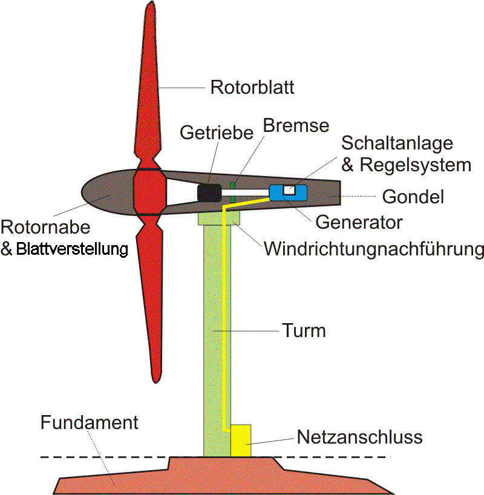

<div class="cell markdown">

Wie beschleunige ich meine Datenanalyse zuhause oder im Cluster
===============================================================

Parallelisierung der Merkmalsberechnung mit python, joblib und dask
-------------------------------------------------------------------

</div>

<div class="cell markdown">

Zuerst initialisieren wir unsere Umgebung mit einigen Paketen. Falls es
zu Fehlern kommt sollten die Pakete auf der Kommandozeile mit pip oder
conda nachinstalliert werden.

</div>

<div class="cell code" execution_count="1">

``` python
import warnings
warnings.filterwarnings("ignore")
import os
import time
from tqdm import tqdm


import sys 
os.environ["PATH"] += os.pathsep + sys.prefix+'/bin'
    
%matplotlib inline
%config InteractiveShell.ast_node_interactivity="last_expr_or_assign"
```

</div>

<div class="cell markdown">

Die folgenden Pfade müssen angepasst werden, sobald die Daten
runtergeladen wurden (&gt;800MB gepackt). Die Daten können unter
<a href="https://bwsyncandshare.kit.edu/s/NzrXCAnTHDWJZRk" class="uri">https://bwsyncandshare.kit.edu/s/NzrXCAnTHDWJZRk</a>
heruntergeladen werden.

</div>

<div class="cell code" execution_count="2">

``` python
TRAIN_LABEL_PATH = "data/train_labels.csv"
TRAIN_PATH = "data/train/"
```

<div class="output execute_result" execution_count="2">

    'data/train/'

</div>

</div>

<div class="cell code" execution_count="59">
</div>

<div class="cell markdown" execution_count="59">

<figure>
    
</figure>

Fig1. wind turbine [1]

References: 

1. [Diagram of a wind turbine](https://upload.wikimedia.org/wikipedia/commons/2/23/Schema_Windenergieanlage.png) drawn by RobbyBer 13 January 2005

</div>

</div>

<div class="cell markdown">

Die Daten sind von verschiedene Windrädern in China bei denen 75
Sensoren alle 10 Minuten aufgezeichnet wurden.

</div>

<div class="cell code" execution_count="3">

``` python
import pandas as pd
data= pd.read_csv("data/train/002/cbd192c9-5e59-3b3c-bae8-20f8ae9f2b36.csv")
```

<div class="output execute_result" execution_count="3">

<div>
<style scoped>
    .dataframe tbody tr th:only-of-type {
        vertical-align: middle;
    }

    .dataframe tbody tr th {
        vertical-align: top;
    }

    .dataframe thead th {
        text-align: right;
    }
</style>
<table border="1" class="dataframe">
  <thead>
    <tr style="text-align: right;">
      <th></th>
      <th>Wheel speed</th>
      <th>hub angle</th>
      <th>blade 1 angle</th>
      <th>blade 2 angle</th>
      <th>blade 3 angle</th>
      <th>pitch motor 1 current</th>
      <th>pitch motor 2 current</th>
      <th>Pitch motor 3 current</th>
      <th>overspeed sensor speed detection value</th>
      <th>5 second yaw against wind average</th>
      <th>...</th>
      <th>blade 3 inverter box temperature</th>
      <th>blade 1 super capacitor voltage</th>
      <th>blade 2 super capacitor voltage</th>
      <th>blade 3 super capacitor voltage</th>
      <th>drive 1 thyristor temperature</th>
      <th>Drive 2 thyristor temperature</th>
      <th>Drive 3 thyristor temperature</th>
      <th>Drive 1 output torque</th>
      <th>Drive 2 output torque</th>
      <th>Drive 3 output torque</th>
    </tr>
  </thead>
  <tbody>
    <tr>
      <th>0</th>
      <td>14.63</td>
      <td>154.01</td>
      <td>0.24</td>
      <td>0.31</td>
      <td>0.22</td>
      <td>12.48</td>
      <td>13.58</td>
      <td>14.00</td>
      <td>14.91</td>
      <td>2.6</td>
      <td>...</td>
      <td>300</td>
      <td>0</td>
      <td>0</td>
      <td>0</td>
      <td>0</td>
      <td>0</td>
      <td>0</td>
      <td>0</td>
      <td>0</td>
      <td>0</td>
    </tr>
    <tr>
      <th>1</th>
      <td>13.74</td>
      <td>312.77</td>
      <td>0.24</td>
      <td>0.31</td>
      <td>0.22</td>
      <td>11.36</td>
      <td>11.14</td>
      <td>13.06</td>
      <td>13.95</td>
      <td>8.7</td>
      <td>...</td>
      <td>300</td>
      <td>0</td>
      <td>0</td>
      <td>0</td>
      <td>0</td>
      <td>0</td>
      <td>0</td>
      <td>0</td>
      <td>0</td>
      <td>0</td>
    </tr>
    <tr>
      <th>2</th>
      <td>13.55</td>
      <td>73.76</td>
      <td>0.24</td>
      <td>0.31</td>
      <td>0.22</td>
      <td>11.74</td>
      <td>11.90</td>
      <td>14.64</td>
      <td>13.81</td>
      <td>5.4</td>
      <td>...</td>
      <td>300</td>
      <td>0</td>
      <td>0</td>
      <td>0</td>
      <td>0</td>
      <td>0</td>
      <td>0</td>
      <td>0</td>
      <td>0</td>
      <td>0</td>
    </tr>
    <tr>
      <th>3</th>
      <td>12.21</td>
      <td>132.26</td>
      <td>0.24</td>
      <td>0.31</td>
      <td>0.22</td>
      <td>10.08</td>
      <td>10.30</td>
      <td>12.20</td>
      <td>12.47</td>
      <td>-7.1</td>
      <td>...</td>
      <td>300</td>
      <td>0</td>
      <td>0</td>
      <td>0</td>
      <td>0</td>
      <td>0</td>
      <td>0</td>
      <td>0</td>
      <td>0</td>
      <td>0</td>
    </tr>
    <tr>
      <th>4</th>
      <td>12.91</td>
      <td>239.51</td>
      <td>0.24</td>
      <td>0.31</td>
      <td>0.22</td>
      <td>10.90</td>
      <td>11.84</td>
      <td>13.04</td>
      <td>13.16</td>
      <td>1.2</td>
      <td>...</td>
      <td>300</td>
      <td>0</td>
      <td>0</td>
      <td>0</td>
      <td>0</td>
      <td>0</td>
      <td>0</td>
      <td>0</td>
      <td>0</td>
      <td>0</td>
    </tr>
    <tr>
      <th>...</th>
      <td>...</td>
      <td>...</td>
      <td>...</td>
      <td>...</td>
      <td>...</td>
      <td>...</td>
      <td>...</td>
      <td>...</td>
      <td>...</td>
      <td>...</td>
      <td>...</td>
      <td>...</td>
      <td>...</td>
      <td>...</td>
      <td>...</td>
      <td>...</td>
      <td>...</td>
      <td>...</td>
      <td>...</td>
      <td>...</td>
      <td>...</td>
    </tr>
    <tr>
      <th>445</th>
      <td>11.37</td>
      <td>93.24</td>
      <td>0.24</td>
      <td>0.31</td>
      <td>0.22</td>
      <td>10.10</td>
      <td>8.84</td>
      <td>11.28</td>
      <td>11.62</td>
      <td>-27.1</td>
      <td>...</td>
      <td>300</td>
      <td>0</td>
      <td>0</td>
      <td>0</td>
      <td>0</td>
      <td>0</td>
      <td>0</td>
      <td>0</td>
      <td>0</td>
      <td>0</td>
    </tr>
    <tr>
      <th>446</th>
      <td>14.37</td>
      <td>194.51</td>
      <td>0.24</td>
      <td>0.31</td>
      <td>0.22</td>
      <td>12.20</td>
      <td>13.46</td>
      <td>14.64</td>
      <td>14.65</td>
      <td>1.6</td>
      <td>...</td>
      <td>300</td>
      <td>0</td>
      <td>0</td>
      <td>0</td>
      <td>0</td>
      <td>0</td>
      <td>0</td>
      <td>0</td>
      <td>0</td>
      <td>0</td>
    </tr>
    <tr>
      <th>447</th>
      <td>12.31</td>
      <td>82.76</td>
      <td>0.24</td>
      <td>0.31</td>
      <td>0.22</td>
      <td>10.00</td>
      <td>10.10</td>
      <td>12.02</td>
      <td>12.60</td>
      <td>-1.5</td>
      <td>...</td>
      <td>300</td>
      <td>0</td>
      <td>0</td>
      <td>0</td>
      <td>0</td>
      <td>0</td>
      <td>0</td>
      <td>0</td>
      <td>0</td>
      <td>0</td>
    </tr>
    <tr>
      <th>448</th>
      <td>12.24</td>
      <td>183.49</td>
      <td>0.24</td>
      <td>0.31</td>
      <td>0.22</td>
      <td>9.48</td>
      <td>10.30</td>
      <td>11.56</td>
      <td>12.50</td>
      <td>2.3</td>
      <td>...</td>
      <td>300</td>
      <td>0</td>
      <td>0</td>
      <td>0</td>
      <td>0</td>
      <td>0</td>
      <td>0</td>
      <td>0</td>
      <td>0</td>
      <td>0</td>
    </tr>
    <tr>
      <th>449</th>
      <td>12.89</td>
      <td>340.74</td>
      <td>0.24</td>
      <td>0.31</td>
      <td>0.22</td>
      <td>10.30</td>
      <td>9.80</td>
      <td>11.50</td>
      <td>13.14</td>
      <td>-7.7</td>
      <td>...</td>
      <td>300</td>
      <td>0</td>
      <td>0</td>
      <td>0</td>
      <td>0</td>
      <td>0</td>
      <td>0</td>
      <td>0</td>
      <td>0</td>
      <td>0</td>
    </tr>
  </tbody>
</table>
<p>450 rows × 75 columns</p>
</div>

         Wheel speed  hub angle  blade 1 angle  blade 2 angle  blade 3 angle  \
    0          14.63     154.01           0.24           0.31           0.22   
    1          13.74     312.77           0.24           0.31           0.22   
    2          13.55      73.76           0.24           0.31           0.22   
    3          12.21     132.26           0.24           0.31           0.22   
    4          12.91     239.51           0.24           0.31           0.22   
    ..           ...        ...            ...            ...            ...   
    445        11.37      93.24           0.24           0.31           0.22   
    446        14.37     194.51           0.24           0.31           0.22   
    447        12.31      82.76           0.24           0.31           0.22   
    448        12.24     183.49           0.24           0.31           0.22   
    449        12.89     340.74           0.24           0.31           0.22   

         pitch motor 1 current  pitch motor 2 current  Pitch motor 3 current  \
    0                    12.48                  13.58                  14.00   
    1                    11.36                  11.14                  13.06   
    2                    11.74                  11.90                  14.64   
    3                    10.08                  10.30                  12.20   
    4                    10.90                  11.84                  13.04   
    ..                     ...                    ...                    ...   
    445                  10.10                   8.84                  11.28   
    446                  12.20                  13.46                  14.64   
    447                  10.00                  10.10                  12.02   
    448                   9.48                  10.30                  11.56   
    449                  10.30                   9.80                  11.50   

         overspeed sensor speed detection value  \
    0                                     14.91   
    1                                     13.95   
    2                                     13.81   
    3                                     12.47   
    4                                     13.16   
    ..                                      ...   
    445                                   11.62   
    446                                   14.65   
    447                                   12.60   
    448                                   12.50   
    449                                   13.14   

         5 second yaw against wind average  ...  blade 3 inverter box temperature  \
    0                                  2.6  ...                               300   
    1                                  8.7  ...                               300   
    2                                  5.4  ...                               300   
    3                                 -7.1  ...                               300   
    4                                  1.2  ...                               300   
    ..                                 ...  ...                               ...   
    445                              -27.1  ...                               300   
    446                                1.6  ...                               300   
    447                               -1.5  ...                               300   
    448                                2.3  ...                               300   
    449                               -7.7  ...                               300   

         blade 1 super capacitor voltage  blade 2 super capacitor voltage  \
    0                                  0                                0   
    1                                  0                                0   
    2                                  0                                0   
    3                                  0                                0   
    4                                  0                                0   
    ..                               ...                              ...   
    445                                0                                0   
    446                                0                                0   
    447                                0                                0   
    448                                0                                0   
    449                                0                                0   

         blade 3 super capacitor voltage  drive 1 thyristor temperature  \
    0                                  0                              0   
    1                                  0                              0   
    2                                  0                              0   
    3                                  0                              0   
    4                                  0                              0   
    ..                               ...                            ...   
    445                                0                              0   
    446                                0                              0   
    447                                0                              0   
    448                                0                              0   
    449                                0                              0   

         Drive 2 thyristor temperature  Drive 3 thyristor temperature  \
    0                                0                              0   
    1                                0                              0   
    2                                0                              0   
    3                                0                              0   
    4                                0                              0   
    ..                             ...                            ...   
    445                              0                              0   
    446                              0                              0   
    447                              0                              0   
    448                              0                              0   
    449                              0                              0   

         Drive 1 output torque  Drive 2 output torque  Drive 3 output torque  
    0                        0                      0                      0  
    1                        0                      0                      0  
    2                        0                      0                      0  
    3                        0                      0                      0  
    4                        0                      0                      0  
    ..                     ...                    ...                    ...  
    445                      0                      0                      0  
    446                      0                      0                      0  
    447                      0                      0                      0  
    448                      0                      0                      0  
    449                      0                      0                      0  

    [450 rows x 75 columns]

</div>

</div>

<div class="cell markdown">

Soviele Minuten umfasst die Datei:

</div>

<div class="cell code" execution_count="4">

``` python
data.shape[0]*10
```

<div class="output execute_result" execution_count="4">

    4500

</div>

</div>

<div class="cell markdown">

Die Spalten sind Zeitreihen

</div>

<div class="cell code" execution_count="5">

``` python
data["Wheel speed"].plot()
```

<div class="output execute_result" execution_count="5">

    <AxesSubplot:>

</div>

<div class="output display_data">


    <Figure size 432x288 with 1 Axes>

</div>

</div>

<div class="cell markdown">

Zu jeder multidimensionalen Zeitreihe gehört ein Label: 1 wenn das
Windrad danach einen Defekt hatte, ansonsten 0. Die Herausforderung wird
es sein den Defekt anhand der Zeitreihe vorherzusagen.

</div>

<div class="cell code" execution_count="6">

``` python
label=pd.read_csv(TRAIN_LABEL_PATH)
```

<div class="output execute_result" execution_count="6">

<div>
<style scoped>
    .dataframe tbody tr th:only-of-type {
        vertical-align: middle;
    }

    .dataframe tbody tr th {
        vertical-align: top;
    }

    .dataframe thead th {
        text-align: right;
    }
</style>
<table border="1" class="dataframe">
  <thead>
    <tr style="text-align: right;">
      <th></th>
      <th>f_id</th>
      <th>file_name</th>
      <th>ret</th>
    </tr>
  </thead>
  <tbody>
    <tr>
      <th>0</th>
      <td>95</td>
      <td>dba63ee5-6603-300e-8071-8536afcbc2de.csv</td>
      <td>0</td>
    </tr>
    <tr>
      <th>1</th>
      <td>95</td>
      <td>0b8bfa51-cf28-35d0-94d2-7922f45120b2.csv</td>
      <td>0</td>
    </tr>
    <tr>
      <th>2</th>
      <td>95</td>
      <td>d7a64eee-165e-3d39-be67-adc82050bde3.csv</td>
      <td>0</td>
    </tr>
    <tr>
      <th>3</th>
      <td>95</td>
      <td>4da3314d-c5b0-3782-bdd6-27fb9e251261.csv</td>
      <td>0</td>
    </tr>
    <tr>
      <th>4</th>
      <td>95</td>
      <td>7d58a65f-af5a-3433-bcbb-a342b9468b71.csv</td>
      <td>0</td>
    </tr>
    <tr>
      <th>...</th>
      <td>...</td>
      <td>...</td>
      <td>...</td>
    </tr>
    <tr>
      <th>48334</th>
      <td>11</td>
      <td>d6e19de9-22a8-39e6-98c1-cc599c819a56.csv</td>
      <td>1</td>
    </tr>
    <tr>
      <th>48335</th>
      <td>11</td>
      <td>83895667-dc4e-303a-90e7-7dfc0725f476.csv</td>
      <td>1</td>
    </tr>
    <tr>
      <th>48336</th>
      <td>11</td>
      <td>a6ab9f83-4bea-323f-b08e-4a9fb4eab8d6.csv</td>
      <td>1</td>
    </tr>
    <tr>
      <th>48337</th>
      <td>11</td>
      <td>a19af894-a9c8-3127-87e4-39567f0a9e0c.csv</td>
      <td>1</td>
    </tr>
    <tr>
      <th>48338</th>
      <td>11</td>
      <td>861ce6ba-f676-3ea6-bfbb-16dfda24ac1a.csv</td>
      <td>1</td>
    </tr>
  </tbody>
</table>
<p>48339 rows × 3 columns</p>
</div>

           f_id                                 file_name  ret
    0        95  dba63ee5-6603-300e-8071-8536afcbc2de.csv    0
    1        95  0b8bfa51-cf28-35d0-94d2-7922f45120b2.csv    0
    2        95  d7a64eee-165e-3d39-be67-adc82050bde3.csv    0
    3        95  4da3314d-c5b0-3782-bdd6-27fb9e251261.csv    0
    4        95  7d58a65f-af5a-3433-bcbb-a342b9468b71.csv    0
    ...     ...                                       ...  ...
    48334    11  d6e19de9-22a8-39e6-98c1-cc599c819a56.csv    1
    48335    11  83895667-dc4e-303a-90e7-7dfc0725f476.csv    1
    48336    11  a6ab9f83-4bea-323f-b08e-4a9fb4eab8d6.csv    1
    48337    11  a19af894-a9c8-3127-87e4-39567f0a9e0c.csv    1
    48338    11  861ce6ba-f676-3ea6-bfbb-16dfda24ac1a.csv    1

    [48339 rows x 3 columns]

</div>

</div>

<div class="cell markdown">

Die Label sind bereits balanciert, was das Vorhersageproblem später
einfacher macht.

</div>

<div class="cell code" execution_count="7">

``` python
label["ret"].hist()
```

<div class="output execute_result" execution_count="7">

    <AxesSubplot:>

</div>

<div class="output display_data">


    <Figure size 432x288 with 1 Axes>

</div>

</div>

<div class="cell markdown">

Um eine einfache Klassifikation auf das Label zu machen können Merkmale
auf den Zeitreihen berechnet werden um kritische Ausprägungen mit einen
Klassifikationsalgorithmus zu lernen. Das Schweizer Taschenmesser der
Merkmalsextraktion ist
<a href="https://github.com/blue-yonder/tsfresh" class="uri">https://github.com/blue-yonder/tsfresh</a>
der Karlsruher Firma BlueYonder

</div>

<div class="cell code" execution_count="8">

``` python
%%timeit -r1 -n1 -o
import tsfresh
data["id"]="a"
tsfresh.extract_features(data,n_jobs=1,column_id="id")
```

<div class="output stream stderr">

    Feature Extraction: 100%|██████████| 5/5 [00:19<00:00,  4.00s/it]

</div>

<div class="output stream stdout">

    29.4 s ± 0 ns per loop (mean ± std. dev. of 1 run, 1 loop each)

</div>

<div class="output execute_result" execution_count="8">

    <TimeitResult : 29.4 s ± 0 ns per loop (mean ± std. dev. of 1 run, 1 loop each)>

</div>

</div>

<div class="cell markdown">

Wenn man nun alle Dateien auf einer CPU Laden will so dauert das dann
ca. so viele Stunden:

</div>

<div class="cell code" execution_count="9">

``` python
label.shape[0]*_.average/60/60
```

<div class="output execute_result" execution_count="9">

    394.79091108894903

</div>

</div>

<div class="cell markdown">

Zum Glück unterstützt tsfresh bereits Parallelisierung:Probieren Sie
verschiedene Werte für n\_jobs aus. Sie werden merken, dass die
Parallelisierung nicht ganz linear skaliert

</div>

<div class="cell markdown">

Um die Liste aller Dateien zu bekommen, müssen wir übrigens noch den
Pfad dran hängen und den Ordner dreistellig kodieren.

</div>

<div class="cell code" execution_count="10">

``` python
files=label.apply(lambda row: os.path.abspath(TRAIN_PATH+"{:03d}/{}".format(row["f_id"],row["file_name"])),axis=1)
```

<div class="output execute_result" execution_count="10">

    0        /gpfs/smartdata/iu5681/src/Parallel_computing/...
    1        /gpfs/smartdata/iu5681/src/Parallel_computing/...
    2        /gpfs/smartdata/iu5681/src/Parallel_computing/...
    3        /gpfs/smartdata/iu5681/src/Parallel_computing/...
    4        /gpfs/smartdata/iu5681/src/Parallel_computing/...
                                   ...                        
    48334    /gpfs/smartdata/iu5681/src/Parallel_computing/...
    48335    /gpfs/smartdata/iu5681/src/Parallel_computing/...
    48336    /gpfs/smartdata/iu5681/src/Parallel_computing/...
    48337    /gpfs/smartdata/iu5681/src/Parallel_computing/...
    48338    /gpfs/smartdata/iu5681/src/Parallel_computing/...
    Length: 48339, dtype: object

</div>

</div>

<div class="cell markdown">

Die Daten einfach alle in den Speicher zu laden funktioniert übrigens
auch nicht. Insgesamt sprechen wir über soviele Gigabyte:

</div>

<div class="cell code" execution_count="11">

``` python
from pathlib import Path
sum(Path(f).stat().st_size  for f in files) /(1024**3)
```

<div class="output execute_result" execution_count="11">

    6.261525361798704

</div>

</div>

<div class="cell markdown">

Nun kopieren wir die Teile von oben in eine Funktion um sie auf alle
Dateien anzuwenden

</div>

<div class="cell code" execution_count="12">

``` python
def get_features(file):
    data= pd.read_csv(file)
    data["id"]=file
    return tsfresh.extract_features(data,disable_progressbar=True, n_jobs=1,column_id="id")
```

</div>

<div class="cell markdown">

Damit es schneller geht können wir ein paar einfachere Features
verwenden

</div>

<div class="cell code" execution_count="13">

``` python
def get_features(file):
    data= pd.read_csv(file)
    data["path"]=file
    return data.groupby("path").agg(["mean","var","min","max"])
```

</div>

<div class="cell markdown">

Wir iterieren hierzu über alle Files und stecken Sie in einen Dataframe
(zu Demozwecken nur die ersten 100). tqdm ist für die Statusanzeige
zuständig

</div>

<div class="cell code" execution_count="14">

``` python
%%time
features=pd.concat(get_features(f) for f in tqdm(files[0:100]))
```

<div class="output stream stderr">

    100%|██████████| 100/100 [00:25<00:00,  3.95it/s]

</div>

<div class="output stream stdout">

    CPU times: user 25.7 s, sys: 83.7 ms, total: 25.8 s
    Wall time: 26.4 s

</div>

</div>

<div class="cell markdown">

Python unterstützt von Haus aus nur einen Prozessor. Hier nutzen wir
also nicht unseren Prozesser aus. Hierzu gibt es die joblib. Mit delayed
werden die Berechnungen asyncron gestartet. Wenn man mehrere
Prozessorkerne hat wird man durch die Erhöhung von n\_jobs wie schon
oben eine leichte Beschleunigung feststellen (Engpass ist meist die
Festplatte).

</div>

<div class="cell code" execution_count="15">

``` python
%%time
from joblib import Parallel, delayed
features=pd.concat(Parallel(n_jobs=4)(delayed(get_features)(f) for f in tqdm(files[0:100])))
```

<div class="output stream stderr">

    100%|██████████| 100/100 [00:07<00:00, 13.34it/s]

</div>

<div class="output stream stdout">

    CPU times: user 7.12 s, sys: 264 ms, total: 7.39 s
    Wall time: 9.18 s

</div>

</div>

<div class="cell markdown">

Limitierend sind hier auch die CPUs und der RAM in einem Rechner. Sehr
große Rechner sind meist extrem teuer. Billiger geht es im Cluster.
(HTCondor)\[<a href="https://research.cs.wisc.edu/htcondor/" class="uri">https://research.cs.wisc.edu/htcondor/</a>\]
ist ein Clusterscheduler der von der Python Bibliothek
(dask)\[<a href="https://dask.org/" class="uri">https://dask.org/</a>\]
für verteiltes Rechnen unterstützt wird. Damit wird die Erstellung eines
eigenen Clusters in einem Hochleistungs-Cluster einfach. Aber man kann
hier auch viele Rechner im Firmennetzwerk zusammenschalten. (Geht auch
über Kubernetes oder Yarn in der Cloud). Wir holen uns nun ein paar
Rechner mit 8 Prozessorkernen und je 32GB RAM und ner kleinen Festplatte
(wir wollen die Daten nur in den Speicher laden).

</div>

<div class="cell code" execution_count="16">

``` python
import dask.dataframe as dd
from dask_jobqueue import HTCondorCluster
from distributed import Client
from dask.distributed import progress


os.environ["_condor_SCHEDD_HOST"]="login-l.sdil.kit.edu"
cluster= HTCondorCluster(cores=8, memory= "32GB", disk="400MB")
client=Client(cluster)
cluster
```

<div class="output display_data">

``` json
{"model_id":"14b0f68e1e134a8894544204f6ab27a4","version_major":2,"version_minor":0}
```

    VBox(children=(HTML(value='<h2>HTCondorCluster</h2>'), HBox(children=(HTML(value='\n<div>\n  <style scoped>\n …

</div>

</div>

<div class="cell markdown">

Diese Konfiguration können wir nun in unserem Fall beliebig
hochskalieren.

</div>

<div class="cell code" execution_count="17">

``` python
cluster.scale(160)
```

</div>

<div class="cell markdown">

Unser Beispiel von oben lässt sich trivial beschleunigen. Wenn sie das
Pythonpaket bokeh installiert haben können sie auf dem Dashboard (link
oben) sehen wie die Funktion parallel auf dem Cluster ausgeführt wird.
(Die Statusbar ist hier unsinnig, da alle jobs parallel in den Cluster
geschickt werden)

</div>

<div class="cell code" execution_count="18">

``` python
%%time
from joblib import parallel_backend
with parallel_backend('dask'):
    features=pd.concat(Parallel()(delayed(get_features)(f) for f in tqdm(files[0:100])))
```

<div class="output stream stderr">

    100%|██████████| 100/100 [00:08<00:00, 11.55it/s]

</div>

<div class="output stream stdout">

    CPU times: user 6.8 s, sys: 306 ms, total: 7.1 s
    Wall time: 11.6 s

</div>

</div>

<div class="cell markdown">

Es geht aber noch einfacher. Die Idee von Big Data ist es das
Berechnungsgraphen auf großen verteilten Datenquellen ausgeführt werden.

</div>

<div class="cell code" execution_count="19">

``` python
ddf=dd.read_csv(TRAIN_PATH+"006/02*.csv",include_path_column=True)
```

<div class="output execute_result" execution_count="19">

<div><strong>Dask DataFrame Structure:</strong></div>
<div>
<style scoped>
    .dataframe tbody tr th:only-of-type {
        vertical-align: middle;
    }

    .dataframe tbody tr th {
        vertical-align: top;
    }

    .dataframe thead th {
        text-align: right;
    }
</style>
<table border="1" class="dataframe">
  <thead>
    <tr style="text-align: right;">
      <th></th>
      <th>Wheel speed</th>
      <th>hub angle</th>
      <th>blade 1 angle</th>
      <th>blade 2 angle</th>
      <th>blade 3 angle</th>
      <th>pitch motor 1 current</th>
      <th>pitch motor 2 current</th>
      <th>Pitch motor 3 current</th>
      <th>overspeed sensor speed detection value</th>
      <th>5 second yaw against wind average</th>
      <th>x direction vibration value</th>
      <th>y direction vibration value</th>
      <th>hydraulic brake pressure</th>
      <th>Aircraft weather station wind speed</th>
      <th>wind direction absolute value</th>
      <th>atmospheric pressure</th>
      <th>reactive power control status</th>
      <th>inverter grid side current</th>
      <th>inverter grid side voltage</th>
      <th>Inverter grid side active power</th>
      <th>inverter grid side reactive power</th>
      <th>inverter generator side power</th>
      <th>generator operating frequency</th>
      <th>generator current</th>
      <th>generator torque</th>
      <th>Inverter inlet temperature</th>
      <th>inverter outlet temperature</th>
      <th>inverter inlet pressure</th>
      <th>inverter outlet pressure</th>
      <th>generator power limit value</th>
      <th>reactive power set value</th>
      <th>Rated hub speed</th>
      <th>wind tower ambient temperature</th>
      <th>generator stator temperature 1</th>
      <th>generator stator temperature 2</th>
      <th>generator stator temperature 3</th>
      <th>generator stator temperature 4</th>
      <th>Generator stator temperature 5</th>
      <th>generator stator temperature 6</th>
      <th>generator air temperature 1</th>
      <th>generator air temperature 2</th>
      <th>main bearing temperature 1</th>
      <th>main bearing temperature 2</th>
      <th>Wheel temperature</th>
      <th>Wheel control cabinet temperature</th>
      <th>Cabin temperature</th>
      <th>Cabin control cabinet temperature</th>
      <th>Inverter INU temperature</th>
      <th>Inverter ISU temperature</th>
      <th>Inverter INU RMIO temperature</th>
      <th>Pitch motor 1 power estimation</th>
      <th>Pitch motor 2 power estimation</th>
      <th>Pitch motor 3 power estimation</th>
      <th>Fan current status value</th>
      <th>hub current status value</th>
      <th>yaw state value</th>
      <th>yaw request value</th>
      <th>blade 1 battery box temperature</th>
      <th>blade 2 battery box temperature</th>
      <th>blade 3 battery box temperature</th>
      <th>vane 1 pitch motor temperature</th>
      <th>blade 2 pitch motor temperature</th>
      <th>blade 3 pitch motor temperature</th>
      <th>blade 1 inverter box temperature</th>
      <th>blade 2 inverter box temperature</th>
      <th>blade 3 inverter box temperature</th>
      <th>blade 1 super capacitor voltage</th>
      <th>blade 2 super capacitor voltage</th>
      <th>blade 3 super capacitor voltage</th>
      <th>drive 1 thyristor temperature</th>
      <th>Drive 2 thyristor temperature</th>
      <th>Drive 3 thyristor temperature</th>
      <th>Drive 1 output torque</th>
      <th>Drive 2 output torque</th>
      <th>Drive 3 output torque</th>
      <th>path</th>
    </tr>
    <tr>
      <th>npartitions=9</th>
      <th></th>
      <th></th>
      <th></th>
      <th></th>
      <th></th>
      <th></th>
      <th></th>
      <th></th>
      <th></th>
      <th></th>
      <th></th>
      <th></th>
      <th></th>
      <th></th>
      <th></th>
      <th></th>
      <th></th>
      <th></th>
      <th></th>
      <th></th>
      <th></th>
      <th></th>
      <th></th>
      <th></th>
      <th></th>
      <th></th>
      <th></th>
      <th></th>
      <th></th>
      <th></th>
      <th></th>
      <th></th>
      <th></th>
      <th></th>
      <th></th>
      <th></th>
      <th></th>
      <th></th>
      <th></th>
      <th></th>
      <th></th>
      <th></th>
      <th></th>
      <th></th>
      <th></th>
      <th></th>
      <th></th>
      <th></th>
      <th></th>
      <th></th>
      <th></th>
      <th></th>
      <th></th>
      <th></th>
      <th></th>
      <th></th>
      <th></th>
      <th></th>
      <th></th>
      <th></th>
      <th></th>
      <th></th>
      <th></th>
      <th></th>
      <th></th>
      <th></th>
      <th></th>
      <th></th>
      <th></th>
      <th></th>
      <th></th>
      <th></th>
      <th></th>
      <th></th>
      <th></th>
      <th></th>
    </tr>
  </thead>
  <tbody>
    <tr>
      <th></th>
      <td>float64</td>
      <td>float64</td>
      <td>float64</td>
      <td>float64</td>
      <td>float64</td>
      <td>float64</td>
      <td>float64</td>
      <td>float64</td>
      <td>float64</td>
      <td>float64</td>
      <td>float64</td>
      <td>float64</td>
      <td>float64</td>
      <td>float64</td>
      <td>float64</td>
      <td>float64</td>
      <td>float64</td>
      <td>float64</td>
      <td>float64</td>
      <td>float64</td>
      <td>float64</td>
      <td>float64</td>
      <td>float64</td>
      <td>float64</td>
      <td>float64</td>
      <td>float64</td>
      <td>float64</td>
      <td>float64</td>
      <td>float64</td>
      <td>float64</td>
      <td>float64</td>
      <td>float64</td>
      <td>float64</td>
      <td>float64</td>
      <td>float64</td>
      <td>float64</td>
      <td>float64</td>
      <td>float64</td>
      <td>float64</td>
      <td>float64</td>
      <td>float64</td>
      <td>float64</td>
      <td>float64</td>
      <td>float64</td>
      <td>float64</td>
      <td>float64</td>
      <td>float64</td>
      <td>float64</td>
      <td>float64</td>
      <td>float64</td>
      <td>float64</td>
      <td>float64</td>
      <td>float64</td>
      <td>float64</td>
      <td>float64</td>
      <td>float64</td>
      <td>float64</td>
      <td>float64</td>
      <td>float64</td>
      <td>float64</td>
      <td>float64</td>
      <td>float64</td>
      <td>float64</td>
      <td>float64</td>
      <td>float64</td>
      <td>float64</td>
      <td>float64</td>
      <td>float64</td>
      <td>float64</td>
      <td>float64</td>
      <td>float64</td>
      <td>float64</td>
      <td>float64</td>
      <td>float64</td>
      <td>float64</td>
      <td>category[known]</td>
    </tr>
    <tr>
      <th></th>
      <td>...</td>
      <td>...</td>
      <td>...</td>
      <td>...</td>
      <td>...</td>
      <td>...</td>
      <td>...</td>
      <td>...</td>
      <td>...</td>
      <td>...</td>
      <td>...</td>
      <td>...</td>
      <td>...</td>
      <td>...</td>
      <td>...</td>
      <td>...</td>
      <td>...</td>
      <td>...</td>
      <td>...</td>
      <td>...</td>
      <td>...</td>
      <td>...</td>
      <td>...</td>
      <td>...</td>
      <td>...</td>
      <td>...</td>
      <td>...</td>
      <td>...</td>
      <td>...</td>
      <td>...</td>
      <td>...</td>
      <td>...</td>
      <td>...</td>
      <td>...</td>
      <td>...</td>
      <td>...</td>
      <td>...</td>
      <td>...</td>
      <td>...</td>
      <td>...</td>
      <td>...</td>
      <td>...</td>
      <td>...</td>
      <td>...</td>
      <td>...</td>
      <td>...</td>
      <td>...</td>
      <td>...</td>
      <td>...</td>
      <td>...</td>
      <td>...</td>
      <td>...</td>
      <td>...</td>
      <td>...</td>
      <td>...</td>
      <td>...</td>
      <td>...</td>
      <td>...</td>
      <td>...</td>
      <td>...</td>
      <td>...</td>
      <td>...</td>
      <td>...</td>
      <td>...</td>
      <td>...</td>
      <td>...</td>
      <td>...</td>
      <td>...</td>
      <td>...</td>
      <td>...</td>
      <td>...</td>
      <td>...</td>
      <td>...</td>
      <td>...</td>
      <td>...</td>
      <td>...</td>
    </tr>
    <tr>
      <th>...</th>
      <td>...</td>
      <td>...</td>
      <td>...</td>
      <td>...</td>
      <td>...</td>
      <td>...</td>
      <td>...</td>
      <td>...</td>
      <td>...</td>
      <td>...</td>
      <td>...</td>
      <td>...</td>
      <td>...</td>
      <td>...</td>
      <td>...</td>
      <td>...</td>
      <td>...</td>
      <td>...</td>
      <td>...</td>
      <td>...</td>
      <td>...</td>
      <td>...</td>
      <td>...</td>
      <td>...</td>
      <td>...</td>
      <td>...</td>
      <td>...</td>
      <td>...</td>
      <td>...</td>
      <td>...</td>
      <td>...</td>
      <td>...</td>
      <td>...</td>
      <td>...</td>
      <td>...</td>
      <td>...</td>
      <td>...</td>
      <td>...</td>
      <td>...</td>
      <td>...</td>
      <td>...</td>
      <td>...</td>
      <td>...</td>
      <td>...</td>
      <td>...</td>
      <td>...</td>
      <td>...</td>
      <td>...</td>
      <td>...</td>
      <td>...</td>
      <td>...</td>
      <td>...</td>
      <td>...</td>
      <td>...</td>
      <td>...</td>
      <td>...</td>
      <td>...</td>
      <td>...</td>
      <td>...</td>
      <td>...</td>
      <td>...</td>
      <td>...</td>
      <td>...</td>
      <td>...</td>
      <td>...</td>
      <td>...</td>
      <td>...</td>
      <td>...</td>
      <td>...</td>
      <td>...</td>
      <td>...</td>
      <td>...</td>
      <td>...</td>
      <td>...</td>
      <td>...</td>
      <td>...</td>
    </tr>
    <tr>
      <th></th>
      <td>...</td>
      <td>...</td>
      <td>...</td>
      <td>...</td>
      <td>...</td>
      <td>...</td>
      <td>...</td>
      <td>...</td>
      <td>...</td>
      <td>...</td>
      <td>...</td>
      <td>...</td>
      <td>...</td>
      <td>...</td>
      <td>...</td>
      <td>...</td>
      <td>...</td>
      <td>...</td>
      <td>...</td>
      <td>...</td>
      <td>...</td>
      <td>...</td>
      <td>...</td>
      <td>...</td>
      <td>...</td>
      <td>...</td>
      <td>...</td>
      <td>...</td>
      <td>...</td>
      <td>...</td>
      <td>...</td>
      <td>...</td>
      <td>...</td>
      <td>...</td>
      <td>...</td>
      <td>...</td>
      <td>...</td>
      <td>...</td>
      <td>...</td>
      <td>...</td>
      <td>...</td>
      <td>...</td>
      <td>...</td>
      <td>...</td>
      <td>...</td>
      <td>...</td>
      <td>...</td>
      <td>...</td>
      <td>...</td>
      <td>...</td>
      <td>...</td>
      <td>...</td>
      <td>...</td>
      <td>...</td>
      <td>...</td>
      <td>...</td>
      <td>...</td>
      <td>...</td>
      <td>...</td>
      <td>...</td>
      <td>...</td>
      <td>...</td>
      <td>...</td>
      <td>...</td>
      <td>...</td>
      <td>...</td>
      <td>...</td>
      <td>...</td>
      <td>...</td>
      <td>...</td>
      <td>...</td>
      <td>...</td>
      <td>...</td>
      <td>...</td>
      <td>...</td>
      <td>...</td>
    </tr>
    <tr>
      <th></th>
      <td>...</td>
      <td>...</td>
      <td>...</td>
      <td>...</td>
      <td>...</td>
      <td>...</td>
      <td>...</td>
      <td>...</td>
      <td>...</td>
      <td>...</td>
      <td>...</td>
      <td>...</td>
      <td>...</td>
      <td>...</td>
      <td>...</td>
      <td>...</td>
      <td>...</td>
      <td>...</td>
      <td>...</td>
      <td>...</td>
      <td>...</td>
      <td>...</td>
      <td>...</td>
      <td>...</td>
      <td>...</td>
      <td>...</td>
      <td>...</td>
      <td>...</td>
      <td>...</td>
      <td>...</td>
      <td>...</td>
      <td>...</td>
      <td>...</td>
      <td>...</td>
      <td>...</td>
      <td>...</td>
      <td>...</td>
      <td>...</td>
      <td>...</td>
      <td>...</td>
      <td>...</td>
      <td>...</td>
      <td>...</td>
      <td>...</td>
      <td>...</td>
      <td>...</td>
      <td>...</td>
      <td>...</td>
      <td>...</td>
      <td>...</td>
      <td>...</td>
      <td>...</td>
      <td>...</td>
      <td>...</td>
      <td>...</td>
      <td>...</td>
      <td>...</td>
      <td>...</td>
      <td>...</td>
      <td>...</td>
      <td>...</td>
      <td>...</td>
      <td>...</td>
      <td>...</td>
      <td>...</td>
      <td>...</td>
      <td>...</td>
      <td>...</td>
      <td>...</td>
      <td>...</td>
      <td>...</td>
      <td>...</td>
      <td>...</td>
      <td>...</td>
      <td>...</td>
      <td>...</td>
    </tr>
  </tbody>
</table>
</div>
<div>Dask Name: read-csv, 9 tasks</div>

    Dask DataFrame Structure:
                  Wheel speed hub angle blade 1 angle blade 2 angle blade 3 angle pitch motor 1 current pitch motor 2 current Pitch motor 3 current overspeed sensor speed detection value 5 second yaw against wind average x direction vibration value y direction vibration value hydraulic brake pressure Aircraft weather station wind speed wind direction absolute value atmospheric pressure reactive power control status inverter grid side current inverter grid side voltage Inverter grid side active power inverter grid side reactive power inverter generator side power generator operating frequency generator current generator torque Inverter inlet temperature inverter outlet temperature inverter inlet pressure inverter outlet pressure generator power limit value reactive power set value Rated hub speed wind tower ambient temperature generator stator temperature 1 generator stator temperature 2 generator stator temperature 3 generator stator temperature 4 Generator stator temperature 5 generator stator temperature 6 generator air temperature 1 generator air temperature 2 main bearing temperature 1 main bearing temperature 2 Wheel temperature Wheel control cabinet temperature Cabin temperature Cabin control cabinet temperature Inverter INU temperature Inverter ISU temperature Inverter INU RMIO temperature Pitch motor 1 power estimation Pitch motor 2 power estimation Pitch motor 3 power estimation Fan current status value hub current status value yaw state value yaw request value blade 1 battery box temperature blade 2 battery box temperature blade 3 battery box temperature vane 1 pitch motor temperature blade 2 pitch motor temperature blade 3 pitch motor temperature blade 1 inverter box temperature blade 2 inverter box temperature blade 3 inverter box temperature blade 1 super capacitor voltage blade 2 super capacitor voltage blade 3 super capacitor voltage drive 1 thyristor temperature Drive 2 thyristor temperature Drive 3 thyristor temperature Drive 1 output torque Drive 2 output torque Drive 3 output torque             path
    npartitions=9                                                                                                                                                                                                                                                                                                                                                                                                                                                                                                                                                                                                                                                                                                                                                                                                                                                                                                                                                                                                                                                                                                                                                                                                                                                                                                                                                                                                                                                                                                                                                                                                                                                                                                                                                                                                                                                                                                                                                                                                                                                                                                                    
                      float64   float64       float64       float64       float64               float64               float64               float64                                float64                           float64                     float64                     float64                  float64                             float64                       float64              float64                       float64                    float64                    float64                         float64                           float64                       float64                       float64           float64          float64                    float64                     float64                 float64                  float64                     float64                  float64         float64                        float64                        float64                        float64                        float64                        float64                        float64                        float64                     float64                     float64                    float64                    float64           float64                           float64           float64                           float64                  float64                  float64                       float64                        float64                        float64                        float64                  float64                  float64         float64           float64                         float64                         float64                         float64                        float64                         float64                         float64                          float64                          float64                          float64                         float64                         float64                         float64                       float64                       float64                       float64               float64               float64               float64  category[known]
                          ...       ...           ...           ...           ...                   ...                   ...                   ...                                    ...                               ...                         ...                         ...                      ...                                 ...                           ...                  ...                           ...                        ...                        ...                             ...                               ...                           ...                           ...               ...              ...                        ...                         ...                     ...                      ...                         ...                      ...             ...                            ...                            ...                            ...                            ...                            ...                            ...                            ...                         ...                         ...                        ...                        ...               ...                               ...               ...                               ...                      ...                      ...                           ...                            ...                            ...                            ...                      ...                      ...             ...               ...                             ...                             ...                             ...                            ...                             ...                             ...                              ...                              ...                              ...                             ...                             ...                             ...                           ...                           ...                           ...                   ...                   ...                   ...              ...
    ...                   ...       ...           ...           ...           ...                   ...                   ...                   ...                                    ...                               ...                         ...                         ...                      ...                                 ...                           ...                  ...                           ...                        ...                        ...                             ...                               ...                           ...                           ...               ...              ...                        ...                         ...                     ...                      ...                         ...                      ...             ...                            ...                            ...                            ...                            ...                            ...                            ...                            ...                         ...                         ...                        ...                        ...               ...                               ...               ...                               ...                      ...                      ...                           ...                            ...                            ...                            ...                      ...                      ...             ...               ...                             ...                             ...                             ...                            ...                             ...                             ...                              ...                              ...                              ...                             ...                             ...                             ...                           ...                           ...                           ...                   ...                   ...                   ...              ...
                          ...       ...           ...           ...           ...                   ...                   ...                   ...                                    ...                               ...                         ...                         ...                      ...                                 ...                           ...                  ...                           ...                        ...                        ...                             ...                               ...                           ...                           ...               ...              ...                        ...                         ...                     ...                      ...                         ...                      ...             ...                            ...                            ...                            ...                            ...                            ...                            ...                            ...                         ...                         ...                        ...                        ...               ...                               ...               ...                               ...                      ...                      ...                           ...                            ...                            ...                            ...                      ...                      ...             ...               ...                             ...                             ...                             ...                            ...                             ...                             ...                              ...                              ...                              ...                             ...                             ...                             ...                           ...                           ...                           ...                   ...                   ...                   ...              ...
                          ...       ...           ...           ...           ...                   ...                   ...                   ...                                    ...                               ...                         ...                         ...                      ...                                 ...                           ...                  ...                           ...                        ...                        ...                             ...                               ...                           ...                           ...               ...              ...                        ...                         ...                     ...                      ...                         ...                      ...             ...                            ...                            ...                            ...                            ...                            ...                            ...                            ...                         ...                         ...                        ...                        ...               ...                               ...               ...                               ...                      ...                      ...                           ...                            ...                            ...                            ...                      ...                      ...             ...               ...                             ...                             ...                             ...                            ...                             ...                             ...                              ...                              ...                              ...                             ...                             ...                             ...                           ...                           ...                           ...                   ...                   ...                   ...              ...
    Dask Name: read-csv, 9 tasks

</div>

</div>

<div class="cell markdown">

Wir haben erstmal eine kleine Anzahl von Dateien geladen. Dask macht im
Hintergrund allerdings nichts als automatisch eine Datenstruktur
anzulegen. Wir können aber z.B. sehr schnell die ersten Daten anschauen
(liest nur einen kleinen Auschnitt einer einzigen Datei).

</div>

<div class="cell code" execution_count="20">

``` python
ddf.head()
```

<div class="output execute_result" execution_count="20">

<div>
<style scoped>
    .dataframe tbody tr th:only-of-type {
        vertical-align: middle;
    }

    .dataframe tbody tr th {
        vertical-align: top;
    }

    .dataframe thead th {
        text-align: right;
    }
</style>
<table border="1" class="dataframe">
  <thead>
    <tr style="text-align: right;">
      <th></th>
      <th>Wheel speed</th>
      <th>hub angle</th>
      <th>blade 1 angle</th>
      <th>blade 2 angle</th>
      <th>blade 3 angle</th>
      <th>pitch motor 1 current</th>
      <th>pitch motor 2 current</th>
      <th>Pitch motor 3 current</th>
      <th>overspeed sensor speed detection value</th>
      <th>5 second yaw against wind average</th>
      <th>...</th>
      <th>blade 1 super capacitor voltage</th>
      <th>blade 2 super capacitor voltage</th>
      <th>blade 3 super capacitor voltage</th>
      <th>drive 1 thyristor temperature</th>
      <th>Drive 2 thyristor temperature</th>
      <th>Drive 3 thyristor temperature</th>
      <th>Drive 1 output torque</th>
      <th>Drive 2 output torque</th>
      <th>Drive 3 output torque</th>
      <th>path</th>
    </tr>
  </thead>
  <tbody>
    <tr>
      <th>0</th>
      <td>1.77</td>
      <td>339.01</td>
      <td>21.0</td>
      <td>21.01</td>
      <td>21.0</td>
      <td>1.88</td>
      <td>2.64</td>
      <td>1.76</td>
      <td>1.78</td>
      <td>-18.5</td>
      <td>...</td>
      <td>0.0</td>
      <td>0.0</td>
      <td>0.0</td>
      <td>0.0</td>
      <td>0.0</td>
      <td>0.0</td>
      <td>0.0</td>
      <td>0.0</td>
      <td>0.0</td>
      <td>/gpfs/smartdata/iu5681/src/Parallel_computing/...</td>
    </tr>
    <tr>
      <th>1</th>
      <td>1.82</td>
      <td>123.01</td>
      <td>21.0</td>
      <td>21.01</td>
      <td>21.0</td>
      <td>1.10</td>
      <td>2.54</td>
      <td>1.58</td>
      <td>1.82</td>
      <td>-14.0</td>
      <td>...</td>
      <td>0.0</td>
      <td>0.0</td>
      <td>0.0</td>
      <td>0.0</td>
      <td>0.0</td>
      <td>0.0</td>
      <td>0.0</td>
      <td>0.0</td>
      <td>0.0</td>
      <td>/gpfs/smartdata/iu5681/src/Parallel_computing/...</td>
    </tr>
    <tr>
      <th>2</th>
      <td>1.82</td>
      <td>230.00</td>
      <td>21.0</td>
      <td>21.01</td>
      <td>21.0</td>
      <td>1.56</td>
      <td>2.70</td>
      <td>1.40</td>
      <td>1.82</td>
      <td>1.8</td>
      <td>...</td>
      <td>0.0</td>
      <td>0.0</td>
      <td>0.0</td>
      <td>0.0</td>
      <td>0.0</td>
      <td>0.0</td>
      <td>0.0</td>
      <td>0.0</td>
      <td>0.0</td>
      <td>/gpfs/smartdata/iu5681/src/Parallel_computing/...</td>
    </tr>
    <tr>
      <th>3</th>
      <td>1.73</td>
      <td>33.98</td>
      <td>21.0</td>
      <td>21.01</td>
      <td>21.0</td>
      <td>0.80</td>
      <td>2.70</td>
      <td>0.86</td>
      <td>1.74</td>
      <td>-12.9</td>
      <td>...</td>
      <td>0.0</td>
      <td>0.0</td>
      <td>0.0</td>
      <td>0.0</td>
      <td>0.0</td>
      <td>0.0</td>
      <td>0.0</td>
      <td>0.0</td>
      <td>0.0</td>
      <td>/gpfs/smartdata/iu5681/src/Parallel_computing/...</td>
    </tr>
    <tr>
      <th>4</th>
      <td>1.75</td>
      <td>82.01</td>
      <td>21.0</td>
      <td>21.01</td>
      <td>21.0</td>
      <td>1.64</td>
      <td>2.70</td>
      <td>1.82</td>
      <td>1.78</td>
      <td>-14.6</td>
      <td>...</td>
      <td>0.0</td>
      <td>0.0</td>
      <td>0.0</td>
      <td>0.0</td>
      <td>0.0</td>
      <td>0.0</td>
      <td>0.0</td>
      <td>0.0</td>
      <td>0.0</td>
      <td>/gpfs/smartdata/iu5681/src/Parallel_computing/...</td>
    </tr>
  </tbody>
</table>
<p>5 rows × 76 columns</p>
</div>

       Wheel speed  hub angle  blade 1 angle  blade 2 angle  blade 3 angle  \
    0         1.77     339.01           21.0          21.01           21.0   
    1         1.82     123.01           21.0          21.01           21.0   
    2         1.82     230.00           21.0          21.01           21.0   
    3         1.73      33.98           21.0          21.01           21.0   
    4         1.75      82.01           21.0          21.01           21.0   

       pitch motor 1 current  pitch motor 2 current  Pitch motor 3 current  \
    0                   1.88                   2.64                   1.76   
    1                   1.10                   2.54                   1.58   
    2                   1.56                   2.70                   1.40   
    3                   0.80                   2.70                   0.86   
    4                   1.64                   2.70                   1.82   

       overspeed sensor speed detection value  5 second yaw against wind average  \
    0                                    1.78                              -18.5   
    1                                    1.82                              -14.0   
    2                                    1.82                                1.8   
    3                                    1.74                              -12.9   
    4                                    1.78                              -14.6   

       ...  blade 1 super capacitor voltage  blade 2 super capacitor voltage  \
    0  ...                              0.0                              0.0   
    1  ...                              0.0                              0.0   
    2  ...                              0.0                              0.0   
    3  ...                              0.0                              0.0   
    4  ...                              0.0                              0.0   

       blade 3 super capacitor voltage  drive 1 thyristor temperature  \
    0                              0.0                            0.0   
    1                              0.0                            0.0   
    2                              0.0                            0.0   
    3                              0.0                            0.0   
    4                              0.0                            0.0   

       Drive 2 thyristor temperature  Drive 3 thyristor temperature  \
    0                            0.0                            0.0   
    1                            0.0                            0.0   
    2                            0.0                            0.0   
    3                            0.0                            0.0   
    4                            0.0                            0.0   

       Drive 1 output torque  Drive 2 output torque  Drive 3 output torque  \
    0                    0.0                    0.0                    0.0   
    1                    0.0                    0.0                    0.0   
    2                    0.0                    0.0                    0.0   
    3                    0.0                    0.0                    0.0   
    4                    0.0                    0.0                    0.0   

                                                    path  
    0  /gpfs/smartdata/iu5681/src/Parallel_computing/...  
    1  /gpfs/smartdata/iu5681/src/Parallel_computing/...  
    2  /gpfs/smartdata/iu5681/src/Parallel_computing/...  
    3  /gpfs/smartdata/iu5681/src/Parallel_computing/...  
    4  /gpfs/smartdata/iu5681/src/Parallel_computing/...  

    [5 rows x 76 columns]

</div>

</div>

<div class="cell markdown">

Genauso können wir unsere Merkmalsextraktion wie oben spezifizieren.
Hier brauchen wir jetzt nicht mehr die Daten in jeder Funktion
einzulesen

</div>

<div class="cell code" execution_count="21">

``` python
dfeatures=ddf.groupby(['path']).agg(["mean","var","min","max"])
```

<div class="output execute_result" execution_count="21">

<div><strong>Dask DataFrame Structure:</strong></div>
<div>
<style scoped>
    .dataframe tbody tr th:only-of-type {
        vertical-align: middle;
    }

    .dataframe tbody tr th {
        vertical-align: top;
    }

    .dataframe thead tr th {
        text-align: left;
    }

    .dataframe thead tr:last-of-type th {
        text-align: right;
    }
</style>
<table border="1" class="dataframe">
  <thead>
    <tr>
      <th></th>
      <th colspan="4" halign="left">Wheel speed</th>
      <th colspan="4" halign="left">hub angle</th>
      <th colspan="4" halign="left">blade 1 angle</th>
      <th colspan="4" halign="left">blade 2 angle</th>
      <th colspan="4" halign="left">blade 3 angle</th>
      <th colspan="4" halign="left">pitch motor 1 current</th>
      <th colspan="4" halign="left">pitch motor 2 current</th>
      <th colspan="4" halign="left">Pitch motor 3 current</th>
      <th colspan="4" halign="left">overspeed sensor speed detection value</th>
      <th colspan="4" halign="left">5 second yaw against wind average</th>
      <th colspan="4" halign="left">x direction vibration value</th>
      <th colspan="4" halign="left">y direction vibration value</th>
      <th colspan="4" halign="left">hydraulic brake pressure</th>
      <th colspan="4" halign="left">Aircraft weather station wind speed</th>
      <th colspan="4" halign="left">wind direction absolute value</th>
      <th colspan="4" halign="left">atmospheric pressure</th>
      <th colspan="4" halign="left">reactive power control status</th>
      <th colspan="4" halign="left">inverter grid side current</th>
      <th colspan="4" halign="left">inverter grid side voltage</th>
      <th colspan="4" halign="left">Inverter grid side active power</th>
      <th colspan="4" halign="left">inverter grid side reactive power</th>
      <th colspan="4" halign="left">inverter generator side power</th>
      <th colspan="4" halign="left">generator operating frequency</th>
      <th colspan="4" halign="left">generator current</th>
      <th colspan="4" halign="left">generator torque</th>
      <th colspan="4" halign="left">Inverter inlet temperature</th>
      <th colspan="4" halign="left">inverter outlet temperature</th>
      <th colspan="4" halign="left">inverter inlet pressure</th>
      <th colspan="4" halign="left">inverter outlet pressure</th>
      <th colspan="4" halign="left">generator power limit value</th>
      <th colspan="4" halign="left">reactive power set value</th>
      <th colspan="4" halign="left">Rated hub speed</th>
      <th colspan="4" halign="left">wind tower ambient temperature</th>
      <th colspan="4" halign="left">generator stator temperature 1</th>
      <th colspan="4" halign="left">generator stator temperature 2</th>
      <th colspan="4" halign="left">generator stator temperature 3</th>
      <th colspan="4" halign="left">generator stator temperature 4</th>
      <th colspan="4" halign="left">Generator stator temperature 5</th>
      <th colspan="4" halign="left">generator stator temperature 6</th>
      <th colspan="4" halign="left">generator air temperature 1</th>
      <th colspan="4" halign="left">generator air temperature 2</th>
      <th colspan="4" halign="left">main bearing temperature 1</th>
      <th colspan="4" halign="left">main bearing temperature 2</th>
      <th colspan="4" halign="left">Wheel temperature</th>
      <th colspan="4" halign="left">Wheel control cabinet temperature</th>
      <th colspan="4" halign="left">Cabin temperature</th>
      <th colspan="4" halign="left">Cabin control cabinet temperature</th>
      <th colspan="4" halign="left">Inverter INU temperature</th>
      <th colspan="4" halign="left">Inverter ISU temperature</th>
      <th colspan="4" halign="left">Inverter INU RMIO temperature</th>
      <th colspan="4" halign="left">Pitch motor 1 power estimation</th>
      <th colspan="4" halign="left">Pitch motor 2 power estimation</th>
      <th colspan="4" halign="left">Pitch motor 3 power estimation</th>
      <th colspan="4" halign="left">Fan current status value</th>
      <th colspan="4" halign="left">hub current status value</th>
      <th colspan="4" halign="left">yaw state value</th>
      <th colspan="4" halign="left">yaw request value</th>
      <th colspan="4" halign="left">blade 1 battery box temperature</th>
      <th colspan="4" halign="left">blade 2 battery box temperature</th>
      <th colspan="4" halign="left">blade 3 battery box temperature</th>
      <th colspan="4" halign="left">vane 1 pitch motor temperature</th>
      <th colspan="4" halign="left">blade 2 pitch motor temperature</th>
      <th colspan="4" halign="left">blade 3 pitch motor temperature</th>
      <th colspan="4" halign="left">blade 1 inverter box temperature</th>
      <th colspan="4" halign="left">blade 2 inverter box temperature</th>
      <th colspan="4" halign="left">blade 3 inverter box temperature</th>
      <th colspan="4" halign="left">blade 1 super capacitor voltage</th>
      <th colspan="4" halign="left">blade 2 super capacitor voltage</th>
      <th colspan="4" halign="left">blade 3 super capacitor voltage</th>
      <th colspan="4" halign="left">drive 1 thyristor temperature</th>
      <th colspan="4" halign="left">Drive 2 thyristor temperature</th>
      <th colspan="4" halign="left">Drive 3 thyristor temperature</th>
      <th colspan="4" halign="left">Drive 1 output torque</th>
      <th colspan="4" halign="left">Drive 2 output torque</th>
      <th colspan="4" halign="left">Drive 3 output torque</th>
    </tr>
    <tr>
      <th></th>
      <th>mean</th>
      <th>var</th>
      <th>min</th>
      <th>max</th>
      <th>mean</th>
      <th>var</th>
      <th>min</th>
      <th>max</th>
      <th>mean</th>
      <th>var</th>
      <th>min</th>
      <th>max</th>
      <th>mean</th>
      <th>var</th>
      <th>min</th>
      <th>max</th>
      <th>mean</th>
      <th>var</th>
      <th>min</th>
      <th>max</th>
      <th>mean</th>
      <th>var</th>
      <th>min</th>
      <th>max</th>
      <th>mean</th>
      <th>var</th>
      <th>min</th>
      <th>max</th>
      <th>mean</th>
      <th>var</th>
      <th>min</th>
      <th>max</th>
      <th>mean</th>
      <th>var</th>
      <th>min</th>
      <th>max</th>
      <th>mean</th>
      <th>var</th>
      <th>min</th>
      <th>max</th>
      <th>mean</th>
      <th>var</th>
      <th>min</th>
      <th>max</th>
      <th>mean</th>
      <th>var</th>
      <th>min</th>
      <th>max</th>
      <th>mean</th>
      <th>var</th>
      <th>min</th>
      <th>max</th>
      <th>mean</th>
      <th>var</th>
      <th>min</th>
      <th>max</th>
      <th>mean</th>
      <th>var</th>
      <th>min</th>
      <th>max</th>
      <th>mean</th>
      <th>var</th>
      <th>min</th>
      <th>max</th>
      <th>mean</th>
      <th>var</th>
      <th>min</th>
      <th>max</th>
      <th>mean</th>
      <th>var</th>
      <th>min</th>
      <th>max</th>
      <th>mean</th>
      <th>var</th>
      <th>min</th>
      <th>max</th>
      <th>mean</th>
      <th>var</th>
      <th>min</th>
      <th>max</th>
      <th>mean</th>
      <th>var</th>
      <th>min</th>
      <th>max</th>
      <th>mean</th>
      <th>var</th>
      <th>min</th>
      <th>max</th>
      <th>mean</th>
      <th>var</th>
      <th>min</th>
      <th>max</th>
      <th>mean</th>
      <th>var</th>
      <th>min</th>
      <th>max</th>
      <th>mean</th>
      <th>var</th>
      <th>min</th>
      <th>max</th>
      <th>mean</th>
      <th>var</th>
      <th>min</th>
      <th>max</th>
      <th>mean</th>
      <th>var</th>
      <th>min</th>
      <th>max</th>
      <th>mean</th>
      <th>var</th>
      <th>min</th>
      <th>max</th>
      <th>mean</th>
      <th>var</th>
      <th>min</th>
      <th>max</th>
      <th>mean</th>
      <th>var</th>
      <th>min</th>
      <th>max</th>
      <th>mean</th>
      <th>var</th>
      <th>min</th>
      <th>max</th>
      <th>mean</th>
      <th>var</th>
      <th>min</th>
      <th>max</th>
      <th>mean</th>
      <th>var</th>
      <th>min</th>
      <th>max</th>
      <th>mean</th>
      <th>var</th>
      <th>min</th>
      <th>max</th>
      <th>mean</th>
      <th>var</th>
      <th>min</th>
      <th>max</th>
      <th>mean</th>
      <th>var</th>
      <th>min</th>
      <th>max</th>
      <th>mean</th>
      <th>var</th>
      <th>min</th>
      <th>max</th>
      <th>mean</th>
      <th>var</th>
      <th>min</th>
      <th>max</th>
      <th>mean</th>
      <th>var</th>
      <th>min</th>
      <th>max</th>
      <th>mean</th>
      <th>var</th>
      <th>min</th>
      <th>max</th>
      <th>mean</th>
      <th>var</th>
      <th>min</th>
      <th>max</th>
      <th>mean</th>
      <th>var</th>
      <th>min</th>
      <th>max</th>
      <th>mean</th>
      <th>var</th>
      <th>min</th>
      <th>max</th>
      <th>mean</th>
      <th>var</th>
      <th>min</th>
      <th>max</th>
      <th>mean</th>
      <th>var</th>
      <th>min</th>
      <th>max</th>
      <th>mean</th>
      <th>var</th>
      <th>min</th>
      <th>max</th>
      <th>mean</th>
      <th>var</th>
      <th>min</th>
      <th>max</th>
      <th>mean</th>
      <th>var</th>
      <th>min</th>
      <th>max</th>
      <th>mean</th>
      <th>var</th>
      <th>min</th>
      <th>max</th>
      <th>mean</th>
      <th>var</th>
      <th>min</th>
      <th>max</th>
      <th>mean</th>
      <th>var</th>
      <th>min</th>
      <th>max</th>
      <th>mean</th>
      <th>var</th>
      <th>min</th>
      <th>max</th>
      <th>mean</th>
      <th>var</th>
      <th>min</th>
      <th>max</th>
      <th>mean</th>
      <th>var</th>
      <th>min</th>
      <th>max</th>
      <th>mean</th>
      <th>var</th>
      <th>min</th>
      <th>max</th>
      <th>mean</th>
      <th>var</th>
      <th>min</th>
      <th>max</th>
      <th>mean</th>
      <th>var</th>
      <th>min</th>
      <th>max</th>
      <th>mean</th>
      <th>var</th>
      <th>min</th>
      <th>max</th>
      <th>mean</th>
      <th>var</th>
      <th>min</th>
      <th>max</th>
      <th>mean</th>
      <th>var</th>
      <th>min</th>
      <th>max</th>
      <th>mean</th>
      <th>var</th>
      <th>min</th>
      <th>max</th>
      <th>mean</th>
      <th>var</th>
      <th>min</th>
      <th>max</th>
      <th>mean</th>
      <th>var</th>
      <th>min</th>
      <th>max</th>
      <th>mean</th>
      <th>var</th>
      <th>min</th>
      <th>max</th>
      <th>mean</th>
      <th>var</th>
      <th>min</th>
      <th>max</th>
      <th>mean</th>
      <th>var</th>
      <th>min</th>
      <th>max</th>
      <th>mean</th>
      <th>var</th>
      <th>min</th>
      <th>max</th>
      <th>mean</th>
      <th>var</th>
      <th>min</th>
      <th>max</th>
      <th>mean</th>
      <th>var</th>
      <th>min</th>
      <th>max</th>
      <th>mean</th>
      <th>var</th>
      <th>min</th>
      <th>max</th>
      <th>mean</th>
      <th>var</th>
      <th>min</th>
      <th>max</th>
      <th>mean</th>
      <th>var</th>
      <th>min</th>
      <th>max</th>
      <th>mean</th>
      <th>var</th>
      <th>min</th>
      <th>max</th>
      <th>mean</th>
      <th>var</th>
      <th>min</th>
      <th>max</th>
      <th>mean</th>
      <th>var</th>
      <th>min</th>
      <th>max</th>
    </tr>
    <tr>
      <th>npartitions=1</th>
      <th></th>
      <th></th>
      <th></th>
      <th></th>
      <th></th>
      <th></th>
      <th></th>
      <th></th>
      <th></th>
      <th></th>
      <th></th>
      <th></th>
      <th></th>
      <th></th>
      <th></th>
      <th></th>
      <th></th>
      <th></th>
      <th></th>
      <th></th>
      <th></th>
      <th></th>
      <th></th>
      <th></th>
      <th></th>
      <th></th>
      <th></th>
      <th></th>
      <th></th>
      <th></th>
      <th></th>
      <th></th>
      <th></th>
      <th></th>
      <th></th>
      <th></th>
      <th></th>
      <th></th>
      <th></th>
      <th></th>
      <th></th>
      <th></th>
      <th></th>
      <th></th>
      <th></th>
      <th></th>
      <th></th>
      <th></th>
      <th></th>
      <th></th>
      <th></th>
      <th></th>
      <th></th>
      <th></th>
      <th></th>
      <th></th>
      <th></th>
      <th></th>
      <th></th>
      <th></th>
      <th></th>
      <th></th>
      <th></th>
      <th></th>
      <th></th>
      <th></th>
      <th></th>
      <th></th>
      <th></th>
      <th></th>
      <th></th>
      <th></th>
      <th></th>
      <th></th>
      <th></th>
      <th></th>
      <th></th>
      <th></th>
      <th></th>
      <th></th>
      <th></th>
      <th></th>
      <th></th>
      <th></th>
      <th></th>
      <th></th>
      <th></th>
      <th></th>
      <th></th>
      <th></th>
      <th></th>
      <th></th>
      <th></th>
      <th></th>
      <th></th>
      <th></th>
      <th></th>
      <th></th>
      <th></th>
      <th></th>
      <th></th>
      <th></th>
      <th></th>
      <th></th>
      <th></th>
      <th></th>
      <th></th>
      <th></th>
      <th></th>
      <th></th>
      <th></th>
      <th></th>
      <th></th>
      <th></th>
      <th></th>
      <th></th>
      <th></th>
      <th></th>
      <th></th>
      <th></th>
      <th></th>
      <th></th>
      <th></th>
      <th></th>
      <th></th>
      <th></th>
      <th></th>
      <th></th>
      <th></th>
      <th></th>
      <th></th>
      <th></th>
      <th></th>
      <th></th>
      <th></th>
      <th></th>
      <th></th>
      <th></th>
      <th></th>
      <th></th>
      <th></th>
      <th></th>
      <th></th>
      <th></th>
      <th></th>
      <th></th>
      <th></th>
      <th></th>
      <th></th>
      <th></th>
      <th></th>
      <th></th>
      <th></th>
      <th></th>
      <th></th>
      <th></th>
      <th></th>
      <th></th>
      <th></th>
      <th></th>
      <th></th>
      <th></th>
      <th></th>
      <th></th>
      <th></th>
      <th></th>
      <th></th>
      <th></th>
      <th></th>
      <th></th>
      <th></th>
      <th></th>
      <th></th>
      <th></th>
      <th></th>
      <th></th>
      <th></th>
      <th></th>
      <th></th>
      <th></th>
      <th></th>
      <th></th>
      <th></th>
      <th></th>
      <th></th>
      <th></th>
      <th></th>
      <th></th>
      <th></th>
      <th></th>
      <th></th>
      <th></th>
      <th></th>
      <th></th>
      <th></th>
      <th></th>
      <th></th>
      <th></th>
      <th></th>
      <th></th>
      <th></th>
      <th></th>
      <th></th>
      <th></th>
      <th></th>
      <th></th>
      <th></th>
      <th></th>
      <th></th>
      <th></th>
      <th></th>
      <th></th>
      <th></th>
      <th></th>
      <th></th>
      <th></th>
      <th></th>
      <th></th>
      <th></th>
      <th></th>
      <th></th>
      <th></th>
      <th></th>
      <th></th>
      <th></th>
      <th></th>
      <th></th>
      <th></th>
      <th></th>
      <th></th>
      <th></th>
      <th></th>
      <th></th>
      <th></th>
      <th></th>
      <th></th>
      <th></th>
      <th></th>
      <th></th>
      <th></th>
      <th></th>
      <th></th>
      <th></th>
      <th></th>
      <th></th>
      <th></th>
      <th></th>
      <th></th>
      <th></th>
      <th></th>
      <th></th>
      <th></th>
      <th></th>
      <th></th>
      <th></th>
      <th></th>
      <th></th>
      <th></th>
      <th></th>
      <th></th>
      <th></th>
      <th></th>
      <th></th>
      <th></th>
      <th></th>
      <th></th>
      <th></th>
      <th></th>
      <th></th>
      <th></th>
      <th></th>
      <th></th>
      <th></th>
      <th></th>
      <th></th>
      <th></th>
      <th></th>
      <th></th>
      <th></th>
      <th></th>
      <th></th>
      <th></th>
      <th></th>
      <th></th>
      <th></th>
      <th></th>
      <th></th>
      <th></th>
      <th></th>
      <th></th>
      <th></th>
      <th></th>
      <th></th>
      <th></th>
      <th></th>
      <th></th>
      <th></th>
      <th></th>
      <th></th>
      <th></th>
    </tr>
  </thead>
  <tbody>
    <tr>
      <th></th>
      <td>float64</td>
      <td>float64</td>
      <td>float64</td>
      <td>float64</td>
      <td>float64</td>
      <td>float64</td>
      <td>float64</td>
      <td>float64</td>
      <td>float64</td>
      <td>float64</td>
      <td>float64</td>
      <td>float64</td>
      <td>float64</td>
      <td>float64</td>
      <td>float64</td>
      <td>float64</td>
      <td>float64</td>
      <td>float64</td>
      <td>float64</td>
      <td>float64</td>
      <td>float64</td>
      <td>float64</td>
      <td>float64</td>
      <td>float64</td>
      <td>float64</td>
      <td>float64</td>
      <td>float64</td>
      <td>float64</td>
      <td>float64</td>
      <td>float64</td>
      <td>float64</td>
      <td>float64</td>
      <td>float64</td>
      <td>float64</td>
      <td>float64</td>
      <td>float64</td>
      <td>float64</td>
      <td>float64</td>
      <td>float64</td>
      <td>float64</td>
      <td>float64</td>
      <td>float64</td>
      <td>float64</td>
      <td>float64</td>
      <td>float64</td>
      <td>float64</td>
      <td>float64</td>
      <td>float64</td>
      <td>float64</td>
      <td>float64</td>
      <td>float64</td>
      <td>float64</td>
      <td>float64</td>
      <td>float64</td>
      <td>float64</td>
      <td>float64</td>
      <td>float64</td>
      <td>float64</td>
      <td>float64</td>
      <td>float64</td>
      <td>float64</td>
      <td>float64</td>
      <td>float64</td>
      <td>float64</td>
      <td>float64</td>
      <td>float64</td>
      <td>float64</td>
      <td>float64</td>
      <td>float64</td>
      <td>float64</td>
      <td>float64</td>
      <td>float64</td>
      <td>float64</td>
      <td>float64</td>
      <td>float64</td>
      <td>float64</td>
      <td>float64</td>
      <td>float64</td>
      <td>float64</td>
      <td>float64</td>
      <td>float64</td>
      <td>float64</td>
      <td>float64</td>
      <td>float64</td>
      <td>float64</td>
      <td>float64</td>
      <td>float64</td>
      <td>float64</td>
      <td>float64</td>
      <td>float64</td>
      <td>float64</td>
      <td>float64</td>
      <td>float64</td>
      <td>float64</td>
      <td>float64</td>
      <td>float64</td>
      <td>float64</td>
      <td>float64</td>
      <td>float64</td>
      <td>float64</td>
      <td>float64</td>
      <td>float64</td>
      <td>float64</td>
      <td>float64</td>
      <td>float64</td>
      <td>float64</td>
      <td>float64</td>
      <td>float64</td>
      <td>float64</td>
      <td>float64</td>
      <td>float64</td>
      <td>float64</td>
      <td>float64</td>
      <td>float64</td>
      <td>float64</td>
      <td>float64</td>
      <td>float64</td>
      <td>float64</td>
      <td>float64</td>
      <td>float64</td>
      <td>float64</td>
      <td>float64</td>
      <td>float64</td>
      <td>float64</td>
      <td>float64</td>
      <td>float64</td>
      <td>float64</td>
      <td>float64</td>
      <td>float64</td>
      <td>float64</td>
      <td>float64</td>
      <td>float64</td>
      <td>float64</td>
      <td>float64</td>
      <td>float64</td>
      <td>float64</td>
      <td>float64</td>
      <td>float64</td>
      <td>float64</td>
      <td>float64</td>
      <td>float64</td>
      <td>float64</td>
      <td>float64</td>
      <td>float64</td>
      <td>float64</td>
      <td>float64</td>
      <td>float64</td>
      <td>float64</td>
      <td>float64</td>
      <td>float64</td>
      <td>float64</td>
      <td>float64</td>
      <td>float64</td>
      <td>float64</td>
      <td>float64</td>
      <td>float64</td>
      <td>float64</td>
      <td>float64</td>
      <td>float64</td>
      <td>float64</td>
      <td>float64</td>
      <td>float64</td>
      <td>float64</td>
      <td>float64</td>
      <td>float64</td>
      <td>float64</td>
      <td>float64</td>
      <td>float64</td>
      <td>float64</td>
      <td>float64</td>
      <td>float64</td>
      <td>float64</td>
      <td>float64</td>
      <td>float64</td>
      <td>float64</td>
      <td>float64</td>
      <td>float64</td>
      <td>float64</td>
      <td>float64</td>
      <td>float64</td>
      <td>float64</td>
      <td>float64</td>
      <td>float64</td>
      <td>float64</td>
      <td>float64</td>
      <td>float64</td>
      <td>float64</td>
      <td>float64</td>
      <td>float64</td>
      <td>float64</td>
      <td>float64</td>
      <td>float64</td>
      <td>float64</td>
      <td>float64</td>
      <td>float64</td>
      <td>float64</td>
      <td>float64</td>
      <td>float64</td>
      <td>float64</td>
      <td>float64</td>
      <td>float64</td>
      <td>float64</td>
      <td>float64</td>
      <td>float64</td>
      <td>float64</td>
      <td>float64</td>
      <td>float64</td>
      <td>float64</td>
      <td>float64</td>
      <td>float64</td>
      <td>float64</td>
      <td>float64</td>
      <td>float64</td>
      <td>float64</td>
      <td>float64</td>
      <td>float64</td>
      <td>float64</td>
      <td>float64</td>
      <td>float64</td>
      <td>float64</td>
      <td>float64</td>
      <td>float64</td>
      <td>float64</td>
      <td>float64</td>
      <td>float64</td>
      <td>float64</td>
      <td>float64</td>
      <td>float64</td>
      <td>float64</td>
      <td>float64</td>
      <td>float64</td>
      <td>float64</td>
      <td>float64</td>
      <td>float64</td>
      <td>float64</td>
      <td>float64</td>
      <td>float64</td>
      <td>float64</td>
      <td>float64</td>
      <td>float64</td>
      <td>float64</td>
      <td>float64</td>
      <td>float64</td>
      <td>float64</td>
      <td>float64</td>
      <td>float64</td>
      <td>float64</td>
      <td>float64</td>
      <td>float64</td>
      <td>float64</td>
      <td>float64</td>
      <td>float64</td>
      <td>float64</td>
      <td>float64</td>
      <td>float64</td>
      <td>float64</td>
      <td>float64</td>
      <td>float64</td>
      <td>float64</td>
      <td>float64</td>
      <td>float64</td>
      <td>float64</td>
      <td>float64</td>
      <td>float64</td>
      <td>float64</td>
      <td>float64</td>
      <td>float64</td>
      <td>float64</td>
      <td>float64</td>
      <td>float64</td>
      <td>float64</td>
      <td>float64</td>
      <td>float64</td>
      <td>float64</td>
      <td>float64</td>
      <td>float64</td>
      <td>float64</td>
      <td>float64</td>
      <td>float64</td>
      <td>float64</td>
      <td>float64</td>
      <td>float64</td>
      <td>float64</td>
      <td>float64</td>
      <td>float64</td>
      <td>float64</td>
      <td>float64</td>
      <td>float64</td>
      <td>float64</td>
      <td>float64</td>
      <td>float64</td>
      <td>float64</td>
      <td>float64</td>
      <td>float64</td>
      <td>float64</td>
      <td>float64</td>
      <td>float64</td>
      <td>float64</td>
      <td>float64</td>
      <td>float64</td>
    </tr>
    <tr>
      <th></th>
      <td>...</td>
      <td>...</td>
      <td>...</td>
      <td>...</td>
      <td>...</td>
      <td>...</td>
      <td>...</td>
      <td>...</td>
      <td>...</td>
      <td>...</td>
      <td>...</td>
      <td>...</td>
      <td>...</td>
      <td>...</td>
      <td>...</td>
      <td>...</td>
      <td>...</td>
      <td>...</td>
      <td>...</td>
      <td>...</td>
      <td>...</td>
      <td>...</td>
      <td>...</td>
      <td>...</td>
      <td>...</td>
      <td>...</td>
      <td>...</td>
      <td>...</td>
      <td>...</td>
      <td>...</td>
      <td>...</td>
      <td>...</td>
      <td>...</td>
      <td>...</td>
      <td>...</td>
      <td>...</td>
      <td>...</td>
      <td>...</td>
      <td>...</td>
      <td>...</td>
      <td>...</td>
      <td>...</td>
      <td>...</td>
      <td>...</td>
      <td>...</td>
      <td>...</td>
      <td>...</td>
      <td>...</td>
      <td>...</td>
      <td>...</td>
      <td>...</td>
      <td>...</td>
      <td>...</td>
      <td>...</td>
      <td>...</td>
      <td>...</td>
      <td>...</td>
      <td>...</td>
      <td>...</td>
      <td>...</td>
      <td>...</td>
      <td>...</td>
      <td>...</td>
      <td>...</td>
      <td>...</td>
      <td>...</td>
      <td>...</td>
      <td>...</td>
      <td>...</td>
      <td>...</td>
      <td>...</td>
      <td>...</td>
      <td>...</td>
      <td>...</td>
      <td>...</td>
      <td>...</td>
      <td>...</td>
      <td>...</td>
      <td>...</td>
      <td>...</td>
      <td>...</td>
      <td>...</td>
      <td>...</td>
      <td>...</td>
      <td>...</td>
      <td>...</td>
      <td>...</td>
      <td>...</td>
      <td>...</td>
      <td>...</td>
      <td>...</td>
      <td>...</td>
      <td>...</td>
      <td>...</td>
      <td>...</td>
      <td>...</td>
      <td>...</td>
      <td>...</td>
      <td>...</td>
      <td>...</td>
      <td>...</td>
      <td>...</td>
      <td>...</td>
      <td>...</td>
      <td>...</td>
      <td>...</td>
      <td>...</td>
      <td>...</td>
      <td>...</td>
      <td>...</td>
      <td>...</td>
      <td>...</td>
      <td>...</td>
      <td>...</td>
      <td>...</td>
      <td>...</td>
      <td>...</td>
      <td>...</td>
      <td>...</td>
      <td>...</td>
      <td>...</td>
      <td>...</td>
      <td>...</td>
      <td>...</td>
      <td>...</td>
      <td>...</td>
      <td>...</td>
      <td>...</td>
      <td>...</td>
      <td>...</td>
      <td>...</td>
      <td>...</td>
      <td>...</td>
      <td>...</td>
      <td>...</td>
      <td>...</td>
      <td>...</td>
      <td>...</td>
      <td>...</td>
      <td>...</td>
      <td>...</td>
      <td>...</td>
      <td>...</td>
      <td>...</td>
      <td>...</td>
      <td>...</td>
      <td>...</td>
      <td>...</td>
      <td>...</td>
      <td>...</td>
      <td>...</td>
      <td>...</td>
      <td>...</td>
      <td>...</td>
      <td>...</td>
      <td>...</td>
      <td>...</td>
      <td>...</td>
      <td>...</td>
      <td>...</td>
      <td>...</td>
      <td>...</td>
      <td>...</td>
      <td>...</td>
      <td>...</td>
      <td>...</td>
      <td>...</td>
      <td>...</td>
      <td>...</td>
      <td>...</td>
      <td>...</td>
      <td>...</td>
      <td>...</td>
      <td>...</td>
      <td>...</td>
      <td>...</td>
      <td>...</td>
      <td>...</td>
      <td>...</td>
      <td>...</td>
      <td>...</td>
      <td>...</td>
      <td>...</td>
      <td>...</td>
      <td>...</td>
      <td>...</td>
      <td>...</td>
      <td>...</td>
      <td>...</td>
      <td>...</td>
      <td>...</td>
      <td>...</td>
      <td>...</td>
      <td>...</td>
      <td>...</td>
      <td>...</td>
      <td>...</td>
      <td>...</td>
      <td>...</td>
      <td>...</td>
      <td>...</td>
      <td>...</td>
      <td>...</td>
      <td>...</td>
      <td>...</td>
      <td>...</td>
      <td>...</td>
      <td>...</td>
      <td>...</td>
      <td>...</td>
      <td>...</td>
      <td>...</td>
      <td>...</td>
      <td>...</td>
      <td>...</td>
      <td>...</td>
      <td>...</td>
      <td>...</td>
      <td>...</td>
      <td>...</td>
      <td>...</td>
      <td>...</td>
      <td>...</td>
      <td>...</td>
      <td>...</td>
      <td>...</td>
      <td>...</td>
      <td>...</td>
      <td>...</td>
      <td>...</td>
      <td>...</td>
      <td>...</td>
      <td>...</td>
      <td>...</td>
      <td>...</td>
      <td>...</td>
      <td>...</td>
      <td>...</td>
      <td>...</td>
      <td>...</td>
      <td>...</td>
      <td>...</td>
      <td>...</td>
      <td>...</td>
      <td>...</td>
      <td>...</td>
      <td>...</td>
      <td>...</td>
      <td>...</td>
      <td>...</td>
      <td>...</td>
      <td>...</td>
      <td>...</td>
      <td>...</td>
      <td>...</td>
      <td>...</td>
      <td>...</td>
      <td>...</td>
      <td>...</td>
      <td>...</td>
      <td>...</td>
      <td>...</td>
      <td>...</td>
      <td>...</td>
      <td>...</td>
      <td>...</td>
      <td>...</td>
      <td>...</td>
      <td>...</td>
      <td>...</td>
      <td>...</td>
      <td>...</td>
      <td>...</td>
      <td>...</td>
      <td>...</td>
      <td>...</td>
      <td>...</td>
      <td>...</td>
      <td>...</td>
      <td>...</td>
      <td>...</td>
      <td>...</td>
      <td>...</td>
      <td>...</td>
      <td>...</td>
      <td>...</td>
      <td>...</td>
      <td>...</td>
      <td>...</td>
      <td>...</td>
      <td>...</td>
      <td>...</td>
      <td>...</td>
      <td>...</td>
      <td>...</td>
      <td>...</td>
      <td>...</td>
      <td>...</td>
      <td>...</td>
      <td>...</td>
    </tr>
  </tbody>
</table>
</div>
<div>Dask Name: aggregate-agg, 21 tasks</div>

    Dask DataFrame Structure:
                  Wheel speed                            hub angle                            blade 1 angle                            blade 2 angle                            blade 3 angle                            pitch motor 1 current                            pitch motor 2 current                            Pitch motor 3 current                            overspeed sensor speed detection value                            5 second yaw against wind average                            x direction vibration value                            y direction vibration value                            hydraulic brake pressure                            Aircraft weather station wind speed                            wind direction absolute value                            atmospheric pressure                            reactive power control status                            inverter grid side current                            inverter grid side voltage                            Inverter grid side active power                            inverter grid side reactive power                            inverter generator side power                            generator operating frequency                            generator current                            generator torque                            Inverter inlet temperature                            inverter outlet temperature                            inverter inlet pressure                            inverter outlet pressure                            generator power limit value                            reactive power set value                            Rated hub speed                            wind tower ambient temperature                            generator stator temperature 1                            generator stator temperature 2                            generator stator temperature 3                            generator stator temperature 4                            Generator stator temperature 5                            generator stator temperature 6                            generator air temperature 1                            generator air temperature 2                            main bearing temperature 1                            main bearing temperature 2                            Wheel temperature                            Wheel control cabinet temperature                            Cabin temperature                            Cabin control cabinet temperature                            Inverter INU temperature                            Inverter ISU temperature                            Inverter INU RMIO temperature                            Pitch motor 1 power estimation                            Pitch motor 2 power estimation                            Pitch motor 3 power estimation                            Fan current status value                            hub current status value                            yaw state value                            yaw request value                            blade 1 battery box temperature                            blade 2 battery box temperature                            blade 3 battery box temperature                            vane 1 pitch motor temperature                            blade 2 pitch motor temperature                            blade 3 pitch motor temperature                            blade 1 inverter box temperature                            blade 2 inverter box temperature                            blade 3 inverter box temperature                            blade 1 super capacitor voltage                            blade 2 super capacitor voltage                            blade 3 super capacitor voltage                            drive 1 thyristor temperature                            Drive 2 thyristor temperature                            Drive 3 thyristor temperature                            Drive 1 output torque                            Drive 2 output torque                            Drive 3 output torque                           
                         mean      var      min      max      mean      var      min      max          mean      var      min      max          mean      var      min      max          mean      var      min      max                  mean      var      min      max                  mean      var      min      max                  mean      var      min      max                                   mean      var      min      max                              mean      var      min      max                        mean      var      min      max                        mean      var      min      max                     mean      var      min      max                                mean      var      min      max                          mean      var      min      max                 mean      var      min      max                          mean      var      min      max                       mean      var      min      max                       mean      var      min      max                            mean      var      min      max                              mean      var      min      max                          mean      var      min      max                          mean      var      min      max              mean      var      min      max             mean      var      min      max                       mean      var      min      max                        mean      var      min      max                    mean      var      min      max                     mean      var      min      max                        mean      var      min      max                     mean      var      min      max            mean      var      min      max                           mean      var      min      max                           mean      var      min      max                           mean      var      min      max                           mean      var      min      max                           mean      var      min      max                           mean      var      min      max                           mean      var      min      max                        mean      var      min      max                        mean      var      min      max                       mean      var      min      max                       mean      var      min      max              mean      var      min      max                              mean      var      min      max              mean      var      min      max                              mean      var      min      max                     mean      var      min      max                     mean      var      min      max                          mean      var      min      max                           mean      var      min      max                           mean      var      min      max                           mean      var      min      max                     mean      var      min      max                     mean      var      min      max            mean      var      min      max              mean      var      min      max                            mean      var      min      max                            mean      var      min      max                            mean      var      min      max                           mean      var      min      max                            mean      var      min      max                            mean      var      min      max                             mean      var      min      max                             mean      var      min      max                             mean      var      min      max                            mean      var      min      max                            mean      var      min      max                            mean      var      min      max                          mean      var      min      max                          mean      var      min      max                          mean      var      min      max                  mean      var      min      max                  mean      var      min      max                  mean      var      min      max
    npartitions=1                                                                                                                                                                                                                                                                                                                                                                                                                                                                                                                                                                                                                                                                                                                                                                                                                                                                                                                                                                                                                                                                                                                                                                                                                                                                                                                                                                                                                                                                                                                                                                                                                                                                                                                                                                                                                                                                                                                                                                                                                                                                                                                                                                                                                                                                                                                                                                                                                                                                                                                                                                                                                                                                                                                                                                                                                                                                                                                                                                                                                                                                                                                                                                                                                                                                                                                                                                                                                                                                                                                                                                                                                                                                                                                                                                                                                                                                                                                                                                                                                                                                                                                                                                                                            
                      float64  float64  float64  float64   float64  float64  float64  float64       float64  float64  float64  float64       float64  float64  float64  float64       float64  float64  float64  float64               float64  float64  float64  float64               float64  float64  float64  float64               float64  float64  float64  float64                                float64  float64  float64  float64                           float64  float64  float64  float64                     float64  float64  float64  float64                     float64  float64  float64  float64                  float64  float64  float64  float64                             float64  float64  float64  float64                       float64  float64  float64  float64              float64  float64  float64  float64                       float64  float64  float64  float64                    float64  float64  float64  float64                    float64  float64  float64  float64                         float64  float64  float64  float64                           float64  float64  float64  float64                       float64  float64  float64  float64                       float64  float64  float64  float64           float64  float64  float64  float64          float64  float64  float64  float64                    float64  float64  float64  float64                     float64  float64  float64  float64                 float64  float64  float64  float64                  float64  float64  float64  float64                     float64  float64  float64  float64                  float64  float64  float64  float64         float64  float64  float64  float64                        float64  float64  float64  float64                        float64  float64  float64  float64                        float64  float64  float64  float64                        float64  float64  float64  float64                        float64  float64  float64  float64                        float64  float64  float64  float64                        float64  float64  float64  float64                     float64  float64  float64  float64                     float64  float64  float64  float64                    float64  float64  float64  float64                    float64  float64  float64  float64           float64  float64  float64  float64                           float64  float64  float64  float64           float64  float64  float64  float64                           float64  float64  float64  float64                  float64  float64  float64  float64                  float64  float64  float64  float64                       float64  float64  float64  float64                        float64  float64  float64  float64                        float64  float64  float64  float64                        float64  float64  float64  float64                  float64  float64  float64  float64                  float64  float64  float64  float64         float64  float64  float64  float64           float64  float64  float64  float64                         float64  float64  float64  float64                         float64  float64  float64  float64                         float64  float64  float64  float64                        float64  float64  float64  float64                         float64  float64  float64  float64                         float64  float64  float64  float64                          float64  float64  float64  float64                          float64  float64  float64  float64                          float64  float64  float64  float64                         float64  float64  float64  float64                         float64  float64  float64  float64                         float64  float64  float64  float64                       float64  float64  float64  float64                       float64  float64  float64  float64                       float64  float64  float64  float64               float64  float64  float64  float64               float64  float64  float64  float64               float64  float64  float64  float64
                          ...      ...      ...      ...       ...      ...      ...      ...           ...      ...      ...      ...           ...      ...      ...      ...           ...      ...      ...      ...                   ...      ...      ...      ...                   ...      ...      ...      ...                   ...      ...      ...      ...                                    ...      ...      ...      ...                               ...      ...      ...      ...                         ...      ...      ...      ...                         ...      ...      ...      ...                      ...      ...      ...      ...                                 ...      ...      ...      ...                           ...      ...      ...      ...                  ...      ...      ...      ...                           ...      ...      ...      ...                        ...      ...      ...      ...                        ...      ...      ...      ...                             ...      ...      ...      ...                               ...      ...      ...      ...                           ...      ...      ...      ...                           ...      ...      ...      ...               ...      ...      ...      ...              ...      ...      ...      ...                        ...      ...      ...      ...                         ...      ...      ...      ...                     ...      ...      ...      ...                      ...      ...      ...      ...                         ...      ...      ...      ...                      ...      ...      ...      ...             ...      ...      ...      ...                            ...      ...      ...      ...                            ...      ...      ...      ...                            ...      ...      ...      ...                            ...      ...      ...      ...                            ...      ...      ...      ...                            ...      ...      ...      ...                            ...      ...      ...      ...                         ...      ...      ...      ...                         ...      ...      ...      ...                        ...      ...      ...      ...                        ...      ...      ...      ...               ...      ...      ...      ...                               ...      ...      ...      ...               ...      ...      ...      ...                               ...      ...      ...      ...                      ...      ...      ...      ...                      ...      ...      ...      ...                           ...      ...      ...      ...                            ...      ...      ...      ...                            ...      ...      ...      ...                            ...      ...      ...      ...                      ...      ...      ...      ...                      ...      ...      ...      ...             ...      ...      ...      ...               ...      ...      ...      ...                             ...      ...      ...      ...                             ...      ...      ...      ...                             ...      ...      ...      ...                            ...      ...      ...      ...                             ...      ...      ...      ...                             ...      ...      ...      ...                              ...      ...      ...      ...                              ...      ...      ...      ...                              ...      ...      ...      ...                             ...      ...      ...      ...                             ...      ...      ...      ...                             ...      ...      ...      ...                           ...      ...      ...      ...                           ...      ...      ...      ...                           ...      ...      ...      ...                   ...      ...      ...      ...                   ...      ...      ...      ...                   ...      ...      ...      ...
    Dask Name: aggregate-agg, 21 tasks

</div>

</div>

<div class="cell markdown">

Wieder ist kaum was im Hintergrund passiert. Dask hat hier einen
Berechnungsgraphen aufgebaut und die Datenstruktur für das Resultat
angelegt.

</div>

<div class="cell code" execution_count="22">

``` python
dfeatures.visualize()
```

<div class="output execute_result" execution_count="22">


    <IPython.core.display.Image object>

</div>

</div>

<div class="cell markdown">

Um die Berechnung zu demonstrieren wagen wir uns an etwas mehr Daten
(Der Graph wird dann etwas zu groß um ihn noch im Notebook darzustellen,
sonst ist alles gleich)

</div>

<div class="cell code" execution_count="23">

``` python
ddf=dd.read_csv(TRAIN_PATH+"006/*.csv",include_path_column=True)
dfeatures=ddf.groupby(['path']).agg(["mean","var","min","max"])
```

<div class="output execute_result" execution_count="23">

<div><strong>Dask DataFrame Structure:</strong></div>
<div>
<style scoped>
    .dataframe tbody tr th:only-of-type {
        vertical-align: middle;
    }

    .dataframe tbody tr th {
        vertical-align: top;
    }

    .dataframe thead tr th {
        text-align: left;
    }

    .dataframe thead tr:last-of-type th {
        text-align: right;
    }
</style>
<table border="1" class="dataframe">
  <thead>
    <tr>
      <th></th>
      <th colspan="4" halign="left">Wheel speed</th>
      <th colspan="4" halign="left">hub angle</th>
      <th colspan="4" halign="left">blade 1 angle</th>
      <th colspan="4" halign="left">blade 2 angle</th>
      <th colspan="4" halign="left">blade 3 angle</th>
      <th colspan="4" halign="left">pitch motor 1 current</th>
      <th colspan="4" halign="left">pitch motor 2 current</th>
      <th colspan="4" halign="left">Pitch motor 3 current</th>
      <th colspan="4" halign="left">overspeed sensor speed detection value</th>
      <th colspan="4" halign="left">5 second yaw against wind average</th>
      <th colspan="4" halign="left">x direction vibration value</th>
      <th colspan="4" halign="left">y direction vibration value</th>
      <th colspan="4" halign="left">hydraulic brake pressure</th>
      <th colspan="4" halign="left">Aircraft weather station wind speed</th>
      <th colspan="4" halign="left">wind direction absolute value</th>
      <th colspan="4" halign="left">atmospheric pressure</th>
      <th colspan="4" halign="left">reactive power control status</th>
      <th colspan="4" halign="left">inverter grid side current</th>
      <th colspan="4" halign="left">inverter grid side voltage</th>
      <th colspan="4" halign="left">Inverter grid side active power</th>
      <th colspan="4" halign="left">inverter grid side reactive power</th>
      <th colspan="4" halign="left">inverter generator side power</th>
      <th colspan="4" halign="left">generator operating frequency</th>
      <th colspan="4" halign="left">generator current</th>
      <th colspan="4" halign="left">generator torque</th>
      <th colspan="4" halign="left">Inverter inlet temperature</th>
      <th colspan="4" halign="left">inverter outlet temperature</th>
      <th colspan="4" halign="left">inverter inlet pressure</th>
      <th colspan="4" halign="left">inverter outlet pressure</th>
      <th colspan="4" halign="left">generator power limit value</th>
      <th colspan="4" halign="left">reactive power set value</th>
      <th colspan="4" halign="left">Rated hub speed</th>
      <th colspan="4" halign="left">wind tower ambient temperature</th>
      <th colspan="4" halign="left">generator stator temperature 1</th>
      <th colspan="4" halign="left">generator stator temperature 2</th>
      <th colspan="4" halign="left">generator stator temperature 3</th>
      <th colspan="4" halign="left">generator stator temperature 4</th>
      <th colspan="4" halign="left">Generator stator temperature 5</th>
      <th colspan="4" halign="left">generator stator temperature 6</th>
      <th colspan="4" halign="left">generator air temperature 1</th>
      <th colspan="4" halign="left">generator air temperature 2</th>
      <th colspan="4" halign="left">main bearing temperature 1</th>
      <th colspan="4" halign="left">main bearing temperature 2</th>
      <th colspan="4" halign="left">Wheel temperature</th>
      <th colspan="4" halign="left">Wheel control cabinet temperature</th>
      <th colspan="4" halign="left">Cabin temperature</th>
      <th colspan="4" halign="left">Cabin control cabinet temperature</th>
      <th colspan="4" halign="left">Inverter INU temperature</th>
      <th colspan="4" halign="left">Inverter ISU temperature</th>
      <th colspan="4" halign="left">Inverter INU RMIO temperature</th>
      <th colspan="4" halign="left">Pitch motor 1 power estimation</th>
      <th colspan="4" halign="left">Pitch motor 2 power estimation</th>
      <th colspan="4" halign="left">Pitch motor 3 power estimation</th>
      <th colspan="4" halign="left">Fan current status value</th>
      <th colspan="4" halign="left">hub current status value</th>
      <th colspan="4" halign="left">yaw state value</th>
      <th colspan="4" halign="left">yaw request value</th>
      <th colspan="4" halign="left">blade 1 battery box temperature</th>
      <th colspan="4" halign="left">blade 2 battery box temperature</th>
      <th colspan="4" halign="left">blade 3 battery box temperature</th>
      <th colspan="4" halign="left">vane 1 pitch motor temperature</th>
      <th colspan="4" halign="left">blade 2 pitch motor temperature</th>
      <th colspan="4" halign="left">blade 3 pitch motor temperature</th>
      <th colspan="4" halign="left">blade 1 inverter box temperature</th>
      <th colspan="4" halign="left">blade 2 inverter box temperature</th>
      <th colspan="4" halign="left">blade 3 inverter box temperature</th>
      <th colspan="4" halign="left">blade 1 super capacitor voltage</th>
      <th colspan="4" halign="left">blade 2 super capacitor voltage</th>
      <th colspan="4" halign="left">blade 3 super capacitor voltage</th>
      <th colspan="4" halign="left">drive 1 thyristor temperature</th>
      <th colspan="4" halign="left">Drive 2 thyristor temperature</th>
      <th colspan="4" halign="left">Drive 3 thyristor temperature</th>
      <th colspan="4" halign="left">Drive 1 output torque</th>
      <th colspan="4" halign="left">Drive 2 output torque</th>
      <th colspan="4" halign="left">Drive 3 output torque</th>
    </tr>
    <tr>
      <th></th>
      <th>mean</th>
      <th>var</th>
      <th>min</th>
      <th>max</th>
      <th>mean</th>
      <th>var</th>
      <th>min</th>
      <th>max</th>
      <th>mean</th>
      <th>var</th>
      <th>min</th>
      <th>max</th>
      <th>mean</th>
      <th>var</th>
      <th>min</th>
      <th>max</th>
      <th>mean</th>
      <th>var</th>
      <th>min</th>
      <th>max</th>
      <th>mean</th>
      <th>var</th>
      <th>min</th>
      <th>max</th>
      <th>mean</th>
      <th>var</th>
      <th>min</th>
      <th>max</th>
      <th>mean</th>
      <th>var</th>
      <th>min</th>
      <th>max</th>
      <th>mean</th>
      <th>var</th>
      <th>min</th>
      <th>max</th>
      <th>mean</th>
      <th>var</th>
      <th>min</th>
      <th>max</th>
      <th>mean</th>
      <th>var</th>
      <th>min</th>
      <th>max</th>
      <th>mean</th>
      <th>var</th>
      <th>min</th>
      <th>max</th>
      <th>mean</th>
      <th>var</th>
      <th>min</th>
      <th>max</th>
      <th>mean</th>
      <th>var</th>
      <th>min</th>
      <th>max</th>
      <th>mean</th>
      <th>var</th>
      <th>min</th>
      <th>max</th>
      <th>mean</th>
      <th>var</th>
      <th>min</th>
      <th>max</th>
      <th>mean</th>
      <th>var</th>
      <th>min</th>
      <th>max</th>
      <th>mean</th>
      <th>var</th>
      <th>min</th>
      <th>max</th>
      <th>mean</th>
      <th>var</th>
      <th>min</th>
      <th>max</th>
      <th>mean</th>
      <th>var</th>
      <th>min</th>
      <th>max</th>
      <th>mean</th>
      <th>var</th>
      <th>min</th>
      <th>max</th>
      <th>mean</th>
      <th>var</th>
      <th>min</th>
      <th>max</th>
      <th>mean</th>
      <th>var</th>
      <th>min</th>
      <th>max</th>
      <th>mean</th>
      <th>var</th>
      <th>min</th>
      <th>max</th>
      <th>mean</th>
      <th>var</th>
      <th>min</th>
      <th>max</th>
      <th>mean</th>
      <th>var</th>
      <th>min</th>
      <th>max</th>
      <th>mean</th>
      <th>var</th>
      <th>min</th>
      <th>max</th>
      <th>mean</th>
      <th>var</th>
      <th>min</th>
      <th>max</th>
      <th>mean</th>
      <th>var</th>
      <th>min</th>
      <th>max</th>
      <th>mean</th>
      <th>var</th>
      <th>min</th>
      <th>max</th>
      <th>mean</th>
      <th>var</th>
      <th>min</th>
      <th>max</th>
      <th>mean</th>
      <th>var</th>
      <th>min</th>
      <th>max</th>
      <th>mean</th>
      <th>var</th>
      <th>min</th>
      <th>max</th>
      <th>mean</th>
      <th>var</th>
      <th>min</th>
      <th>max</th>
      <th>mean</th>
      <th>var</th>
      <th>min</th>
      <th>max</th>
      <th>mean</th>
      <th>var</th>
      <th>min</th>
      <th>max</th>
      <th>mean</th>
      <th>var</th>
      <th>min</th>
      <th>max</th>
      <th>mean</th>
      <th>var</th>
      <th>min</th>
      <th>max</th>
      <th>mean</th>
      <th>var</th>
      <th>min</th>
      <th>max</th>
      <th>mean</th>
      <th>var</th>
      <th>min</th>
      <th>max</th>
      <th>mean</th>
      <th>var</th>
      <th>min</th>
      <th>max</th>
      <th>mean</th>
      <th>var</th>
      <th>min</th>
      <th>max</th>
      <th>mean</th>
      <th>var</th>
      <th>min</th>
      <th>max</th>
      <th>mean</th>
      <th>var</th>
      <th>min</th>
      <th>max</th>
      <th>mean</th>
      <th>var</th>
      <th>min</th>
      <th>max</th>
      <th>mean</th>
      <th>var</th>
      <th>min</th>
      <th>max</th>
      <th>mean</th>
      <th>var</th>
      <th>min</th>
      <th>max</th>
      <th>mean</th>
      <th>var</th>
      <th>min</th>
      <th>max</th>
      <th>mean</th>
      <th>var</th>
      <th>min</th>
      <th>max</th>
      <th>mean</th>
      <th>var</th>
      <th>min</th>
      <th>max</th>
      <th>mean</th>
      <th>var</th>
      <th>min</th>
      <th>max</th>
      <th>mean</th>
      <th>var</th>
      <th>min</th>
      <th>max</th>
      <th>mean</th>
      <th>var</th>
      <th>min</th>
      <th>max</th>
      <th>mean</th>
      <th>var</th>
      <th>min</th>
      <th>max</th>
      <th>mean</th>
      <th>var</th>
      <th>min</th>
      <th>max</th>
      <th>mean</th>
      <th>var</th>
      <th>min</th>
      <th>max</th>
      <th>mean</th>
      <th>var</th>
      <th>min</th>
      <th>max</th>
      <th>mean</th>
      <th>var</th>
      <th>min</th>
      <th>max</th>
      <th>mean</th>
      <th>var</th>
      <th>min</th>
      <th>max</th>
      <th>mean</th>
      <th>var</th>
      <th>min</th>
      <th>max</th>
      <th>mean</th>
      <th>var</th>
      <th>min</th>
      <th>max</th>
      <th>mean</th>
      <th>var</th>
      <th>min</th>
      <th>max</th>
      <th>mean</th>
      <th>var</th>
      <th>min</th>
      <th>max</th>
      <th>mean</th>
      <th>var</th>
      <th>min</th>
      <th>max</th>
      <th>mean</th>
      <th>var</th>
      <th>min</th>
      <th>max</th>
      <th>mean</th>
      <th>var</th>
      <th>min</th>
      <th>max</th>
      <th>mean</th>
      <th>var</th>
      <th>min</th>
      <th>max</th>
      <th>mean</th>
      <th>var</th>
      <th>min</th>
      <th>max</th>
      <th>mean</th>
      <th>var</th>
      <th>min</th>
      <th>max</th>
      <th>mean</th>
      <th>var</th>
      <th>min</th>
      <th>max</th>
      <th>mean</th>
      <th>var</th>
      <th>min</th>
      <th>max</th>
      <th>mean</th>
      <th>var</th>
      <th>min</th>
      <th>max</th>
      <th>mean</th>
      <th>var</th>
      <th>min</th>
      <th>max</th>
      <th>mean</th>
      <th>var</th>
      <th>min</th>
      <th>max</th>
      <th>mean</th>
      <th>var</th>
      <th>min</th>
      <th>max</th>
    </tr>
    <tr>
      <th>npartitions=1</th>
      <th></th>
      <th></th>
      <th></th>
      <th></th>
      <th></th>
      <th></th>
      <th></th>
      <th></th>
      <th></th>
      <th></th>
      <th></th>
      <th></th>
      <th></th>
      <th></th>
      <th></th>
      <th></th>
      <th></th>
      <th></th>
      <th></th>
      <th></th>
      <th></th>
      <th></th>
      <th></th>
      <th></th>
      <th></th>
      <th></th>
      <th></th>
      <th></th>
      <th></th>
      <th></th>
      <th></th>
      <th></th>
      <th></th>
      <th></th>
      <th></th>
      <th></th>
      <th></th>
      <th></th>
      <th></th>
      <th></th>
      <th></th>
      <th></th>
      <th></th>
      <th></th>
      <th></th>
      <th></th>
      <th></th>
      <th></th>
      <th></th>
      <th></th>
      <th></th>
      <th></th>
      <th></th>
      <th></th>
      <th></th>
      <th></th>
      <th></th>
      <th></th>
      <th></th>
      <th></th>
      <th></th>
      <th></th>
      <th></th>
      <th></th>
      <th></th>
      <th></th>
      <th></th>
      <th></th>
      <th></th>
      <th></th>
      <th></th>
      <th></th>
      <th></th>
      <th></th>
      <th></th>
      <th></th>
      <th></th>
      <th></th>
      <th></th>
      <th></th>
      <th></th>
      <th></th>
      <th></th>
      <th></th>
      <th></th>
      <th></th>
      <th></th>
      <th></th>
      <th></th>
      <th></th>
      <th></th>
      <th></th>
      <th></th>
      <th></th>
      <th></th>
      <th></th>
      <th></th>
      <th></th>
      <th></th>
      <th></th>
      <th></th>
      <th></th>
      <th></th>
      <th></th>
      <th></th>
      <th></th>
      <th></th>
      <th></th>
      <th></th>
      <th></th>
      <th></th>
      <th></th>
      <th></th>
      <th></th>
      <th></th>
      <th></th>
      <th></th>
      <th></th>
      <th></th>
      <th></th>
      <th></th>
      <th></th>
      <th></th>
      <th></th>
      <th></th>
      <th></th>
      <th></th>
      <th></th>
      <th></th>
      <th></th>
      <th></th>
      <th></th>
      <th></th>
      <th></th>
      <th></th>
      <th></th>
      <th></th>
      <th></th>
      <th></th>
      <th></th>
      <th></th>
      <th></th>
      <th></th>
      <th></th>
      <th></th>
      <th></th>
      <th></th>
      <th></th>
      <th></th>
      <th></th>
      <th></th>
      <th></th>
      <th></th>
      <th></th>
      <th></th>
      <th></th>
      <th></th>
      <th></th>
      <th></th>
      <th></th>
      <th></th>
      <th></th>
      <th></th>
      <th></th>
      <th></th>
      <th></th>
      <th></th>
      <th></th>
      <th></th>
      <th></th>
      <th></th>
      <th></th>
      <th></th>
      <th></th>
      <th></th>
      <th></th>
      <th></th>
      <th></th>
      <th></th>
      <th></th>
      <th></th>
      <th></th>
      <th></th>
      <th></th>
      <th></th>
      <th></th>
      <th></th>
      <th></th>
      <th></th>
      <th></th>
      <th></th>
      <th></th>
      <th></th>
      <th></th>
      <th></th>
      <th></th>
      <th></th>
      <th></th>
      <th></th>
      <th></th>
      <th></th>
      <th></th>
      <th></th>
      <th></th>
      <th></th>
      <th></th>
      <th></th>
      <th></th>
      <th></th>
      <th></th>
      <th></th>
      <th></th>
      <th></th>
      <th></th>
      <th></th>
      <th></th>
      <th></th>
      <th></th>
      <th></th>
      <th></th>
      <th></th>
      <th></th>
      <th></th>
      <th></th>
      <th></th>
      <th></th>
      <th></th>
      <th></th>
      <th></th>
      <th></th>
      <th></th>
      <th></th>
      <th></th>
      <th></th>
      <th></th>
      <th></th>
      <th></th>
      <th></th>
      <th></th>
      <th></th>
      <th></th>
      <th></th>
      <th></th>
      <th></th>
      <th></th>
      <th></th>
      <th></th>
      <th></th>
      <th></th>
      <th></th>
      <th></th>
      <th></th>
      <th></th>
      <th></th>
      <th></th>
      <th></th>
      <th></th>
      <th></th>
      <th></th>
      <th></th>
      <th></th>
      <th></th>
      <th></th>
      <th></th>
      <th></th>
      <th></th>
      <th></th>
      <th></th>
      <th></th>
      <th></th>
      <th></th>
      <th></th>
      <th></th>
      <th></th>
      <th></th>
      <th></th>
      <th></th>
      <th></th>
      <th></th>
      <th></th>
      <th></th>
      <th></th>
      <th></th>
      <th></th>
      <th></th>
      <th></th>
      <th></th>
      <th></th>
      <th></th>
      <th></th>
      <th></th>
      <th></th>
      <th></th>
      <th></th>
      <th></th>
      <th></th>
      <th></th>
      <th></th>
      <th></th>
      <th></th>
    </tr>
  </thead>
  <tbody>
    <tr>
      <th></th>
      <td>float64</td>
      <td>float64</td>
      <td>float64</td>
      <td>float64</td>
      <td>float64</td>
      <td>float64</td>
      <td>float64</td>
      <td>float64</td>
      <td>float64</td>
      <td>float64</td>
      <td>float64</td>
      <td>float64</td>
      <td>float64</td>
      <td>float64</td>
      <td>float64</td>
      <td>float64</td>
      <td>float64</td>
      <td>float64</td>
      <td>float64</td>
      <td>float64</td>
      <td>float64</td>
      <td>float64</td>
      <td>float64</td>
      <td>float64</td>
      <td>float64</td>
      <td>float64</td>
      <td>float64</td>
      <td>float64</td>
      <td>float64</td>
      <td>float64</td>
      <td>float64</td>
      <td>float64</td>
      <td>float64</td>
      <td>float64</td>
      <td>float64</td>
      <td>float64</td>
      <td>float64</td>
      <td>float64</td>
      <td>float64</td>
      <td>float64</td>
      <td>float64</td>
      <td>float64</td>
      <td>float64</td>
      <td>float64</td>
      <td>float64</td>
      <td>float64</td>
      <td>float64</td>
      <td>float64</td>
      <td>float64</td>
      <td>float64</td>
      <td>float64</td>
      <td>float64</td>
      <td>float64</td>
      <td>float64</td>
      <td>float64</td>
      <td>float64</td>
      <td>float64</td>
      <td>float64</td>
      <td>float64</td>
      <td>float64</td>
      <td>float64</td>
      <td>float64</td>
      <td>float64</td>
      <td>float64</td>
      <td>float64</td>
      <td>float64</td>
      <td>float64</td>
      <td>float64</td>
      <td>float64</td>
      <td>float64</td>
      <td>float64</td>
      <td>float64</td>
      <td>float64</td>
      <td>float64</td>
      <td>float64</td>
      <td>float64</td>
      <td>float64</td>
      <td>float64</td>
      <td>float64</td>
      <td>float64</td>
      <td>float64</td>
      <td>float64</td>
      <td>float64</td>
      <td>float64</td>
      <td>float64</td>
      <td>float64</td>
      <td>float64</td>
      <td>float64</td>
      <td>float64</td>
      <td>float64</td>
      <td>float64</td>
      <td>float64</td>
      <td>float64</td>
      <td>float64</td>
      <td>float64</td>
      <td>float64</td>
      <td>float64</td>
      <td>float64</td>
      <td>float64</td>
      <td>float64</td>
      <td>float64</td>
      <td>float64</td>
      <td>float64</td>
      <td>float64</td>
      <td>float64</td>
      <td>float64</td>
      <td>float64</td>
      <td>float64</td>
      <td>float64</td>
      <td>float64</td>
      <td>float64</td>
      <td>float64</td>
      <td>float64</td>
      <td>float64</td>
      <td>float64</td>
      <td>float64</td>
      <td>float64</td>
      <td>float64</td>
      <td>float64</td>
      <td>float64</td>
      <td>float64</td>
      <td>float64</td>
      <td>float64</td>
      <td>float64</td>
      <td>float64</td>
      <td>float64</td>
      <td>float64</td>
      <td>float64</td>
      <td>float64</td>
      <td>float64</td>
      <td>float64</td>
      <td>float64</td>
      <td>float64</td>
      <td>float64</td>
      <td>float64</td>
      <td>float64</td>
      <td>float64</td>
      <td>float64</td>
      <td>float64</td>
      <td>float64</td>
      <td>float64</td>
      <td>float64</td>
      <td>float64</td>
      <td>float64</td>
      <td>float64</td>
      <td>float64</td>
      <td>float64</td>
      <td>float64</td>
      <td>float64</td>
      <td>float64</td>
      <td>float64</td>
      <td>float64</td>
      <td>float64</td>
      <td>float64</td>
      <td>float64</td>
      <td>float64</td>
      <td>float64</td>
      <td>float64</td>
      <td>float64</td>
      <td>float64</td>
      <td>float64</td>
      <td>float64</td>
      <td>float64</td>
      <td>float64</td>
      <td>float64</td>
      <td>float64</td>
      <td>float64</td>
      <td>float64</td>
      <td>float64</td>
      <td>float64</td>
      <td>float64</td>
      <td>float64</td>
      <td>float64</td>
      <td>float64</td>
      <td>float64</td>
      <td>float64</td>
      <td>float64</td>
      <td>float64</td>
      <td>float64</td>
      <td>float64</td>
      <td>float64</td>
      <td>float64</td>
      <td>float64</td>
      <td>float64</td>
      <td>float64</td>
      <td>float64</td>
      <td>float64</td>
      <td>float64</td>
      <td>float64</td>
      <td>float64</td>
      <td>float64</td>
      <td>float64</td>
      <td>float64</td>
      <td>float64</td>
      <td>float64</td>
      <td>float64</td>
      <td>float64</td>
      <td>float64</td>
      <td>float64</td>
      <td>float64</td>
      <td>float64</td>
      <td>float64</td>
      <td>float64</td>
      <td>float64</td>
      <td>float64</td>
      <td>float64</td>
      <td>float64</td>
      <td>float64</td>
      <td>float64</td>
      <td>float64</td>
      <td>float64</td>
      <td>float64</td>
      <td>float64</td>
      <td>float64</td>
      <td>float64</td>
      <td>float64</td>
      <td>float64</td>
      <td>float64</td>
      <td>float64</td>
      <td>float64</td>
      <td>float64</td>
      <td>float64</td>
      <td>float64</td>
      <td>float64</td>
      <td>float64</td>
      <td>float64</td>
      <td>float64</td>
      <td>float64</td>
      <td>float64</td>
      <td>float64</td>
      <td>float64</td>
      <td>float64</td>
      <td>float64</td>
      <td>float64</td>
      <td>float64</td>
      <td>float64</td>
      <td>float64</td>
      <td>float64</td>
      <td>float64</td>
      <td>float64</td>
      <td>float64</td>
      <td>float64</td>
      <td>float64</td>
      <td>float64</td>
      <td>float64</td>
      <td>float64</td>
      <td>float64</td>
      <td>float64</td>
      <td>float64</td>
      <td>float64</td>
      <td>float64</td>
      <td>float64</td>
      <td>float64</td>
      <td>float64</td>
      <td>float64</td>
      <td>float64</td>
      <td>float64</td>
      <td>float64</td>
      <td>float64</td>
      <td>float64</td>
      <td>float64</td>
      <td>float64</td>
      <td>float64</td>
      <td>float64</td>
      <td>float64</td>
      <td>float64</td>
      <td>float64</td>
      <td>float64</td>
      <td>float64</td>
      <td>float64</td>
      <td>float64</td>
      <td>float64</td>
      <td>float64</td>
      <td>float64</td>
      <td>float64</td>
      <td>float64</td>
      <td>float64</td>
      <td>float64</td>
      <td>float64</td>
      <td>float64</td>
      <td>float64</td>
      <td>float64</td>
      <td>float64</td>
      <td>float64</td>
      <td>float64</td>
      <td>float64</td>
      <td>float64</td>
      <td>float64</td>
      <td>float64</td>
      <td>float64</td>
      <td>float64</td>
      <td>float64</td>
      <td>float64</td>
      <td>float64</td>
      <td>float64</td>
      <td>float64</td>
      <td>float64</td>
      <td>float64</td>
      <td>float64</td>
      <td>float64</td>
    </tr>
    <tr>
      <th></th>
      <td>...</td>
      <td>...</td>
      <td>...</td>
      <td>...</td>
      <td>...</td>
      <td>...</td>
      <td>...</td>
      <td>...</td>
      <td>...</td>
      <td>...</td>
      <td>...</td>
      <td>...</td>
      <td>...</td>
      <td>...</td>
      <td>...</td>
      <td>...</td>
      <td>...</td>
      <td>...</td>
      <td>...</td>
      <td>...</td>
      <td>...</td>
      <td>...</td>
      <td>...</td>
      <td>...</td>
      <td>...</td>
      <td>...</td>
      <td>...</td>
      <td>...</td>
      <td>...</td>
      <td>...</td>
      <td>...</td>
      <td>...</td>
      <td>...</td>
      <td>...</td>
      <td>...</td>
      <td>...</td>
      <td>...</td>
      <td>...</td>
      <td>...</td>
      <td>...</td>
      <td>...</td>
      <td>...</td>
      <td>...</td>
      <td>...</td>
      <td>...</td>
      <td>...</td>
      <td>...</td>
      <td>...</td>
      <td>...</td>
      <td>...</td>
      <td>...</td>
      <td>...</td>
      <td>...</td>
      <td>...</td>
      <td>...</td>
      <td>...</td>
      <td>...</td>
      <td>...</td>
      <td>...</td>
      <td>...</td>
      <td>...</td>
      <td>...</td>
      <td>...</td>
      <td>...</td>
      <td>...</td>
      <td>...</td>
      <td>...</td>
      <td>...</td>
      <td>...</td>
      <td>...</td>
      <td>...</td>
      <td>...</td>
      <td>...</td>
      <td>...</td>
      <td>...</td>
      <td>...</td>
      <td>...</td>
      <td>...</td>
      <td>...</td>
      <td>...</td>
      <td>...</td>
      <td>...</td>
      <td>...</td>
      <td>...</td>
      <td>...</td>
      <td>...</td>
      <td>...</td>
      <td>...</td>
      <td>...</td>
      <td>...</td>
      <td>...</td>
      <td>...</td>
      <td>...</td>
      <td>...</td>
      <td>...</td>
      <td>...</td>
      <td>...</td>
      <td>...</td>
      <td>...</td>
      <td>...</td>
      <td>...</td>
      <td>...</td>
      <td>...</td>
      <td>...</td>
      <td>...</td>
      <td>...</td>
      <td>...</td>
      <td>...</td>
      <td>...</td>
      <td>...</td>
      <td>...</td>
      <td>...</td>
      <td>...</td>
      <td>...</td>
      <td>...</td>
      <td>...</td>
      <td>...</td>
      <td>...</td>
      <td>...</td>
      <td>...</td>
      <td>...</td>
      <td>...</td>
      <td>...</td>
      <td>...</td>
      <td>...</td>
      <td>...</td>
      <td>...</td>
      <td>...</td>
      <td>...</td>
      <td>...</td>
      <td>...</td>
      <td>...</td>
      <td>...</td>
      <td>...</td>
      <td>...</td>
      <td>...</td>
      <td>...</td>
      <td>...</td>
      <td>...</td>
      <td>...</td>
      <td>...</td>
      <td>...</td>
      <td>...</td>
      <td>...</td>
      <td>...</td>
      <td>...</td>
      <td>...</td>
      <td>...</td>
      <td>...</td>
      <td>...</td>
      <td>...</td>
      <td>...</td>
      <td>...</td>
      <td>...</td>
      <td>...</td>
      <td>...</td>
      <td>...</td>
      <td>...</td>
      <td>...</td>
      <td>...</td>
      <td>...</td>
      <td>...</td>
      <td>...</td>
      <td>...</td>
      <td>...</td>
      <td>...</td>
      <td>...</td>
      <td>...</td>
      <td>...</td>
      <td>...</td>
      <td>...</td>
      <td>...</td>
      <td>...</td>
      <td>...</td>
      <td>...</td>
      <td>...</td>
      <td>...</td>
      <td>...</td>
      <td>...</td>
      <td>...</td>
      <td>...</td>
      <td>...</td>
      <td>...</td>
      <td>...</td>
      <td>...</td>
      <td>...</td>
      <td>...</td>
      <td>...</td>
      <td>...</td>
      <td>...</td>
      <td>...</td>
      <td>...</td>
      <td>...</td>
      <td>...</td>
      <td>...</td>
      <td>...</td>
      <td>...</td>
      <td>...</td>
      <td>...</td>
      <td>...</td>
      <td>...</td>
      <td>...</td>
      <td>...</td>
      <td>...</td>
      <td>...</td>
      <td>...</td>
      <td>...</td>
      <td>...</td>
      <td>...</td>
      <td>...</td>
      <td>...</td>
      <td>...</td>
      <td>...</td>
      <td>...</td>
      <td>...</td>
      <td>...</td>
      <td>...</td>
      <td>...</td>
      <td>...</td>
      <td>...</td>
      <td>...</td>
      <td>...</td>
      <td>...</td>
      <td>...</td>
      <td>...</td>
      <td>...</td>
      <td>...</td>
      <td>...</td>
      <td>...</td>
      <td>...</td>
      <td>...</td>
      <td>...</td>
      <td>...</td>
      <td>...</td>
      <td>...</td>
      <td>...</td>
      <td>...</td>
      <td>...</td>
      <td>...</td>
      <td>...</td>
      <td>...</td>
      <td>...</td>
      <td>...</td>
      <td>...</td>
      <td>...</td>
      <td>...</td>
      <td>...</td>
      <td>...</td>
      <td>...</td>
      <td>...</td>
      <td>...</td>
      <td>...</td>
      <td>...</td>
      <td>...</td>
      <td>...</td>
      <td>...</td>
      <td>...</td>
      <td>...</td>
      <td>...</td>
      <td>...</td>
      <td>...</td>
      <td>...</td>
      <td>...</td>
      <td>...</td>
      <td>...</td>
      <td>...</td>
      <td>...</td>
      <td>...</td>
      <td>...</td>
      <td>...</td>
      <td>...</td>
      <td>...</td>
      <td>...</td>
      <td>...</td>
      <td>...</td>
      <td>...</td>
      <td>...</td>
      <td>...</td>
      <td>...</td>
      <td>...</td>
      <td>...</td>
      <td>...</td>
      <td>...</td>
      <td>...</td>
      <td>...</td>
      <td>...</td>
      <td>...</td>
      <td>...</td>
      <td>...</td>
      <td>...</td>
      <td>...</td>
      <td>...</td>
      <td>...</td>
      <td>...</td>
      <td>...</td>
      <td>...</td>
      <td>...</td>
      <td>...</td>
      <td>...</td>
      <td>...</td>
    </tr>
  </tbody>
</table>
</div>
<div>Dask Name: aggregate-agg, 2895 tasks</div>

    Dask DataFrame Structure:
                  Wheel speed                            hub angle                            blade 1 angle                            blade 2 angle                            blade 3 angle                            pitch motor 1 current                            pitch motor 2 current                            Pitch motor 3 current                            overspeed sensor speed detection value                            5 second yaw against wind average                            x direction vibration value                            y direction vibration value                            hydraulic brake pressure                            Aircraft weather station wind speed                            wind direction absolute value                            atmospheric pressure                            reactive power control status                            inverter grid side current                            inverter grid side voltage                            Inverter grid side active power                            inverter grid side reactive power                            inverter generator side power                            generator operating frequency                            generator current                            generator torque                            Inverter inlet temperature                            inverter outlet temperature                            inverter inlet pressure                            inverter outlet pressure                            generator power limit value                            reactive power set value                            Rated hub speed                            wind tower ambient temperature                            generator stator temperature 1                            generator stator temperature 2                            generator stator temperature 3                            generator stator temperature 4                            Generator stator temperature 5                            generator stator temperature 6                            generator air temperature 1                            generator air temperature 2                            main bearing temperature 1                            main bearing temperature 2                            Wheel temperature                            Wheel control cabinet temperature                            Cabin temperature                            Cabin control cabinet temperature                            Inverter INU temperature                            Inverter ISU temperature                            Inverter INU RMIO temperature                            Pitch motor 1 power estimation                            Pitch motor 2 power estimation                            Pitch motor 3 power estimation                            Fan current status value                            hub current status value                            yaw state value                            yaw request value                            blade 1 battery box temperature                            blade 2 battery box temperature                            blade 3 battery box temperature                            vane 1 pitch motor temperature                            blade 2 pitch motor temperature                            blade 3 pitch motor temperature                            blade 1 inverter box temperature                            blade 2 inverter box temperature                            blade 3 inverter box temperature                            blade 1 super capacitor voltage                            blade 2 super capacitor voltage                            blade 3 super capacitor voltage                            drive 1 thyristor temperature                            Drive 2 thyristor temperature                            Drive 3 thyristor temperature                            Drive 1 output torque                            Drive 2 output torque                            Drive 3 output torque                           
                         mean      var      min      max      mean      var      min      max          mean      var      min      max          mean      var      min      max          mean      var      min      max                  mean      var      min      max                  mean      var      min      max                  mean      var      min      max                                   mean      var      min      max                              mean      var      min      max                        mean      var      min      max                        mean      var      min      max                     mean      var      min      max                                mean      var      min      max                          mean      var      min      max                 mean      var      min      max                          mean      var      min      max                       mean      var      min      max                       mean      var      min      max                            mean      var      min      max                              mean      var      min      max                          mean      var      min      max                          mean      var      min      max              mean      var      min      max             mean      var      min      max                       mean      var      min      max                        mean      var      min      max                    mean      var      min      max                     mean      var      min      max                        mean      var      min      max                     mean      var      min      max            mean      var      min      max                           mean      var      min      max                           mean      var      min      max                           mean      var      min      max                           mean      var      min      max                           mean      var      min      max                           mean      var      min      max                           mean      var      min      max                        mean      var      min      max                        mean      var      min      max                       mean      var      min      max                       mean      var      min      max              mean      var      min      max                              mean      var      min      max              mean      var      min      max                              mean      var      min      max                     mean      var      min      max                     mean      var      min      max                          mean      var      min      max                           mean      var      min      max                           mean      var      min      max                           mean      var      min      max                     mean      var      min      max                     mean      var      min      max            mean      var      min      max              mean      var      min      max                            mean      var      min      max                            mean      var      min      max                            mean      var      min      max                           mean      var      min      max                            mean      var      min      max                            mean      var      min      max                             mean      var      min      max                             mean      var      min      max                             mean      var      min      max                            mean      var      min      max                            mean      var      min      max                            mean      var      min      max                          mean      var      min      max                          mean      var      min      max                          mean      var      min      max                  mean      var      min      max                  mean      var      min      max                  mean      var      min      max
    npartitions=1                                                                                                                                                                                                                                                                                                                                                                                                                                                                                                                                                                                                                                                                                                                                                                                                                                                                                                                                                                                                                                                                                                                                                                                                                                                                                                                                                                                                                                                                                                                                                                                                                                                                                                                                                                                                                                                                                                                                                                                                                                                                                                                                                                                                                                                                                                                                                                                                                                                                                                                                                                                                                                                                                                                                                                                                                                                                                                                                                                                                                                                                                                                                                                                                                                                                                                                                                                                                                                                                                                                                                                                                                                                                                                                                                                                                                                                                                                                                                                                                                                                                                                                                                                                                            
                      float64  float64  float64  float64   float64  float64  float64  float64       float64  float64  float64  float64       float64  float64  float64  float64       float64  float64  float64  float64               float64  float64  float64  float64               float64  float64  float64  float64               float64  float64  float64  float64                                float64  float64  float64  float64                           float64  float64  float64  float64                     float64  float64  float64  float64                     float64  float64  float64  float64                  float64  float64  float64  float64                             float64  float64  float64  float64                       float64  float64  float64  float64              float64  float64  float64  float64                       float64  float64  float64  float64                    float64  float64  float64  float64                    float64  float64  float64  float64                         float64  float64  float64  float64                           float64  float64  float64  float64                       float64  float64  float64  float64                       float64  float64  float64  float64           float64  float64  float64  float64          float64  float64  float64  float64                    float64  float64  float64  float64                     float64  float64  float64  float64                 float64  float64  float64  float64                  float64  float64  float64  float64                     float64  float64  float64  float64                  float64  float64  float64  float64         float64  float64  float64  float64                        float64  float64  float64  float64                        float64  float64  float64  float64                        float64  float64  float64  float64                        float64  float64  float64  float64                        float64  float64  float64  float64                        float64  float64  float64  float64                        float64  float64  float64  float64                     float64  float64  float64  float64                     float64  float64  float64  float64                    float64  float64  float64  float64                    float64  float64  float64  float64           float64  float64  float64  float64                           float64  float64  float64  float64           float64  float64  float64  float64                           float64  float64  float64  float64                  float64  float64  float64  float64                  float64  float64  float64  float64                       float64  float64  float64  float64                        float64  float64  float64  float64                        float64  float64  float64  float64                        float64  float64  float64  float64                  float64  float64  float64  float64                  float64  float64  float64  float64         float64  float64  float64  float64           float64  float64  float64  float64                         float64  float64  float64  float64                         float64  float64  float64  float64                         float64  float64  float64  float64                        float64  float64  float64  float64                         float64  float64  float64  float64                         float64  float64  float64  float64                          float64  float64  float64  float64                          float64  float64  float64  float64                          float64  float64  float64  float64                         float64  float64  float64  float64                         float64  float64  float64  float64                         float64  float64  float64  float64                       float64  float64  float64  float64                       float64  float64  float64  float64                       float64  float64  float64  float64               float64  float64  float64  float64               float64  float64  float64  float64               float64  float64  float64  float64
                          ...      ...      ...      ...       ...      ...      ...      ...           ...      ...      ...      ...           ...      ...      ...      ...           ...      ...      ...      ...                   ...      ...      ...      ...                   ...      ...      ...      ...                   ...      ...      ...      ...                                    ...      ...      ...      ...                               ...      ...      ...      ...                         ...      ...      ...      ...                         ...      ...      ...      ...                      ...      ...      ...      ...                                 ...      ...      ...      ...                           ...      ...      ...      ...                  ...      ...      ...      ...                           ...      ...      ...      ...                        ...      ...      ...      ...                        ...      ...      ...      ...                             ...      ...      ...      ...                               ...      ...      ...      ...                           ...      ...      ...      ...                           ...      ...      ...      ...               ...      ...      ...      ...              ...      ...      ...      ...                        ...      ...      ...      ...                         ...      ...      ...      ...                     ...      ...      ...      ...                      ...      ...      ...      ...                         ...      ...      ...      ...                      ...      ...      ...      ...             ...      ...      ...      ...                            ...      ...      ...      ...                            ...      ...      ...      ...                            ...      ...      ...      ...                            ...      ...      ...      ...                            ...      ...      ...      ...                            ...      ...      ...      ...                            ...      ...      ...      ...                         ...      ...      ...      ...                         ...      ...      ...      ...                        ...      ...      ...      ...                        ...      ...      ...      ...               ...      ...      ...      ...                               ...      ...      ...      ...               ...      ...      ...      ...                               ...      ...      ...      ...                      ...      ...      ...      ...                      ...      ...      ...      ...                           ...      ...      ...      ...                            ...      ...      ...      ...                            ...      ...      ...      ...                            ...      ...      ...      ...                      ...      ...      ...      ...                      ...      ...      ...      ...             ...      ...      ...      ...               ...      ...      ...      ...                             ...      ...      ...      ...                             ...      ...      ...      ...                             ...      ...      ...      ...                            ...      ...      ...      ...                             ...      ...      ...      ...                             ...      ...      ...      ...                              ...      ...      ...      ...                              ...      ...      ...      ...                              ...      ...      ...      ...                             ...      ...      ...      ...                             ...      ...      ...      ...                             ...      ...      ...      ...                           ...      ...      ...      ...                           ...      ...      ...      ...                           ...      ...      ...      ...                   ...      ...      ...      ...                   ...      ...      ...      ...                   ...      ...      ...      ...
    Dask Name: aggregate-agg, 2895 tasks

</div>

</div>

<div class="cell markdown">

Die eigentliche Berechnung stoßen wir mit compute an. Jetzt sollte man
wieder auf das Cluster dashboard wechseln. Am besten schaut man sich
hier den Graph an. Hier kann man sehen wie nach und nach parallel die
Daten eingelesen werden und das Ergebnis stückweise aggregiert wird.

</div>

<div class="cell code" execution_count="24">

``` python
features=dfeatures.compute()
```

<div class="output execute_result" execution_count="24">

<div>
<style scoped>
    .dataframe tbody tr th:only-of-type {
        vertical-align: middle;
    }

    .dataframe tbody tr th {
        vertical-align: top;
    }

    .dataframe thead tr th {
        text-align: left;
    }

    .dataframe thead tr:last-of-type th {
        text-align: right;
    }
</style>
<table border="1" class="dataframe">
  <thead>
    <tr>
      <th></th>
      <th colspan="4" halign="left">Wheel speed</th>
      <th colspan="4" halign="left">hub angle</th>
      <th colspan="2" halign="left">blade 1 angle</th>
      <th>...</th>
      <th colspan="2" halign="left">Drive 1 output torque</th>
      <th colspan="4" halign="left">Drive 2 output torque</th>
      <th colspan="4" halign="left">Drive 3 output torque</th>
    </tr>
    <tr>
      <th></th>
      <th>mean</th>
      <th>var</th>
      <th>min</th>
      <th>max</th>
      <th>mean</th>
      <th>var</th>
      <th>min</th>
      <th>max</th>
      <th>mean</th>
      <th>var</th>
      <th>...</th>
      <th>min</th>
      <th>max</th>
      <th>mean</th>
      <th>var</th>
      <th>min</th>
      <th>max</th>
      <th>mean</th>
      <th>var</th>
      <th>min</th>
      <th>max</th>
    </tr>
    <tr>
      <th>path</th>
      <th></th>
      <th></th>
      <th></th>
      <th></th>
      <th></th>
      <th></th>
      <th></th>
      <th></th>
      <th></th>
      <th></th>
      <th></th>
      <th></th>
      <th></th>
      <th></th>
      <th></th>
      <th></th>
      <th></th>
      <th></th>
      <th></th>
      <th></th>
      <th></th>
    </tr>
  </thead>
  <tbody>
    <tr>
      <th>/gpfs/smartdata/iu5681/src/Parallel_computing/data/train/006/00273039-d989-3811-a90c-3ea5281a863d.csv</th>
      <td>11.652135</td>
      <td>0.995131</td>
      <td>0.00</td>
      <td>12.23</td>
      <td>175.732668</td>
      <td>11396.391191</td>
      <td>0.00</td>
      <td>357.01</td>
      <td>0.248260</td>
      <td>4.330114e-04</td>
      <td>...</td>
      <td>0.0</td>
      <td>0.0</td>
      <td>0.0</td>
      <td>0.0</td>
      <td>0.0</td>
      <td>0.0</td>
      <td>0.0</td>
      <td>0.0</td>
      <td>0.0</td>
      <td>0.0</td>
    </tr>
    <tr>
      <th>/gpfs/smartdata/iu5681/src/Parallel_computing/data/train/006/004539e0-0349-3410-8603-3d7e3918975e.csv</th>
      <td>7.316793</td>
      <td>0.121421</td>
      <td>0.00</td>
      <td>7.47</td>
      <td>179.592517</td>
      <td>10355.845285</td>
      <td>0.00</td>
      <td>360.00</td>
      <td>0.267996</td>
      <td>1.727589e-04</td>
      <td>...</td>
      <td>0.0</td>
      <td>0.0</td>
      <td>0.0</td>
      <td>0.0</td>
      <td>0.0</td>
      <td>0.0</td>
      <td>0.0</td>
      <td>0.0</td>
      <td>0.0</td>
      <td>0.0</td>
    </tr>
    <tr>
      <th>/gpfs/smartdata/iu5681/src/Parallel_computing/data/train/006/00a233ba-2567-3f7e-9aeb-9b599de7d9f1.csv</th>
      <td>14.688076</td>
      <td>1.125021</td>
      <td>0.00</td>
      <td>15.35</td>
      <td>179.179799</td>
      <td>10784.273071</td>
      <td>0.00</td>
      <td>359.75</td>
      <td>0.238926</td>
      <td>2.571403e-04</td>
      <td>...</td>
      <td>0.0</td>
      <td>0.0</td>
      <td>0.0</td>
      <td>0.0</td>
      <td>0.0</td>
      <td>0.0</td>
      <td>0.0</td>
      <td>0.0</td>
      <td>0.0</td>
      <td>0.0</td>
    </tr>
    <tr>
      <th>/gpfs/smartdata/iu5681/src/Parallel_computing/data/train/006/00ddf709-bb2e-3444-88b7-61dc04b3bf13.csv</th>
      <td>10.150067</td>
      <td>1.033120</td>
      <td>7.99</td>
      <td>12.18</td>
      <td>184.451317</td>
      <td>10813.880820</td>
      <td>0.00</td>
      <td>357.98</td>
      <td>4.434978</td>
      <td>1.894467e+01</td>
      <td>...</td>
      <td>0.0</td>
      <td>0.0</td>
      <td>0.0</td>
      <td>0.0</td>
      <td>0.0</td>
      <td>0.0</td>
      <td>0.0</td>
      <td>0.0</td>
      <td>0.0</td>
      <td>0.0</td>
    </tr>
    <tr>
      <th>/gpfs/smartdata/iu5681/src/Parallel_computing/data/train/006/015d4b9f-77c5-340d-bd57-024fb53f3480.csv</th>
      <td>7.151622</td>
      <td>0.003039</td>
      <td>7.02</td>
      <td>7.26</td>
      <td>180.776289</td>
      <td>10975.712335</td>
      <td>1.01</td>
      <td>360.00</td>
      <td>0.266978</td>
      <td>2.113536e-05</td>
      <td>...</td>
      <td>0.0</td>
      <td>0.0</td>
      <td>0.0</td>
      <td>0.0</td>
      <td>0.0</td>
      <td>0.0</td>
      <td>0.0</td>
      <td>0.0</td>
      <td>0.0</td>
      <td>0.0</td>
    </tr>
    <tr>
      <th>...</th>
      <td>...</td>
      <td>...</td>
      <td>...</td>
      <td>...</td>
      <td>...</td>
      <td>...</td>
      <td>...</td>
      <td>...</td>
      <td>...</td>
      <td>...</td>
      <td>...</td>
      <td>...</td>
      <td>...</td>
      <td>...</td>
      <td>...</td>
      <td>...</td>
      <td>...</td>
      <td>...</td>
      <td>...</td>
      <td>...</td>
      <td>...</td>
    </tr>
    <tr>
      <th>/gpfs/smartdata/iu5681/src/Parallel_computing/data/train/006/ff37d10d-bca3-37e9-8f5b-9c6abf77b862.csv</th>
      <td>1.312825</td>
      <td>6.887868</td>
      <td>-0.05</td>
      <td>7.02</td>
      <td>77.193371</td>
      <td>7435.980567</td>
      <td>0.00</td>
      <td>357.98</td>
      <td>70.065740</td>
      <td>1.047322e+03</td>
      <td>...</td>
      <td>0.0</td>
      <td>0.0</td>
      <td>0.0</td>
      <td>0.0</td>
      <td>0.0</td>
      <td>0.0</td>
      <td>0.0</td>
      <td>0.0</td>
      <td>0.0</td>
      <td>0.0</td>
    </tr>
    <tr>
      <th>/gpfs/smartdata/iu5681/src/Parallel_computing/data/train/006/ff4dbb6a-b846-3914-b6f8-031d498e3be6.csv</th>
      <td>7.355244</td>
      <td>0.008396</td>
      <td>7.13</td>
      <td>7.64</td>
      <td>179.541178</td>
      <td>10948.732273</td>
      <td>0.25</td>
      <td>359.75</td>
      <td>0.265311</td>
      <td>2.495867e-05</td>
      <td>...</td>
      <td>0.0</td>
      <td>0.0</td>
      <td>0.0</td>
      <td>0.0</td>
      <td>0.0</td>
      <td>0.0</td>
      <td>0.0</td>
      <td>0.0</td>
      <td>0.0</td>
      <td>0.0</td>
    </tr>
    <tr>
      <th>/gpfs/smartdata/iu5681/src/Parallel_computing/data/train/006/ff56b7ba-9fc2-306d-8d6e-fd75c31079da.csv</th>
      <td>6.825356</td>
      <td>0.590923</td>
      <td>4.80</td>
      <td>7.83</td>
      <td>175.144556</td>
      <td>10654.435697</td>
      <td>0.00</td>
      <td>359.24</td>
      <td>0.269600</td>
      <td>3.848552e-06</td>
      <td>...</td>
      <td>0.0</td>
      <td>0.0</td>
      <td>0.0</td>
      <td>0.0</td>
      <td>0.0</td>
      <td>0.0</td>
      <td>0.0</td>
      <td>0.0</td>
      <td>0.0</td>
      <td>0.0</td>
    </tr>
    <tr>
      <th>/gpfs/smartdata/iu5681/src/Parallel_computing/data/train/006/ff9791d0-aec7-3271-a2d6-942457e42f91.csv</th>
      <td>8.051719</td>
      <td>0.869359</td>
      <td>0.00</td>
      <td>9.93</td>
      <td>176.688996</td>
      <td>11072.518108</td>
      <td>0.00</td>
      <td>358.49</td>
      <td>0.358393</td>
      <td>5.772771e-04</td>
      <td>...</td>
      <td>0.0</td>
      <td>0.0</td>
      <td>0.0</td>
      <td>0.0</td>
      <td>0.0</td>
      <td>0.0</td>
      <td>0.0</td>
      <td>0.0</td>
      <td>0.0</td>
      <td>0.0</td>
    </tr>
    <tr>
      <th>/gpfs/smartdata/iu5681/src/Parallel_computing/data/train/006/ffff4a7c-ee26-3517-94f6-6e1734348276.csv</th>
      <td>7.366778</td>
      <td>0.002350</td>
      <td>7.20</td>
      <td>7.47</td>
      <td>179.519911</td>
      <td>10488.953408</td>
      <td>2.02</td>
      <td>360.00</td>
      <td>0.270000</td>
      <td>9.811503e-16</td>
      <td>...</td>
      <td>0.0</td>
      <td>0.0</td>
      <td>0.0</td>
      <td>0.0</td>
      <td>0.0</td>
      <td>0.0</td>
      <td>0.0</td>
      <td>0.0</td>
      <td>0.0</td>
      <td>0.0</td>
    </tr>
  </tbody>
</table>
<p>1350 rows × 300 columns</p>
</div>

                                                       Wheel speed            \
                                                              mean       var   
    path                                                                       
    /gpfs/smartdata/iu5681/src/Parallel_computing/d...   11.652135  0.995131   
    /gpfs/smartdata/iu5681/src/Parallel_computing/d...    7.316793  0.121421   
    /gpfs/smartdata/iu5681/src/Parallel_computing/d...   14.688076  1.125021   
    /gpfs/smartdata/iu5681/src/Parallel_computing/d...   10.150067  1.033120   
    /gpfs/smartdata/iu5681/src/Parallel_computing/d...    7.151622  0.003039   
    ...                                                        ...       ...   
    /gpfs/smartdata/iu5681/src/Parallel_computing/d...    1.312825  6.887868   
    /gpfs/smartdata/iu5681/src/Parallel_computing/d...    7.355244  0.008396   
    /gpfs/smartdata/iu5681/src/Parallel_computing/d...    6.825356  0.590923   
    /gpfs/smartdata/iu5681/src/Parallel_computing/d...    8.051719  0.869359   
    /gpfs/smartdata/iu5681/src/Parallel_computing/d...    7.366778  0.002350   

                                                                      hub angle  \
                                                         min    max        mean   
    path                                                                          
    /gpfs/smartdata/iu5681/src/Parallel_computing/d...  0.00  12.23  175.732668   
    /gpfs/smartdata/iu5681/src/Parallel_computing/d...  0.00   7.47  179.592517   
    /gpfs/smartdata/iu5681/src/Parallel_computing/d...  0.00  15.35  179.179799   
    /gpfs/smartdata/iu5681/src/Parallel_computing/d...  7.99  12.18  184.451317   
    /gpfs/smartdata/iu5681/src/Parallel_computing/d...  7.02   7.26  180.776289   
    ...                                                  ...    ...         ...   
    /gpfs/smartdata/iu5681/src/Parallel_computing/d... -0.05   7.02   77.193371   
    /gpfs/smartdata/iu5681/src/Parallel_computing/d...  7.13   7.64  179.541178   
    /gpfs/smartdata/iu5681/src/Parallel_computing/d...  4.80   7.83  175.144556   
    /gpfs/smartdata/iu5681/src/Parallel_computing/d...  0.00   9.93  176.688996   
    /gpfs/smartdata/iu5681/src/Parallel_computing/d...  7.20   7.47  179.519911   

                                                                            \
                                                                 var   min   
    path                                                                     
    /gpfs/smartdata/iu5681/src/Parallel_computing/d...  11396.391191  0.00   
    /gpfs/smartdata/iu5681/src/Parallel_computing/d...  10355.845285  0.00   
    /gpfs/smartdata/iu5681/src/Parallel_computing/d...  10784.273071  0.00   
    /gpfs/smartdata/iu5681/src/Parallel_computing/d...  10813.880820  0.00   
    /gpfs/smartdata/iu5681/src/Parallel_computing/d...  10975.712335  1.01   
    ...                                                          ...   ...   
    /gpfs/smartdata/iu5681/src/Parallel_computing/d...   7435.980567  0.00   
    /gpfs/smartdata/iu5681/src/Parallel_computing/d...  10948.732273  0.25   
    /gpfs/smartdata/iu5681/src/Parallel_computing/d...  10654.435697  0.00   
    /gpfs/smartdata/iu5681/src/Parallel_computing/d...  11072.518108  0.00   
    /gpfs/smartdata/iu5681/src/Parallel_computing/d...  10488.953408  2.02   

                                                               blade 1 angle  \
                                                           max          mean   
    path                                                                       
    /gpfs/smartdata/iu5681/src/Parallel_computing/d...  357.01      0.248260   
    /gpfs/smartdata/iu5681/src/Parallel_computing/d...  360.00      0.267996   
    /gpfs/smartdata/iu5681/src/Parallel_computing/d...  359.75      0.238926   
    /gpfs/smartdata/iu5681/src/Parallel_computing/d...  357.98      4.434978   
    /gpfs/smartdata/iu5681/src/Parallel_computing/d...  360.00      0.266978   
    ...                                                    ...           ...   
    /gpfs/smartdata/iu5681/src/Parallel_computing/d...  357.98     70.065740   
    /gpfs/smartdata/iu5681/src/Parallel_computing/d...  359.75      0.265311   
    /gpfs/smartdata/iu5681/src/Parallel_computing/d...  359.24      0.269600   
    /gpfs/smartdata/iu5681/src/Parallel_computing/d...  358.49      0.358393   
    /gpfs/smartdata/iu5681/src/Parallel_computing/d...  360.00      0.270000   

                                                                      ...  \
                                                                 var  ...   
    path                                                              ...   
    /gpfs/smartdata/iu5681/src/Parallel_computing/d...  4.330114e-04  ...   
    /gpfs/smartdata/iu5681/src/Parallel_computing/d...  1.727589e-04  ...   
    /gpfs/smartdata/iu5681/src/Parallel_computing/d...  2.571403e-04  ...   
    /gpfs/smartdata/iu5681/src/Parallel_computing/d...  1.894467e+01  ...   
    /gpfs/smartdata/iu5681/src/Parallel_computing/d...  2.113536e-05  ...   
    ...                                                          ...  ...   
    /gpfs/smartdata/iu5681/src/Parallel_computing/d...  1.047322e+03  ...   
    /gpfs/smartdata/iu5681/src/Parallel_computing/d...  2.495867e-05  ...   
    /gpfs/smartdata/iu5681/src/Parallel_computing/d...  3.848552e-06  ...   
    /gpfs/smartdata/iu5681/src/Parallel_computing/d...  5.772771e-04  ...   
    /gpfs/smartdata/iu5681/src/Parallel_computing/d...  9.811503e-16  ...   

                                                       Drive 1 output torque       \
                                                                         min  max   
    path                                                                            
    /gpfs/smartdata/iu5681/src/Parallel_computing/d...                   0.0  0.0   
    /gpfs/smartdata/iu5681/src/Parallel_computing/d...                   0.0  0.0   
    /gpfs/smartdata/iu5681/src/Parallel_computing/d...                   0.0  0.0   
    /gpfs/smartdata/iu5681/src/Parallel_computing/d...                   0.0  0.0   
    /gpfs/smartdata/iu5681/src/Parallel_computing/d...                   0.0  0.0   
    ...                                                                  ...  ...   
    /gpfs/smartdata/iu5681/src/Parallel_computing/d...                   0.0  0.0   
    /gpfs/smartdata/iu5681/src/Parallel_computing/d...                   0.0  0.0   
    /gpfs/smartdata/iu5681/src/Parallel_computing/d...                   0.0  0.0   
    /gpfs/smartdata/iu5681/src/Parallel_computing/d...                   0.0  0.0   
    /gpfs/smartdata/iu5681/src/Parallel_computing/d...                   0.0  0.0   

                                                       Drive 2 output torque       \
                                                                        mean  var   
    path                                                                            
    /gpfs/smartdata/iu5681/src/Parallel_computing/d...                   0.0  0.0   
    /gpfs/smartdata/iu5681/src/Parallel_computing/d...                   0.0  0.0   
    /gpfs/smartdata/iu5681/src/Parallel_computing/d...                   0.0  0.0   
    /gpfs/smartdata/iu5681/src/Parallel_computing/d...                   0.0  0.0   
    /gpfs/smartdata/iu5681/src/Parallel_computing/d...                   0.0  0.0   
    ...                                                                  ...  ...   
    /gpfs/smartdata/iu5681/src/Parallel_computing/d...                   0.0  0.0   
    /gpfs/smartdata/iu5681/src/Parallel_computing/d...                   0.0  0.0   
    /gpfs/smartdata/iu5681/src/Parallel_computing/d...                   0.0  0.0   
    /gpfs/smartdata/iu5681/src/Parallel_computing/d...                   0.0  0.0   
    /gpfs/smartdata/iu5681/src/Parallel_computing/d...                   0.0  0.0   

                                                                  \
                                                        min  max   
    path                                                           
    /gpfs/smartdata/iu5681/src/Parallel_computing/d...  0.0  0.0   
    /gpfs/smartdata/iu5681/src/Parallel_computing/d...  0.0  0.0   
    /gpfs/smartdata/iu5681/src/Parallel_computing/d...  0.0  0.0   
    /gpfs/smartdata/iu5681/src/Parallel_computing/d...  0.0  0.0   
    /gpfs/smartdata/iu5681/src/Parallel_computing/d...  0.0  0.0   
    ...                                                 ...  ...   
    /gpfs/smartdata/iu5681/src/Parallel_computing/d...  0.0  0.0   
    /gpfs/smartdata/iu5681/src/Parallel_computing/d...  0.0  0.0   
    /gpfs/smartdata/iu5681/src/Parallel_computing/d...  0.0  0.0   
    /gpfs/smartdata/iu5681/src/Parallel_computing/d...  0.0  0.0   
    /gpfs/smartdata/iu5681/src/Parallel_computing/d...  0.0  0.0   

                                                       Drive 3 output torque       \
                                                                        mean  var   
    path                                                                            
    /gpfs/smartdata/iu5681/src/Parallel_computing/d...                   0.0  0.0   
    /gpfs/smartdata/iu5681/src/Parallel_computing/d...                   0.0  0.0   
    /gpfs/smartdata/iu5681/src/Parallel_computing/d...                   0.0  0.0   
    /gpfs/smartdata/iu5681/src/Parallel_computing/d...                   0.0  0.0   
    /gpfs/smartdata/iu5681/src/Parallel_computing/d...                   0.0  0.0   
    ...                                                                  ...  ...   
    /gpfs/smartdata/iu5681/src/Parallel_computing/d...                   0.0  0.0   
    /gpfs/smartdata/iu5681/src/Parallel_computing/d...                   0.0  0.0   
    /gpfs/smartdata/iu5681/src/Parallel_computing/d...                   0.0  0.0   
    /gpfs/smartdata/iu5681/src/Parallel_computing/d...                   0.0  0.0   
    /gpfs/smartdata/iu5681/src/Parallel_computing/d...                   0.0  0.0   

                                                                  
                                                        min  max  
    path                                                          
    /gpfs/smartdata/iu5681/src/Parallel_computing/d...  0.0  0.0  
    /gpfs/smartdata/iu5681/src/Parallel_computing/d...  0.0  0.0  
    /gpfs/smartdata/iu5681/src/Parallel_computing/d...  0.0  0.0  
    /gpfs/smartdata/iu5681/src/Parallel_computing/d...  0.0  0.0  
    /gpfs/smartdata/iu5681/src/Parallel_computing/d...  0.0  0.0  
    ...                                                 ...  ...  
    /gpfs/smartdata/iu5681/src/Parallel_computing/d...  0.0  0.0  
    /gpfs/smartdata/iu5681/src/Parallel_computing/d...  0.0  0.0  
    /gpfs/smartdata/iu5681/src/Parallel_computing/d...  0.0  0.0  
    /gpfs/smartdata/iu5681/src/Parallel_computing/d...  0.0  0.0  
    /gpfs/smartdata/iu5681/src/Parallel_computing/d...  0.0  0.0  

    [1350 rows x 300 columns]

</div>

</div>

<div class="cell markdown">

Weil dask die Dateien nach und nach einliest, kann es auch zu Problemen
bei der automatischen Erkennung der Spaltentypen kommen:

</div>

<div class="cell code" execution_count="25">

``` python
try: 
    features=dd.read_csv(TRAIN_PATH+"095/*.csv",include_path_column=True).\
            groupby(['path']).\
            agg(["mean","var","min","max"]).\
            compute()
except ValueError as e:
    print(e)
```

<div class="output stream stdout">

    Mismatched dtypes found in `pd.read_csv`/`pd.read_table`.

    +-----------------------------------+---------+----------+
    | Column                            | Found   | Expected |
    +-----------------------------------+---------+----------+
    | Drive 1 output torque             | float64 | int64    |
    | Drive 2 output torque             | float64 | int64    |
    | Drive 2 thyristor temperature     | float64 | int64    |
    | Drive 3 output torque             | float64 | int64    |
    | Fan current status value          | float64 | int64    |
    | Inverter INU RMIO temperature     | float64 | int64    |
    | Inverter INU temperature          | float64 | int64    |
    | Inverter ISU temperature          | float64 | int64    |
    | Inverter grid side active power   | float64 | int64    |
    | Pitch motor 1 power estimation    | float64 | int64    |
    | Pitch motor 2 power estimation    | float64 | int64    |
    | Pitch motor 3 current             | float64 | int64    |
    | Pitch motor 3 power estimation    | float64 | int64    |
    | Rated hub speed                   | float64 | int64    |
    | Wheel control cabinet temperature | float64 | int64    |
    | Wheel temperature                 | float64 | int64    |
    | atmospheric pressure              | float64 | int64    |
    | blade 1 battery box temperature   | float64 | int64    |
    | blade 1 inverter box temperature  | float64 | int64    |
    | blade 2 battery box temperature   | float64 | int64    |
    | blade 2 inverter box temperature  | float64 | int64    |
    | blade 2 pitch motor temperature   | float64 | int64    |
    | blade 3 battery box temperature   | float64 | int64    |
    | blade 3 inverter box temperature  | float64 | int64    |
    | blade 3 pitch motor temperature   | float64 | int64    |
    | drive 1 thyristor temperature     | float64 | int64    |
    | generator power limit value       | float64 | int64    |
    | generator torque                  | float64 | int64    |
    | hub angle                         | float64 | int64    |
    | hub current status value          | float64 | int64    |
    | inverter generator side power     | float64 | int64    |
    | inverter grid side current        | float64 | int64    |
    | inverter grid side reactive power | float64 | int64    |
    | inverter grid side voltage        | float64 | int64    |
    | pitch motor 1 current             | float64 | int64    |
    | pitch motor 2 current             | float64 | int64    |
    | reactive power control status     | float64 | int64    |
    | reactive power set value          | float64 | int64    |
    | vane 1 pitch motor temperature    | float64 | int64    |
    | wind direction absolute value     | float64 | int64    |
    | yaw request value                 | float64 | int64    |
    | yaw state value                   | float64 | int64    |
    +-----------------------------------+---------+----------+

    Usually this is due to dask's dtype inference failing, and
    *may* be fixed by specifying dtypes manually by adding:

    dtype={'Drive 1 output torque': 'float64',
           'Drive 2 output torque': 'float64',
           'Drive 2 thyristor temperature': 'float64',
           'Drive 3 output torque': 'float64',
           'Fan current status value': 'float64',
           'Inverter INU RMIO temperature': 'float64',
           'Inverter INU temperature': 'float64',
           'Inverter ISU temperature': 'float64',
           'Inverter grid side active power': 'float64',
           'Pitch motor 1 power estimation': 'float64',
           'Pitch motor 2 power estimation': 'float64',
           'Pitch motor 3 current': 'float64',
           'Pitch motor 3 power estimation': 'float64',
           'Rated hub speed': 'float64',
           'Wheel control cabinet temperature': 'float64',
           'Wheel temperature': 'float64',
           'atmospheric pressure': 'float64',
           'blade 1 battery box temperature': 'float64',
           'blade 1 inverter box temperature': 'float64',
           'blade 2 battery box temperature': 'float64',
           'blade 2 inverter box temperature': 'float64',
           'blade 2 pitch motor temperature': 'float64',
           'blade 3 battery box temperature': 'float64',
           'blade 3 inverter box temperature': 'float64',
           'blade 3 pitch motor temperature': 'float64',
           'drive 1 thyristor temperature': 'float64',
           'generator power limit value': 'float64',
           'generator torque': 'float64',
           'hub angle': 'float64',
           'hub current status value': 'float64',
           'inverter generator side power': 'float64',
           'inverter grid side current': 'float64',
           'inverter grid side reactive power': 'float64',
           'inverter grid side voltage': 'float64',
           'pitch motor 1 current': 'float64',
           'pitch motor 2 current': 'float64',
           'reactive power control status': 'float64',
           'reactive power set value': 'float64',
           'vane 1 pitch motor temperature': 'float64',
           'wind direction absolute value': 'float64',
           'yaw request value': 'float64',
           'yaw state value': 'float64'}

    to the call to `read_csv`/`read_table`.

    Alternatively, provide `assume_missing=True` to interpret
    all unspecified integer columns as floats.

</div>

</div>

<div class="cell markdown">

Hier hilft es die Typen manuell zu setzen (wir nutzen der Einfachheit
halber einfach immer Fließkommazahlen).

</div>

<div class="cell code" execution_count="26">

``` python
%time features=dd.read_csv(TRAIN_PATH+"095/*.csv",include_path_column=True, dtype='float64').\
            groupby(['path']).\
            agg(["mean","var","min","max"])
%time features=features.persist()
```

<div class="output stream stdout">

    CPU times: user 2.56 s, sys: 568 ms, total: 3.12 s
    Wall time: 2.98 s
    CPU times: user 31 s, sys: 686 ms, total: 31.7 s
    Wall time: 31.5 s

</div>

</div>

<div class="cell code" execution_count="27">

``` python
progress(features)
```

<div class="output display_data">

``` json
{"model_id":"81f25856fedc45c29fe355a3db5d95d5","version_major":2,"version_minor":0}
```

    VBox()

</div>

</div>

<div class="cell markdown">

`persist` belässt im Gegensatz zu `compute` das Berechnungsergebnis im
Cluster und ist asyncron. Die erste Zeit ist die Zeit die es braucht den
Graphen aufzubauen. Die zweite Zeit ist die Zeit, die es brauch den Task
an den Cluster zu schicken.

</div>

<div class="cell code" execution_count="33">

``` python
from dask.distributed import wait
wait(features, timeout=30)
client.cancel(features)
```

</div>

<div class="cell markdown">

Leider skaliert der Daskgraph hier mit der Anzahl der Dateien. Man
beachte, dass hier gar nichts berechnet wird sondern nur der Graph lokal
aufgebaut wird. Entsprechend lange dauert auch die Berechnung auf dem
Cluster zu starten (währenddessen tut der Scheduler gar nichts). Am
besten nicht auskommentieren: 16GB Speicher reichen nicht... 🙂

</div>

<div class="cell code" execution_count="37">

``` python
%time features=dd.read_csv(TRAIN_PATH+"*/*.csv",include_path_column=True, dtype='float64').\
            groupby(['path']).\
            agg(["mean","var","min","max"])
#%time features=features.persist()
```

<div class="output stream stdout">

    CPU times: user 58.5 s, sys: 8.8 s, total: 1min 7s
    Wall time: 1min 6s

</div>

</div>

<div class="cell code" execution_count="38">

``` python
#progress(features)
```

</div>

<div class="cell code" execution_count="39">

``` python
#from dask.distributed import wait
#wait(features, timeout=30)
#client.cancel(features)
```

</div>

<div class="cell markdown">

Alternativ kann man in diesem Fall klassisches map-reduce mit unserer
Funktion `get_features` von oben benutzen. Das hält den Graphen
überschaubar klein.

</div>

<div class="cell code" execution_count="44">

``` python
import dask.bag as db

%time features=db.from_sequence(files).map(get_features).\
reduction(pd.concat,pd.concat)
%time features=features.persist()
```

<div class="output stream stdout">

    CPU times: user 83.7 ms, sys: 6.03 ms, total: 89.8 ms
    Wall time: 88.6 ms
    CPU times: user 111 ms, sys: 2.99 ms, total: 114 ms
    Wall time: 114 ms

</div>

</div>

<div class="cell code" execution_count="45">

``` python
progress(features)
```

<div class="output display_data">

``` json
{"model_id":"b23b663940104f74a977dd9f9554b476","version_major":2,"version_minor":0}
```

    VBox()

</div>

</div>

<div class="cell markdown">

Um das Projekt abzuschließen können wir nun mit dem eigentlichen
Maschinellen Lernen beginnen. Hierzu fügen wir die labels von oben an
den Datensatz an und entfernen die Ids sowie evtl. Nulleinträge.

</div>

<div class="cell code" execution_count="46">

``` python
features=features.compute()
train=features.join(
    label.set_index(files)
).drop(['file_name','f_id'],axis=1).dropna()
```

<div class="output execute_result" execution_count="46">

<div>
<style scoped>
    .dataframe tbody tr th:only-of-type {
        vertical-align: middle;
    }

    .dataframe tbody tr th {
        vertical-align: top;
    }

    .dataframe thead th {
        text-align: right;
    }
</style>
<table border="1" class="dataframe">
  <thead>
    <tr style="text-align: right;">
      <th></th>
      <th>(Wheel speed, mean)</th>
      <th>(Wheel speed, var)</th>
      <th>(Wheel speed, min)</th>
      <th>(Wheel speed, max)</th>
      <th>(hub angle, mean)</th>
      <th>(hub angle, var)</th>
      <th>(hub angle, min)</th>
      <th>(hub angle, max)</th>
      <th>(blade 1 angle, mean)</th>
      <th>(blade 1 angle, var)</th>
      <th>...</th>
      <th>(Drive 1 output torque, max)</th>
      <th>(Drive 2 output torque, mean)</th>
      <th>(Drive 2 output torque, var)</th>
      <th>(Drive 2 output torque, min)</th>
      <th>(Drive 2 output torque, max)</th>
      <th>(Drive 3 output torque, mean)</th>
      <th>(Drive 3 output torque, var)</th>
      <th>(Drive 3 output torque, min)</th>
      <th>(Drive 3 output torque, max)</th>
      <th>ret</th>
    </tr>
    <tr>
      <th>path</th>
      <th></th>
      <th></th>
      <th></th>
      <th></th>
      <th></th>
      <th></th>
      <th></th>
      <th></th>
      <th></th>
      <th></th>
      <th></th>
      <th></th>
      <th></th>
      <th></th>
      <th></th>
      <th></th>
      <th></th>
      <th></th>
      <th></th>
      <th></th>
      <th></th>
    </tr>
  </thead>
  <tbody>
    <tr>
      <th>/gpfs/smartdata/iu5681/src/Parallel_computing/data/train/095/dba63ee5-6603-300e-8071-8536afcbc2de.csv</th>
      <td>13.394722</td>
      <td>0.498932</td>
      <td>0.00</td>
      <td>14.14</td>
      <td>172.347439</td>
      <td>10709.343303</td>
      <td>0.00</td>
      <td>356.00</td>
      <td>0.259421</td>
      <td>0.000151</td>
      <td>...</td>
      <td>0.0</td>
      <td>0.0</td>
      <td>0.0</td>
      <td>0.0</td>
      <td>0.0</td>
      <td>0.0</td>
      <td>0.0</td>
      <td>0.0</td>
      <td>0.0</td>
      <td>0</td>
    </tr>
    <tr>
      <th>/gpfs/smartdata/iu5681/src/Parallel_computing/data/train/095/0b8bfa51-cf28-35d0-94d2-7922f45120b2.csv</th>
      <td>14.962244</td>
      <td>0.079155</td>
      <td>14.32</td>
      <td>15.51</td>
      <td>174.595556</td>
      <td>10632.927374</td>
      <td>0.00</td>
      <td>356.00</td>
      <td>0.260000</td>
      <td>0.000000</td>
      <td>...</td>
      <td>0.0</td>
      <td>0.0</td>
      <td>0.0</td>
      <td>0.0</td>
      <td>0.0</td>
      <td>0.0</td>
      <td>0.0</td>
      <td>0.0</td>
      <td>0.0</td>
      <td>0</td>
    </tr>
    <tr>
      <th>/gpfs/smartdata/iu5681/src/Parallel_computing/data/train/095/d7a64eee-165e-3d39-be67-adc82050bde3.csv</th>
      <td>15.089200</td>
      <td>0.287379</td>
      <td>13.41</td>
      <td>15.86</td>
      <td>176.764444</td>
      <td>10886.184925</td>
      <td>0.00</td>
      <td>356.00</td>
      <td>0.260000</td>
      <td>0.000000</td>
      <td>...</td>
      <td>0.0</td>
      <td>0.0</td>
      <td>0.0</td>
      <td>0.0</td>
      <td>0.0</td>
      <td>0.0</td>
      <td>0.0</td>
      <td>0.0</td>
      <td>0.0</td>
      <td>0</td>
    </tr>
    <tr>
      <th>/gpfs/smartdata/iu5681/src/Parallel_computing/data/train/095/4da3314d-c5b0-3782-bdd6-27fb9e251261.csv</th>
      <td>13.077089</td>
      <td>0.221067</td>
      <td>11.87</td>
      <td>14.15</td>
      <td>170.177778</td>
      <td>10579.442712</td>
      <td>0.00</td>
      <td>356.00</td>
      <td>0.260000</td>
      <td>0.000000</td>
      <td>...</td>
      <td>0.0</td>
      <td>0.0</td>
      <td>0.0</td>
      <td>0.0</td>
      <td>0.0</td>
      <td>0.0</td>
      <td>0.0</td>
      <td>0.0</td>
      <td>0.0</td>
      <td>0</td>
    </tr>
    <tr>
      <th>/gpfs/smartdata/iu5681/src/Parallel_computing/data/train/095/7d58a65f-af5a-3433-bcbb-a342b9468b71.csv</th>
      <td>16.138867</td>
      <td>0.037577</td>
      <td>15.73</td>
      <td>16.59</td>
      <td>179.893333</td>
      <td>10386.946281</td>
      <td>0.00</td>
      <td>356.00</td>
      <td>0.261156</td>
      <td>0.000574</td>
      <td>...</td>
      <td>0.0</td>
      <td>0.0</td>
      <td>0.0</td>
      <td>0.0</td>
      <td>0.0</td>
      <td>0.0</td>
      <td>0.0</td>
      <td>0.0</td>
      <td>0.0</td>
      <td>0</td>
    </tr>
    <tr>
      <th>...</th>
      <td>...</td>
      <td>...</td>
      <td>...</td>
      <td>...</td>
      <td>...</td>
      <td>...</td>
      <td>...</td>
      <td>...</td>
      <td>...</td>
      <td>...</td>
      <td>...</td>
      <td>...</td>
      <td>...</td>
      <td>...</td>
      <td>...</td>
      <td>...</td>
      <td>...</td>
      <td>...</td>
      <td>...</td>
      <td>...</td>
      <td>...</td>
    </tr>
    <tr>
      <th>/gpfs/smartdata/iu5681/src/Parallel_computing/data/train/011/d6e19de9-22a8-39e6-98c1-cc599c819a56.csv</th>
      <td>0.066200</td>
      <td>0.009512</td>
      <td>-0.19</td>
      <td>0.31</td>
      <td>161.388044</td>
      <td>11954.801024</td>
      <td>0.50</td>
      <td>359.64</td>
      <td>92.240000</td>
      <td>0.000000</td>
      <td>...</td>
      <td>0.0</td>
      <td>0.0</td>
      <td>0.0</td>
      <td>0.0</td>
      <td>0.0</td>
      <td>0.0</td>
      <td>0.0</td>
      <td>0.0</td>
      <td>0.0</td>
      <td>1</td>
    </tr>
    <tr>
      <th>/gpfs/smartdata/iu5681/src/Parallel_computing/data/train/011/83895667-dc4e-303a-90e7-7dfc0725f476.csv</th>
      <td>0.055000</td>
      <td>0.004598</td>
      <td>-0.14</td>
      <td>0.22</td>
      <td>191.891689</td>
      <td>3728.019529</td>
      <td>109.87</td>
      <td>304.74</td>
      <td>92.240000</td>
      <td>0.000000</td>
      <td>...</td>
      <td>0.0</td>
      <td>0.0</td>
      <td>0.0</td>
      <td>0.0</td>
      <td>0.0</td>
      <td>0.0</td>
      <td>0.0</td>
      <td>0.0</td>
      <td>0.0</td>
      <td>1</td>
    </tr>
    <tr>
      <th>/gpfs/smartdata/iu5681/src/Parallel_computing/data/train/011/a6ab9f83-4bea-323f-b08e-4a9fb4eab8d6.csv</th>
      <td>0.008853</td>
      <td>0.006387</td>
      <td>-0.25</td>
      <td>0.22</td>
      <td>333.971078</td>
      <td>430.780434</td>
      <td>0.00</td>
      <td>355.14</td>
      <td>92.028440</td>
      <td>19.514261</td>
      <td>...</td>
      <td>0.0</td>
      <td>0.0</td>
      <td>0.0</td>
      <td>0.0</td>
      <td>0.0</td>
      <td>0.0</td>
      <td>0.0</td>
      <td>0.0</td>
      <td>0.0</td>
      <td>1</td>
    </tr>
    <tr>
      <th>/gpfs/smartdata/iu5681/src/Parallel_computing/data/train/011/a19af894-a9c8-3127-87e4-39567f0a9e0c.csv</th>
      <td>0.008089</td>
      <td>0.004167</td>
      <td>-0.15</td>
      <td>0.19</td>
      <td>200.854242</td>
      <td>404.828171</td>
      <td>0.00</td>
      <td>218.63</td>
      <td>91.594965</td>
      <td>59.219997</td>
      <td>...</td>
      <td>0.0</td>
      <td>0.0</td>
      <td>0.0</td>
      <td>0.0</td>
      <td>0.0</td>
      <td>0.0</td>
      <td>0.0</td>
      <td>0.0</td>
      <td>0.0</td>
      <td>1</td>
    </tr>
    <tr>
      <th>/gpfs/smartdata/iu5681/src/Parallel_computing/data/train/011/861ce6ba-f676-3ea6-bfbb-16dfda24ac1a.csv</th>
      <td>0.000756</td>
      <td>0.002392</td>
      <td>-0.17</td>
      <td>0.14</td>
      <td>215.658711</td>
      <td>46.816874</td>
      <td>202.25</td>
      <td>228.74</td>
      <td>92.240000</td>
      <td>0.000000</td>
      <td>...</td>
      <td>0.0</td>
      <td>0.0</td>
      <td>0.0</td>
      <td>0.0</td>
      <td>0.0</td>
      <td>0.0</td>
      <td>0.0</td>
      <td>0.0</td>
      <td>0.0</td>
      <td>1</td>
    </tr>
  </tbody>
</table>
<p>48339 rows × 301 columns</p>
</div>

                                                        (Wheel speed, mean)  \
    path                                                                      
    /gpfs/smartdata/iu5681/src/Parallel_computing/d...            13.394722   
    /gpfs/smartdata/iu5681/src/Parallel_computing/d...            14.962244   
    /gpfs/smartdata/iu5681/src/Parallel_computing/d...            15.089200   
    /gpfs/smartdata/iu5681/src/Parallel_computing/d...            13.077089   
    /gpfs/smartdata/iu5681/src/Parallel_computing/d...            16.138867   
    ...                                                                 ...   
    /gpfs/smartdata/iu5681/src/Parallel_computing/d...             0.066200   
    /gpfs/smartdata/iu5681/src/Parallel_computing/d...             0.055000   
    /gpfs/smartdata/iu5681/src/Parallel_computing/d...             0.008853   
    /gpfs/smartdata/iu5681/src/Parallel_computing/d...             0.008089   
    /gpfs/smartdata/iu5681/src/Parallel_computing/d...             0.000756   

                                                        (Wheel speed, var)  \
    path                                                                     
    /gpfs/smartdata/iu5681/src/Parallel_computing/d...            0.498932   
    /gpfs/smartdata/iu5681/src/Parallel_computing/d...            0.079155   
    /gpfs/smartdata/iu5681/src/Parallel_computing/d...            0.287379   
    /gpfs/smartdata/iu5681/src/Parallel_computing/d...            0.221067   
    /gpfs/smartdata/iu5681/src/Parallel_computing/d...            0.037577   
    ...                                                                ...   
    /gpfs/smartdata/iu5681/src/Parallel_computing/d...            0.009512   
    /gpfs/smartdata/iu5681/src/Parallel_computing/d...            0.004598   
    /gpfs/smartdata/iu5681/src/Parallel_computing/d...            0.006387   
    /gpfs/smartdata/iu5681/src/Parallel_computing/d...            0.004167   
    /gpfs/smartdata/iu5681/src/Parallel_computing/d...            0.002392   

                                                        (Wheel speed, min)  \
    path                                                                     
    /gpfs/smartdata/iu5681/src/Parallel_computing/d...                0.00   
    /gpfs/smartdata/iu5681/src/Parallel_computing/d...               14.32   
    /gpfs/smartdata/iu5681/src/Parallel_computing/d...               13.41   
    /gpfs/smartdata/iu5681/src/Parallel_computing/d...               11.87   
    /gpfs/smartdata/iu5681/src/Parallel_computing/d...               15.73   
    ...                                                                ...   
    /gpfs/smartdata/iu5681/src/Parallel_computing/d...               -0.19   
    /gpfs/smartdata/iu5681/src/Parallel_computing/d...               -0.14   
    /gpfs/smartdata/iu5681/src/Parallel_computing/d...               -0.25   
    /gpfs/smartdata/iu5681/src/Parallel_computing/d...               -0.15   
    /gpfs/smartdata/iu5681/src/Parallel_computing/d...               -0.17   

                                                        (Wheel speed, max)  \
    path                                                                     
    /gpfs/smartdata/iu5681/src/Parallel_computing/d...               14.14   
    /gpfs/smartdata/iu5681/src/Parallel_computing/d...               15.51   
    /gpfs/smartdata/iu5681/src/Parallel_computing/d...               15.86   
    /gpfs/smartdata/iu5681/src/Parallel_computing/d...               14.15   
    /gpfs/smartdata/iu5681/src/Parallel_computing/d...               16.59   
    ...                                                                ...   
    /gpfs/smartdata/iu5681/src/Parallel_computing/d...                0.31   
    /gpfs/smartdata/iu5681/src/Parallel_computing/d...                0.22   
    /gpfs/smartdata/iu5681/src/Parallel_computing/d...                0.22   
    /gpfs/smartdata/iu5681/src/Parallel_computing/d...                0.19   
    /gpfs/smartdata/iu5681/src/Parallel_computing/d...                0.14   

                                                        (hub angle, mean)  \
    path                                                                    
    /gpfs/smartdata/iu5681/src/Parallel_computing/d...         172.347439   
    /gpfs/smartdata/iu5681/src/Parallel_computing/d...         174.595556   
    /gpfs/smartdata/iu5681/src/Parallel_computing/d...         176.764444   
    /gpfs/smartdata/iu5681/src/Parallel_computing/d...         170.177778   
    /gpfs/smartdata/iu5681/src/Parallel_computing/d...         179.893333   
    ...                                                               ...   
    /gpfs/smartdata/iu5681/src/Parallel_computing/d...         161.388044   
    /gpfs/smartdata/iu5681/src/Parallel_computing/d...         191.891689   
    /gpfs/smartdata/iu5681/src/Parallel_computing/d...         333.971078   
    /gpfs/smartdata/iu5681/src/Parallel_computing/d...         200.854242   
    /gpfs/smartdata/iu5681/src/Parallel_computing/d...         215.658711   

                                                        (hub angle, var)  \
    path                                                                   
    /gpfs/smartdata/iu5681/src/Parallel_computing/d...      10709.343303   
    /gpfs/smartdata/iu5681/src/Parallel_computing/d...      10632.927374   
    /gpfs/smartdata/iu5681/src/Parallel_computing/d...      10886.184925   
    /gpfs/smartdata/iu5681/src/Parallel_computing/d...      10579.442712   
    /gpfs/smartdata/iu5681/src/Parallel_computing/d...      10386.946281   
    ...                                                              ...   
    /gpfs/smartdata/iu5681/src/Parallel_computing/d...      11954.801024   
    /gpfs/smartdata/iu5681/src/Parallel_computing/d...       3728.019529   
    /gpfs/smartdata/iu5681/src/Parallel_computing/d...        430.780434   
    /gpfs/smartdata/iu5681/src/Parallel_computing/d...        404.828171   
    /gpfs/smartdata/iu5681/src/Parallel_computing/d...         46.816874   

                                                        (hub angle, min)  \
    path                                                                   
    /gpfs/smartdata/iu5681/src/Parallel_computing/d...              0.00   
    /gpfs/smartdata/iu5681/src/Parallel_computing/d...              0.00   
    /gpfs/smartdata/iu5681/src/Parallel_computing/d...              0.00   
    /gpfs/smartdata/iu5681/src/Parallel_computing/d...              0.00   
    /gpfs/smartdata/iu5681/src/Parallel_computing/d...              0.00   
    ...                                                              ...   
    /gpfs/smartdata/iu5681/src/Parallel_computing/d...              0.50   
    /gpfs/smartdata/iu5681/src/Parallel_computing/d...            109.87   
    /gpfs/smartdata/iu5681/src/Parallel_computing/d...              0.00   
    /gpfs/smartdata/iu5681/src/Parallel_computing/d...              0.00   
    /gpfs/smartdata/iu5681/src/Parallel_computing/d...            202.25   

                                                        (hub angle, max)  \
    path                                                                   
    /gpfs/smartdata/iu5681/src/Parallel_computing/d...            356.00   
    /gpfs/smartdata/iu5681/src/Parallel_computing/d...            356.00   
    /gpfs/smartdata/iu5681/src/Parallel_computing/d...            356.00   
    /gpfs/smartdata/iu5681/src/Parallel_computing/d...            356.00   
    /gpfs/smartdata/iu5681/src/Parallel_computing/d...            356.00   
    ...                                                              ...   
    /gpfs/smartdata/iu5681/src/Parallel_computing/d...            359.64   
    /gpfs/smartdata/iu5681/src/Parallel_computing/d...            304.74   
    /gpfs/smartdata/iu5681/src/Parallel_computing/d...            355.14   
    /gpfs/smartdata/iu5681/src/Parallel_computing/d...            218.63   
    /gpfs/smartdata/iu5681/src/Parallel_computing/d...            228.74   

                                                        (blade 1 angle, mean)  \
    path                                                                        
    /gpfs/smartdata/iu5681/src/Parallel_computing/d...               0.259421   
    /gpfs/smartdata/iu5681/src/Parallel_computing/d...               0.260000   
    /gpfs/smartdata/iu5681/src/Parallel_computing/d...               0.260000   
    /gpfs/smartdata/iu5681/src/Parallel_computing/d...               0.260000   
    /gpfs/smartdata/iu5681/src/Parallel_computing/d...               0.261156   
    ...                                                                   ...   
    /gpfs/smartdata/iu5681/src/Parallel_computing/d...              92.240000   
    /gpfs/smartdata/iu5681/src/Parallel_computing/d...              92.240000   
    /gpfs/smartdata/iu5681/src/Parallel_computing/d...              92.028440   
    /gpfs/smartdata/iu5681/src/Parallel_computing/d...              91.594965   
    /gpfs/smartdata/iu5681/src/Parallel_computing/d...              92.240000   

                                                        (blade 1 angle, var)  ...  \
    path                                                                      ...   
    /gpfs/smartdata/iu5681/src/Parallel_computing/d...              0.000151  ...   
    /gpfs/smartdata/iu5681/src/Parallel_computing/d...              0.000000  ...   
    /gpfs/smartdata/iu5681/src/Parallel_computing/d...              0.000000  ...   
    /gpfs/smartdata/iu5681/src/Parallel_computing/d...              0.000000  ...   
    /gpfs/smartdata/iu5681/src/Parallel_computing/d...              0.000574  ...   
    ...                                                                  ...  ...   
    /gpfs/smartdata/iu5681/src/Parallel_computing/d...              0.000000  ...   
    /gpfs/smartdata/iu5681/src/Parallel_computing/d...              0.000000  ...   
    /gpfs/smartdata/iu5681/src/Parallel_computing/d...             19.514261  ...   
    /gpfs/smartdata/iu5681/src/Parallel_computing/d...             59.219997  ...   
    /gpfs/smartdata/iu5681/src/Parallel_computing/d...              0.000000  ...   

                                                        (Drive 1 output torque, max)  \
    path                                                                               
    /gpfs/smartdata/iu5681/src/Parallel_computing/d...                           0.0   
    /gpfs/smartdata/iu5681/src/Parallel_computing/d...                           0.0   
    /gpfs/smartdata/iu5681/src/Parallel_computing/d...                           0.0   
    /gpfs/smartdata/iu5681/src/Parallel_computing/d...                           0.0   
    /gpfs/smartdata/iu5681/src/Parallel_computing/d...                           0.0   
    ...                                                                          ...   
    /gpfs/smartdata/iu5681/src/Parallel_computing/d...                           0.0   
    /gpfs/smartdata/iu5681/src/Parallel_computing/d...                           0.0   
    /gpfs/smartdata/iu5681/src/Parallel_computing/d...                           0.0   
    /gpfs/smartdata/iu5681/src/Parallel_computing/d...                           0.0   
    /gpfs/smartdata/iu5681/src/Parallel_computing/d...                           0.0   

                                                        (Drive 2 output torque, mean)  \
    path                                                                                
    /gpfs/smartdata/iu5681/src/Parallel_computing/d...                            0.0   
    /gpfs/smartdata/iu5681/src/Parallel_computing/d...                            0.0   
    /gpfs/smartdata/iu5681/src/Parallel_computing/d...                            0.0   
    /gpfs/smartdata/iu5681/src/Parallel_computing/d...                            0.0   
    /gpfs/smartdata/iu5681/src/Parallel_computing/d...                            0.0   
    ...                                                                           ...   
    /gpfs/smartdata/iu5681/src/Parallel_computing/d...                            0.0   
    /gpfs/smartdata/iu5681/src/Parallel_computing/d...                            0.0   
    /gpfs/smartdata/iu5681/src/Parallel_computing/d...                            0.0   
    /gpfs/smartdata/iu5681/src/Parallel_computing/d...                            0.0   
    /gpfs/smartdata/iu5681/src/Parallel_computing/d...                            0.0   

                                                        (Drive 2 output torque, var)  \
    path                                                                               
    /gpfs/smartdata/iu5681/src/Parallel_computing/d...                           0.0   
    /gpfs/smartdata/iu5681/src/Parallel_computing/d...                           0.0   
    /gpfs/smartdata/iu5681/src/Parallel_computing/d...                           0.0   
    /gpfs/smartdata/iu5681/src/Parallel_computing/d...                           0.0   
    /gpfs/smartdata/iu5681/src/Parallel_computing/d...                           0.0   
    ...                                                                          ...   
    /gpfs/smartdata/iu5681/src/Parallel_computing/d...                           0.0   
    /gpfs/smartdata/iu5681/src/Parallel_computing/d...                           0.0   
    /gpfs/smartdata/iu5681/src/Parallel_computing/d...                           0.0   
    /gpfs/smartdata/iu5681/src/Parallel_computing/d...                           0.0   
    /gpfs/smartdata/iu5681/src/Parallel_computing/d...                           0.0   

                                                        (Drive 2 output torque, min)  \
    path                                                                               
    /gpfs/smartdata/iu5681/src/Parallel_computing/d...                           0.0   
    /gpfs/smartdata/iu5681/src/Parallel_computing/d...                           0.0   
    /gpfs/smartdata/iu5681/src/Parallel_computing/d...                           0.0   
    /gpfs/smartdata/iu5681/src/Parallel_computing/d...                           0.0   
    /gpfs/smartdata/iu5681/src/Parallel_computing/d...                           0.0   
    ...                                                                          ...   
    /gpfs/smartdata/iu5681/src/Parallel_computing/d...                           0.0   
    /gpfs/smartdata/iu5681/src/Parallel_computing/d...                           0.0   
    /gpfs/smartdata/iu5681/src/Parallel_computing/d...                           0.0   
    /gpfs/smartdata/iu5681/src/Parallel_computing/d...                           0.0   
    /gpfs/smartdata/iu5681/src/Parallel_computing/d...                           0.0   

                                                        (Drive 2 output torque, max)  \
    path                                                                               
    /gpfs/smartdata/iu5681/src/Parallel_computing/d...                           0.0   
    /gpfs/smartdata/iu5681/src/Parallel_computing/d...                           0.0   
    /gpfs/smartdata/iu5681/src/Parallel_computing/d...                           0.0   
    /gpfs/smartdata/iu5681/src/Parallel_computing/d...                           0.0   
    /gpfs/smartdata/iu5681/src/Parallel_computing/d...                           0.0   
    ...                                                                          ...   
    /gpfs/smartdata/iu5681/src/Parallel_computing/d...                           0.0   
    /gpfs/smartdata/iu5681/src/Parallel_computing/d...                           0.0   
    /gpfs/smartdata/iu5681/src/Parallel_computing/d...                           0.0   
    /gpfs/smartdata/iu5681/src/Parallel_computing/d...                           0.0   
    /gpfs/smartdata/iu5681/src/Parallel_computing/d...                           0.0   

                                                        (Drive 3 output torque, mean)  \
    path                                                                                
    /gpfs/smartdata/iu5681/src/Parallel_computing/d...                            0.0   
    /gpfs/smartdata/iu5681/src/Parallel_computing/d...                            0.0   
    /gpfs/smartdata/iu5681/src/Parallel_computing/d...                            0.0   
    /gpfs/smartdata/iu5681/src/Parallel_computing/d...                            0.0   
    /gpfs/smartdata/iu5681/src/Parallel_computing/d...                            0.0   
    ...                                                                           ...   
    /gpfs/smartdata/iu5681/src/Parallel_computing/d...                            0.0   
    /gpfs/smartdata/iu5681/src/Parallel_computing/d...                            0.0   
    /gpfs/smartdata/iu5681/src/Parallel_computing/d...                            0.0   
    /gpfs/smartdata/iu5681/src/Parallel_computing/d...                            0.0   
    /gpfs/smartdata/iu5681/src/Parallel_computing/d...                            0.0   

                                                        (Drive 3 output torque, var)  \
    path                                                                               
    /gpfs/smartdata/iu5681/src/Parallel_computing/d...                           0.0   
    /gpfs/smartdata/iu5681/src/Parallel_computing/d...                           0.0   
    /gpfs/smartdata/iu5681/src/Parallel_computing/d...                           0.0   
    /gpfs/smartdata/iu5681/src/Parallel_computing/d...                           0.0   
    /gpfs/smartdata/iu5681/src/Parallel_computing/d...                           0.0   
    ...                                                                          ...   
    /gpfs/smartdata/iu5681/src/Parallel_computing/d...                           0.0   
    /gpfs/smartdata/iu5681/src/Parallel_computing/d...                           0.0   
    /gpfs/smartdata/iu5681/src/Parallel_computing/d...                           0.0   
    /gpfs/smartdata/iu5681/src/Parallel_computing/d...                           0.0   
    /gpfs/smartdata/iu5681/src/Parallel_computing/d...                           0.0   

                                                        (Drive 3 output torque, min)  \
    path                                                                               
    /gpfs/smartdata/iu5681/src/Parallel_computing/d...                           0.0   
    /gpfs/smartdata/iu5681/src/Parallel_computing/d...                           0.0   
    /gpfs/smartdata/iu5681/src/Parallel_computing/d...                           0.0   
    /gpfs/smartdata/iu5681/src/Parallel_computing/d...                           0.0   
    /gpfs/smartdata/iu5681/src/Parallel_computing/d...                           0.0   
    ...                                                                          ...   
    /gpfs/smartdata/iu5681/src/Parallel_computing/d...                           0.0   
    /gpfs/smartdata/iu5681/src/Parallel_computing/d...                           0.0   
    /gpfs/smartdata/iu5681/src/Parallel_computing/d...                           0.0   
    /gpfs/smartdata/iu5681/src/Parallel_computing/d...                           0.0   
    /gpfs/smartdata/iu5681/src/Parallel_computing/d...                           0.0   

                                                        (Drive 3 output torque, max)  \
    path                                                                               
    /gpfs/smartdata/iu5681/src/Parallel_computing/d...                           0.0   
    /gpfs/smartdata/iu5681/src/Parallel_computing/d...                           0.0   
    /gpfs/smartdata/iu5681/src/Parallel_computing/d...                           0.0   
    /gpfs/smartdata/iu5681/src/Parallel_computing/d...                           0.0   
    /gpfs/smartdata/iu5681/src/Parallel_computing/d...                           0.0   
    ...                                                                          ...   
    /gpfs/smartdata/iu5681/src/Parallel_computing/d...                           0.0   
    /gpfs/smartdata/iu5681/src/Parallel_computing/d...                           0.0   
    /gpfs/smartdata/iu5681/src/Parallel_computing/d...                           0.0   
    /gpfs/smartdata/iu5681/src/Parallel_computing/d...                           0.0   
    /gpfs/smartdata/iu5681/src/Parallel_computing/d...                           0.0   

                                                        ret  
    path                                                     
    /gpfs/smartdata/iu5681/src/Parallel_computing/d...    0  
    /gpfs/smartdata/iu5681/src/Parallel_computing/d...    0  
    /gpfs/smartdata/iu5681/src/Parallel_computing/d...    0  
    /gpfs/smartdata/iu5681/src/Parallel_computing/d...    0  
    /gpfs/smartdata/iu5681/src/Parallel_computing/d...    0  
    ...                                                 ...  
    /gpfs/smartdata/iu5681/src/Parallel_computing/d...    1  
    /gpfs/smartdata/iu5681/src/Parallel_computing/d...    1  
    /gpfs/smartdata/iu5681/src/Parallel_computing/d...    1  
    /gpfs/smartdata/iu5681/src/Parallel_computing/d...    1  
    /gpfs/smartdata/iu5681/src/Parallel_computing/d...    1  

    [48339 rows x 301 columns]

</div>

</div>

<div class="cell markdown">

Um das Modell zu lernen und später zu überprüfen splitten wir die Daten
und Trainings- und Testdaten.

</div>

<div class="cell code" execution_count="48">

``` python
import sklearn as sk
import sklearn.model_selection 

X_train, X_test, y_train, y_test = sk.model_selection.train_test_split( 
    train.drop('ret', axis=1), train["ret"], test_size=0.33, random_state=42)
```

</div>

<div class="cell markdown">

Nun können wir den Klassifikator lernen.

</div>

<div class="cell code" execution_count="49">

``` python
import sklearn.ensemble 

classifier = sk.ensemble.RandomForestClassifier()
```

<div class="output execute_result" execution_count="49">

    RandomForestClassifier()

</div>

</div>

<div class="cell markdown">

Auch wenn wir hier das Cluster zum Parallelisierung nutzen könnten, ist
in dem Fall das Lernen so schnell dass es sich kaum lohnt. Hierzu
müssten wir alle Daten und viel mehr Merkmale berechnen. Wer hier mehr
wissen will sollte
<a href="https://ml.dask.org/" class="uri">https://ml.dask.org/</a>
lesen.

</div>

<div class="cell code" execution_count="50">

``` python
classifier.fit(X_train, y_train)
```

<div class="output execute_result" execution_count="50">

    RandomForestClassifier()

</div>

</div>

<div class="cell markdown">

Die Ergebnisse sind übrigens gar nicht mal so schlecht

</div>

<div class="cell code" execution_count="51">

``` python
print(sk.metrics.classification_report(y_test,classifier.predict(X_test)))
```

<div class="output stream stdout">

                  precision    recall  f1-score   support

               0       0.98      0.97      0.97      8143
               1       0.97      0.98      0.97      7809

        accuracy                           0.97     15952
       macro avg       0.97      0.97      0.97     15952
    weighted avg       0.97      0.97      0.97     15952

</div>

</div>

<div class="cell markdown">

Wer sich Lust hat anzuschauen, was die verschiedenen Merkmale zur
Klassifikation beitragen, kann sich auch noch mal einen Entscheidungbaum
anschauen.

</div>

<div class="cell code" execution_count="52">

``` python
from dtreeviz.trees import *
classifier = sk.tree.DecisionTreeClassifier(max_depth=6)  # limit depth of tree

classifier.fit(X_train, y_train)

dtreeviz(classifier, 
               X_train, 
               y_train,
               target_name='ret',
               feature_names=X_train.columns, 
               class_names=["1.0", "0.0"]  # need class_names for classifier
              )  
```

<div class="output stream stderr">

    findfont: Font family ['Arial'] not found. Falling back to DejaVu Sans.
    findfont: Font family ['Arial'] not found. Falling back to DejaVu Sans.
    findfont: Font family ['Arial'] not found. Falling back to DejaVu Sans.

</div>

<div class="output execute_result" execution_count="52">


    <dtreeviz.trees.DTreeViz at 0x2ad06be25390>

</div>

</div>

<div class="cell markdown">

Am Schluss fahren wir noch unsern Cluster runter, damit andere die CPUs
wieder nutzen können :).

</div>

<div class="cell code" execution_count="53">

``` python
cluster.scale(0)
```

</div>

<div class="cell code" execution_count="54">

``` python
client.restart()
```

<div class="output execute_result" execution_count="54">

<table style="border: 2px solid white;">
<tr>
<td style="vertical-align: top; border: 0px solid white">
<h3 style="text-align: left;">Client</h3>
<ul style="text-align: left; list-style: none; margin: 0; padding: 0;">
  <li><b>Scheduler: </b>tcp://141.52.224.192:36959</li>
  <li><b>Dashboard: </b><a href='http://141.52.224.192:35111/status' target='_blank'>http://141.52.224.192:35111/status</a></li>
</ul>
</td>
<td style="vertical-align: top; border: 0px solid white">
<h3 style="text-align: left;">Cluster</h3>
<ul style="text-align: left; list-style:none; margin: 0; padding: 0;">
  <li><b>Workers: </b>0</li>
  <li><b>Cores: </b>0</li>
  <li><b>Memory: </b>0 B</li>
</ul>
</td>
</tr>
</table>

    <Client: 'tcp://141.52.224.192:36959' processes=0 threads=0, memory=0 B>

</div>

</div>

<div class="cell markdown"
nteract="{&quot;transient&quot;:{&quot;deleting&quot;:false}}">

Das Notebook wurde im Rahmen des
[MWK-BW](https://mwk.baden-wuerttemberg.de/de/service/presse/pressemitteilung/pid/rechenpower-fuer-den-mittelstand-land-unterstuetzt-kleine-und-mittlere-unternehmen-bei-big-data/)
geförderten [SDSC-BW Projektes](http://www.sdsc-bw.de) vom KIT TECO
entwickelt und kann unter [CC-BY Lizenz](License.md) genutzt und
weiterentwickelt werden.

</div>
